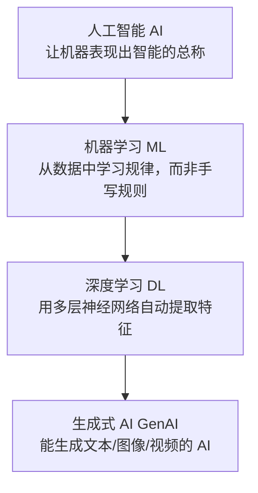
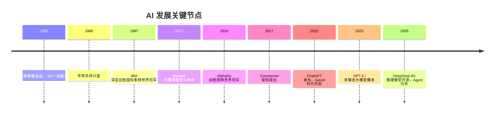

# 01 · AI 基础入门

## 1. 什么是人工智能

人工智能（Artificial Intelligence, AI）是让机器模拟人类智能行为的技术总称，包括感知（看/听）、理解（语言/图像）、推理（决策）和生成（创作）。

### AI / ML / DL / GenAI 的关系

| 概念 | 一句话解释 | 代表 |
|------|-----------|------|
| AI | 目标：机器表现出智能 | 专家系统、搜索算法 |
| ML 机器学习 | 方法：用数据训练模型 | 决策树、SVM |
| DL 深度学习 | ML 分支：深层神经网络 | CNN、Transformer |
| GenAI 生成式 AI | 能"创作"的 AI | ChatGPT、Midjourney |

## 2. 发展简史

**三次浪潮**：
1. **符号主义**（1956-1980s）：手写规则，专家系统 → 规则太多写不完，陷入寒冬
2. **统计学习**（1990s-2010s）：机器学习，数据驱动 → 特征工程依赖人工
3. **深度学习与大模型**（2012-至今）：神经网络自动学特征，Scaling Law 推动大模型涌现智能

## 3. AI 的核心能力分类

| 能力 | 说明 | 典型应用 |
|------|------|----------|
| 感知智能 | 识别图像、语音、文字 | 人脸识别、语音转文字 |
| 认知智能 | 理解语义、推理决策 | 智能问答、代码生成 |
| 生成智能 | 创作文本/图片/视频 | AI 写作、文生图 |
| 行动智能 | 调用工具、执行多步任务 | AI Agent、机器人 |

## 4. 必懂核心术语

- **模型（Model）**：训练得到的"智能程序"，本质是巨量参数构成的数学函数
- **参数（Parameters）**：模型内部的数值权重，GPT-4 级模型达数千亿个
- **训练（Training）**：用数据调整参数的过程
- **推理（Inference）**：用训练好的模型做预测/生成
- **Token**：大模型处理文本的最小单位（约 1 个汉字 ≈ 1~2 token）
- **上下文窗口（Context Window）**：模型一次能"看到"的最大 token 数
- **幻觉（Hallucination）**：模型编造看似合理但错误的内容
- **对齐（Alignment）**：让 AI 行为符合人类意图和价值观

## 5. 实践建议

1. 注册并日常使用 2~3 个主流 AI 产品（ChatGPT / Claude / DeepSeek / 豆包），培养体感
2. 用 AI 完成一件你原来的日常工作（写周报、翻译、写代码），体会能力边界
3. 遇到术语随时回到本目录查阅，或向「AI学习小能手」提问

## 6. 延伸阅读

- [02-机器学习](../02-机器学习/README.md) —— AI 的核心方法论
- [11-学习资源导航](../11-学习资源导航/README.md) —— 入门课程与书籍推荐

## 重点·陷阱·工程注意事项

**必记重点**
- AI/ML/DL/GenAI 包含关系是一切讨论的地基；Token、上下文窗口、幻觉三个概念决定你怎么用、怎么估算成本
- 感知→认知→生成→行动四种能力对应不同的产品形态，别混为一谈

**新手高频陷阱**
- ❌ 把 AI 当搜索引擎：知识有截止日期 + 会幻觉，**时效与事实类问题必须联网核实**
- ❌ 拿发布会演示当能力边界：演示是 cherry-pick，真实成功率要亲手测
- ❌ 术语混用：参数 ≠ token ≠ 上下文窗口 ≠ 显存，混用会导致方案估算全错
- ❌ 一开始就买卡/训模型：先用 Prompt + API 验证价值（见 [10 章项目1](../10-AI应用实战/README.md)）

**工程注意事项**
- 选模型看**任务匹配**不看名气：简单任务小模型，成本差 10 倍
- 任何方案先做 token 成本粗算（输入+输出×调用量），超预算的架构再好也落不了地
- 建立"这个回答我要不要核查"的肌肉记忆：医疗/法律/金融类必须核查来源

## 学完自测检查点

能不看资料回答以下问题即过关（答不出回到对应小节）：
1. 用一张图说清 AI / ML / DL / GenAI 的包含关系
2. AI 三次浪潮各自的核心主张与衰落/兴起原因
3. 向非技术人员解释：什么是 Token、什么是上下文窗口、什么是幻觉
4. 说出"训练"和"推理"的区别，并各举一个生活类比
5. 能默画 [深入专题](./深入专题-AI版图与流派.md) 的"三流派 → 六领域 → 五产业层"地图
