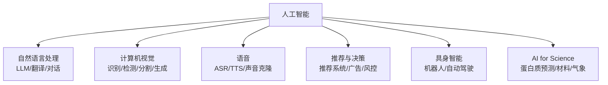

# 深入专题 · AI 版图与流派（建立全局认知坐标系）

> 基础概念见 [README](./README.md)。本篇回答三个问题：AI 内部有哪些技术流派？产业版图怎么划分？我在地图的哪个位置？

## 1. 三大技术流派（理解 AI 的"思想史"）

| 流派 | 核心主张 | 代表 | 兴衰 |
|------|----------|------|------|
| **符号主义** Symbolism | 智能 = 符号推理，知识显式表示为规则 | 专家系统、知识图谱、逻辑推理 | 80 年代主流，因规则无法穷尽而衰落，现以知识图谱形式存续 |
| **连接主义** Connectionism | 智能从神经网络的连接权重中涌现 | 深度学习、大模型 | 2012 年后绝对主流，ChatGPT 即其巅峰 |
| **行为主义** Actionism | 智能在与环境的交互试错中产生 | 强化学习、机器人 | AlphaGo 扬名，现以 RLHF/RL 推理、具身智能回归 |

**2026 年的融合趋势**：三者正在合流——LLM（连接主义）+ 知识图谱/RAG（符号主义）+ RL 推理与 Agent（行为主义）。面试问"AI 未来走向"可用此框架作答。

## 2. AI 技术版图（按问题域划分）



| 领域 | 2026 现状 | 学习入口 |
|------|-----------|----------|
| NLP/LLM | 最火热，本资料库主线 | 04 大语言模型 |
| CV | 成熟产业化（安防/质检/医疗影像），生成式（扩散模型）是新增长点 | 03 深度学习 CNN 部分 |
| 语音 | ASR/TTS 已高度成熟，实时语音对话是热点 | 08 多模态 |
| 推荐 | 抖音/淘宝的印钞机，表格+序列建模，与大模型融合中 | 02 机器学习 |
| 具身智能 | 人形机器人元年，VLA（视觉-语言-动作）模型兴起 | 关注 11 资源导航跟踪 |
| AI4S | AlphaFold 级突破持续，科研范式变革 | 论文渠道跟踪 |

## 3. 产业分层（钱在哪里流动）

```
应用层    AI 应用/Agent/SaaS（最多创业机会，本资料库 10 章主场）
编排层    LangChain/Dify/MCP 生态（工具链）
模型层    OpenAI/Anthropic/DeepSeek/Qwen（烧钱最多，格局渐稳）
 infra 层  推理框架/向量库/云平台（卖水人）
算力层    NVIDIA/国产芯片/数据中心（确定性最高）
```

- 个人开发者机会密度：应用层 > 编排层 >> 模型层
- 职业选择参考：想做研究去模型层，想做产品去应用层，想做稳定工程去 infra 层

## 4. 关键概念辨析（易混淆点）

- **AI vs 算法 vs 模型**：算法是方法（Transformer），模型是算法+数据训练的产物（GPT-4），AI 是目标与领域统称
- **训练 vs 微调 vs 提示**：改参数程度递减，成本递减，见 [03-深度学习](../03-深度学习/README.md) §4
- **大模型 vs 小模型**：不是优劣而是分工——云端大模型做难任务，端侧小模型做快/私/省的任务
- **开源 vs 开放权重**：Llama/Qwen 多为"开放权重"（可下载但训练数据与代码不公开），真正的开源（数据+代码+权重）极少（如 OLMo）

## 5. 如何判断一个 AI 新闻的含金量（信息素养）

1. **看基准还是看案例**：benchmark 提升 2% 可能是噪声；真实场景 case 更有说服力，反之亦然（警惕 cherry-pick 演示）
2. **看是否可复现**：开源权重/代码/API 可用 > 只有新闻稿
3. **看成本**：效果提升 5% 但成本翻 10 倍，工程上可能是倒退
4. **看谁在说**：实验室官宣（有利益）< 第三方独立评测 < 自己亲手试

## 6. 定位练习（学完本篇自测）

在纸上画出：技术流派三分 → 六大问题域 → 产业五层，并各举 2 个例子。能默画出来，说明全局坐标系已建立。
