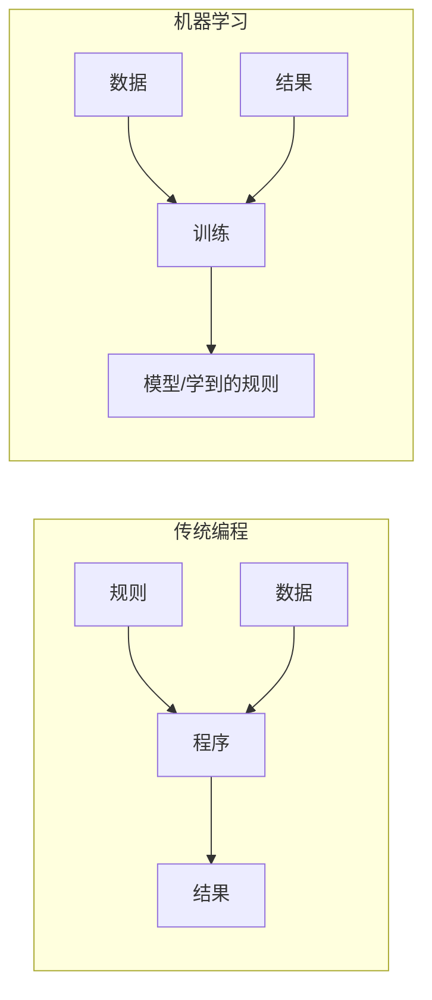

# 02 · 机器学习（Machine Learning）

## 1. 核心思想

传统编程是"人写规则 + 数据 → 结果"；机器学习是"数据 + 结果 → 机器学出规则"。

## 2. 三大学习范式

| 范式 | 数据特点 | 类比 | 典型算法 | 应用场景 |
|------|----------|------|----------|----------|
| 监督学习 Supervised | 有标准答案（标签） | 有老师改作业 | 线性回归、决策树、SVM、XGBoost | 房价预测、垃圾邮件分类 |
| 无监督学习 Unsupervised | 无标签，找结构 | 自己整理抽屉 | K-Means 聚类、PCA 降维 | 用户分群、异常检测 |
| 强化学习 Reinforcement | 通过奖励信号试错 | 训狗：做对给零食 | Q-Learning、PPO | 游戏 AI、机器人、RLHF |

## 3. 经典算法速览

### 监督学习

- **线性回归（Linear Regression）**：拟合一条直线预测连续值，如房价 = w·面积 + b
- **逻辑回归（Logistic Regression）**：输出 0~1 概率，用于二分类，如"是否为垃圾邮件"
- **决策树 / 随机森林 / XGBoost**：像"二十个问题"游戏一样层层判断；森林和 Boosting 是多棵树的集成，表格数据竞赛常胜将军
- **支持向量机（SVM）**：找一条"间隔最宽"的分界线分开两类数据
- **KNN（K 近邻）**：看新样本周围 K 个邻居多数属于哪类

### 无监督学习

- **K-Means 聚类**：把数据自动分成 K 堆，堆内相似、堆间不同
- **PCA 主成分分析**：把高维数据压缩到低维，保留主要信息，用于可视化和去噪

## 4. 机器学习的完整流程

## 5. 关键概念

- **过拟合（Overfitting）**：模型"死记硬背"训练数据，新数据表现差 → 对策：更多数据、正则化、简化模型
- **欠拟合（Underfitting）**：模型太简单，连训练数据都学不好 → 对策：更强的模型、更好的特征
- **训练集 / 验证集 / 测试集**：学习 / 调参 / 期末考，测试集只能用一次
- **评估指标**：
  - 分类：准确率 Accuracy、精确率 Precision、召回率 Recall、F1
  - 回归：MAE、RMSE、R²
- **特征工程**：把原始数据（如日期、文本）变成模型能用的数值，传统 ML 中"特征决定上限"

## 6. 实践建议

1. 用 Python + scikit-learn 跑通鸢尾花分类（30 行代码），体验完整流程
2. 在 Kaggle 上完成 Titanic 入门赛，理解特征工程
3. 思考：为什么表格数据场景 XGBoost 常胜，而图像/文本被深度学习统治？

## 7. 延伸阅读

- [03-深度学习](../03-深度学习/README.md) —— 自动特征学习的进阶
- [经典算法详解](./经典算法详解.md) —— **算法大全**：12 个经典算法（原理/超参/优缺点/选型/面试速答）+ 决策树 + 对比总表
- [强化学习深入专题](./强化学习深入专题.md) —— 深入专题：Q-Learning→DQN→PPO→GRPO 演进 + RLHF/RLVR 三次关键应用
- [数学基础速成](./数学基础速成.md) —— 深入专题：线代/概率/微积分最小必会集
- 书籍：《统计学习方法》（李航）、*Hands-On ML with Scikit-Learn*

## 重点·陷阱·工程注意事项

**必记重点**
- 三大范式分工：监督（有答案）、无监督（找结构）、强化（试错拿奖励）
- 过拟合是终身命题；评估指标选错 = 优化错方向（不平衡数据看 P/R/F1 别看准确率）
- 表格数据 XGBoost、非结构化数据深度学习——这条分工线能省你半年弯路

**工程陷阱（真实事故高发区）**
- ❌ **数据泄露**：特征里混入了"未来信息"（如用最终结果反推的特征），离线 99 分上线 60 分
- ❌ 用测试集反复调参 → 测试集失效，你以为的泛化性能是假的
- ❌ 时序数据用随机 K 折交叉验证 → 未来数据泄露进训练集，必须时间滑窗
- ❌ KNN/SVM/PCA 不做归一化 → 量纲大的特征支配一切
- ❌ 类别不平衡还看准确率 → 99% 准确率可能等于"全部猜多数类"

**工程案例与注意事项**
- **小数据过拟合测试**：先让模型在 100 条数据上过拟合到 100%——证明代码没错，再谈效果（排查第一招）
- 特征工程仍是传统 ML 的主战场（60~80% 工作量），别把时间全花在调模型上
- 基线先行：先跑逻辑回归/随机森林当基准，复杂方案必须显著超过基线才值得上

## 学完自测检查点

1. 三大学习范式的区别，各举一个实际应用
2. 过拟合的 5 种对策，并解释为什么"更多数据"最有效
3. 什么场景用召回率而非准确率？举例说明
4. 随机森林（Bagging）和 XGBoost（Boosting）的降误差思路有何不同
5. 说出"训练集/验证集/测试集"各自的用途，为什么测试集只能用一次
6. 交叉熵为什么优于 MSE 做分类损失（见[数学基础](./数学基础速成.md) §2.4）
7. 表格数据任务首选什么算法？小数据高维文本首选什么？（见[经典算法详解](./经典算法详解.md) 决策树）
