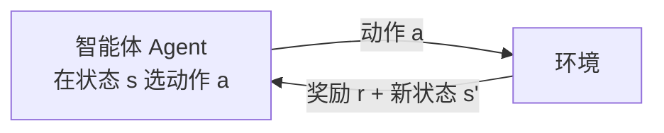

# 深入专题 · 强化学习（从 Q-Learning 到 PPO/GRPO）

> 基础概念见 [经典算法详解 §12](./经典算法详解.md)。强化学习是 2025 年后 LLM 突破的核心引擎（RLHF 让模型"有用"，RLVR/GRPO 让模型"会推理"），值得单独深入。

## 1. 强化学习的形式化（先把语言统一）



- **五要素**：状态 S、动作 A、奖励 R、转移概率 P、折扣因子 γ
- **目标**：学一个策略 π(a|s)，最大化**长期折扣回报** $G_t = \sum \gamma^k r_{t+k}$
- **与监督学习的本质区别**：没有标准答案，只有延迟的、稀疏的奖励信号；数据来自**自己的探索**（分布随策略变化）

| 概念 | 监督学习 | 强化学习 |
|------|----------|----------|
| 信号 | 标准答案（密集） | 奖励（稀疏/延迟） |
| 数据 | 静态数据集 | 与环境交互产生 |
| 探索 | 不需要 | **必需**（不探索不知道什么更好） |

## 2. 核心概念速通

- **价值函数**：$V(s)$="在 s 长期能拿多少奖励"；$Q(s,a)$="在 s 做 a 能拿多少"
- **贝尔曼方程**：价值 = 即时奖励 + 折扣后的未来价值（递归分解，一切 RL 算法的地基）
- **探索 vs 利用**：ε-greedy——90% 选当前最优（利用），10% 随机尝试（探索）；只利用会困在局部最优
- **折扣因子 γ**：0.9~0.99；γ→1 看重长远（围棋布局），γ→0 只看眼前
- **On-policy vs Off-policy**：边探索边学（用自己最新数据）vs 可以学别人的经验（回放池）

## 3. 算法演进地图

```
表格时代：Q-Learning（价值表查表，状态少时有效）
    ↓ 状态爆炸（围棋 10^170 状态，表格存不下）
深度时代：DQN（用神经网络近似 Q 函数，2013 玩 Atari）
    ↓ 连续动作空间 + 稳定性问题
策略梯度时代：Actor-Critic → PPO（2017，稳定易调的标杆）
    ↓ 应用到大模型
LLM 时代：RLHF（PPO+奖励模型）→ DPO（免 RL）→ GRPO（免 Critic，R1 核心）
```

### 3.1 Q-Learning（查表法，理解 RL 的最佳入口）

$$Q(s,a) \leftarrow Q(s,a) + \alpha\underbrace{[r + \gamma \max_{a'} Q(s',a') - Q(s,a)]}_{\text{TD 误差：现实与预期的差距}}$$

- 直觉：每次经历后，用"实际拿到的 + 对未来的最新估计"修正"原来的预期"
- 局限：状态表随状态数爆炸 → 用神经网络替代表格 = DQN

### 3.2 DQN 的两个稳定器（工程智慧）

- **经验回放**：把经历存进池子随机抽样训练 → 打破数据相关性（连续经历高度相关会让网络发散）
- **目标网络**：用一份"冻结的旧网络"算目标值，定期同步 → 避免"自己追自己尾巴"的不稳定

### 3.3 策略梯度与 Actor-Critic

- 直接对策略 $\pi_\theta$ 求梯度：往"让高回报动作概率变大"的方向调参
- **Actor-Critic**：Actor（策略网络，决定做什么）+ Critic（价值网络，评估做得好不好）→ 用 Critic 的评估降低方差

### 3.4 PPO（LLM 时代的功臣）

- 核心思想：** clipped 目标函数**——限制每次更新的步幅，防"一步踏空全盘崩"
- 四个模型同驻显存（LLM 场景）：Actor（要训的策略）、Critic（价值估计）、Reward Model（打分）、Reference（参照防跑偏）
- 痛点：复杂、不稳定、显存爆炸 → 催生了 DPO 和 GRPO

### 3.5 GRPO（DeepSeek-R1 的核心创新）

```
传统 PPO：需要 Critic 网络估计"这步值多少"（显存翻倍、训练难）
GRPO：对同一问题采样 G 个回答 → 组内相对打分（比平均好多少）→ 用相对优势替代 Critic
```

- **可验证奖励（RLVR）**：数学答案对不对、代码过不过测试，**规则自动判分**，不需要人类标注 → 奖励信号廉价且规模化
- 结果：涌现出长思维链、自我验证、反思回溯（"aha moment"）

## 4. RL 在 LLM 中的三次关键应用（面试必考）

| 应用 | 奖励信号 | 解决的问题 | 代表 |
|------|----------|-----------|------|
| **RLHF** | 人类偏好训练的奖励模型 | 让模型"有用、无害、诚实" | InstructGPT/ChatGPT |
| **RLAIF/Constitutional AI** | AI 按原则自评 | 降低人工标注成本 | Anthropic Claude |
| **RLVR（可验证奖励）** | 规则自动判分（数学/代码） | 训练推理能力（长思维链） | DeepSeek-R1、o 系列 |

**演进逻辑**：人类标注（贵）→ AI 反馈（便宜但继承 AI 偏差）→ 规则验证（免费但只适用可判分任务）——**奖励信号的来源决定了 RL 能规模化到什么程度**。

## 5. 经典案例速览

- **AlphaGo/AlphaZero**：MCTS + RL 自我对弈，从零开始超越人类（纯 RL 的传奇）
- **ChatGPT**：RLHF 让 GPT-3 从"会续写"变"会对话"
- **DeepSeek-R1**：GRPO + 可验证奖励，开源复现推理能力涌现
- **机器人/具身智能**：RL + 仿真到现实迁移（Sim2Real），当前最热前沿

## 6. 常见误区与陷阱

- ❌ "RL 什么都能学"：奖励函数设计错（reward misspecification），模型会**钻空子**（reward hacking）——奖励什么就得到什么，包括你不想要的
- ❌ 忽视探索：ε 太小 → 困在局部最优；ε 不衰减 → 永远不稳定
- ❌ 稀疏奖励直接硬训：围棋式"赢=1 输=0"对多数任务太稀疏 → 需要奖励塑形（reward shaping）或课程学习
- ❌ 仿真效果好直接上真机：Sim2Real 鸿沟（物理参数差异）→ 域随机化
- ❌ 以为 RLHF 是"强化学习主战场"：LLM 时代 RL 更准确的定位是**对齐与推理训练的工具**，而非通用智能方案

## 7. 与其他板块的连接

- RLHF/DPO/GRPO 面试深挖 → [题库03](../12-AI面试题库/03-预训练微调与对齐.md)
- 推理模型训练细节 → [04/训练推理全链路详解](../04-大语言模型/训练推理全链路详解.md) §4.3
- Agent 与 RL 的关系（Agent 是"工程实现的智能体"，RL 是"学习智能的方法"）→ [06 目录](../06-AI-Agent智能体/README.md)

## 8. 学完自测检查点

1. 用贝尔曼方程解释"价值"的递归含义
2. Q-Learning 到 DQN 解决了什么问题？DQN 的两个稳定器各防什么
3. PPO 在 LLM 场景为什么要四个模型？GRPO 省掉了哪个、怎么省的
4. RLHF / RLAIF / RLVR 的奖励信号来源分别是什么，各自的规模化瓶颈
5. 什么是 reward hacking？举一个 LLM 场景的例子（回答变长骗高分）
6. 为什么"可验证奖励"的任务（数学/代码）最先被 RL 攻克？
