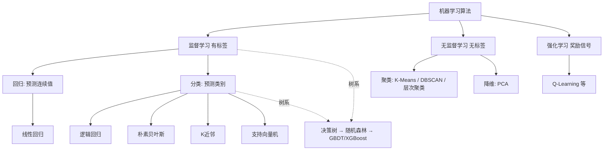

# 学习笔记 · 机器学习经典算法详解

> 每个算法统一按六步学习：**直觉类比 → 核心原理 → 关键超参 → 优缺点 → 适用场景 → 面试速答**。先建立"什么时候用它"的判断，再深挖"它怎么工作"。

## 0. 全景地图（先知道有哪些）



**算法能力光谱（经验规律）**：
```
简单可解释 ←————————————————→ 强大但黑盒
线性回归/逻辑回归 → 决策树 → KNN → SVM → 随机森林 → XGBoost → 神经网络
（小数据、表格、要解释）                    （表格数据竞赛之王）   （非结构化大数据）
```

---

## 1. 线性回归（Linear Regression）

**直觉**：在众多散点中画一条"总体最贴合"的直线，用直线外推新点。
**核心原理**：拟合 $y = w^Tx + b$，最小化均方误差 $L = \frac{1}{n}\sum(y_i - \hat{y}_i)^2$；可用**最小二乘法**解析求解，也可用梯度下降迭代。
**关键超参**：是否加正则（Ridge=L2 收缩系数 / Lasso=L1 稀疏化可做特征选择）。
**优点**：快、可解释（每个系数=特征贡献）、无需调参。**缺点**：只能拟合线性关系，对异常值敏感。
**适用**：基线模型、房价/销量等趋势预测、特征重要性初探。
**面试速答**："线性回归假设误差服从正态分布；Ridge 防止过拟合，Lasso 能做特征选择；异常值多用 Huber 损失或 RANSAC。"

## 2. 逻辑回归（Logistic Regression）

**直觉**：把线性回归的输出"压"进 0~1，变成概率，以 0.5 为界分类。
**核心原理**：$P(y=1|x) = \sigma(w^Tx+b)$，$\sigma(z)=\frac{1}{1+e^{-z}}$；损失用**交叉熵**（不是 MSE，原因见[数学基础](./数学基础速成.md) §2.4）。
**关键超参**：正则强度 C（越小正则越强）、类别权重（处理不平衡）。
**优点**：输出有概率意义、训练快、可解释、工业界基线（广告 CTR 预估常年主力）。**缺点**：本质线性分类器，复杂边界需特征工程（交叉特征/分桶）。
**适用**：二分类基线（是否违约/流失/点击）、需要概率输出的场景。
**面试速答**："名字带回归但用于分类；sigmoid 把输出压成概率；为什么用交叉熵不用 MSE——MSE 在 sigmoid 饱和区梯度趋零，学得慢。"

## 3. 决策树（Decision Tree）

**直觉**：玩"二十个问题"——每个问题（特征判断）把数据分成两半，问到能下结论为止。
**核心原理**：每步选择**信息增益最大**（ID3）/ 增益率（C4.5）/ **基尼不纯度下降最大**（CART，最常用）的特征做划分；递归直到纯净或达停止条件；**剪枝**防过拟合。
**关键超参**：`max_depth`（最重要）、`min_samples_split/leaf`、剪枝参数。
**优点**：天然可解释（规则可读）、无需特征归一化、自动处理非线性和特征交互。**缺点**：**极易过拟合**、对数据扰动敏感（换批数据树就变了）。
**适用**：规则提取、业务可解释性要求高的场景、作为集成方法的基学习器。
**面试速答**："ID3 用信息增益，C4.5 用增益率（修正多取值特征偏好），CART 用基尼指数；预剪枝 vs 后剪枝。"

## 4. 随机森林（Random Forest）

**直觉**：一棵树容易"想歪"，让几百棵各有偏见的树投票，集体智慧更稳。
**核心原理**：**Bagging**——每棵树用**有放回随机抽样**的训练集 + **随机特征子集**训练，预测时投票（分类）/取均值（回归）。双重随机性 → 树之间差异大 → 集成降方差。
**关键超参**：树的数量 `n_estimators`（300~500 常够）、`max_features`、树深度。
**优点**：准、稳、抗过拟合、几乎不用调参、能输出特征重要性。**缺点**：模型大、慢（树多时）、不可解释性下降。
**适用**：中小规模表格数据的"开箱即用"首选。
**面试速答**："Bagging 降方差；随机森林 = Bagging + 随机特征子集；OOB（袋外样本）可免验证集评估。"

## 5. GBDT / XGBoost / LightGBM（梯度提升树）

**直觉**：不是"平行投票"而是"接力纠错"——第一棵树预测后，第二棵专门学第一棵**没答对的部分（残差）**，一路纠下去。
**核心原理**：**Boosting**——串行加法模型，每棵新树拟合当前模型的**负梯度（≈残差）**；XGBoost 引入二阶泰勒展开 + 正则项 + 列采样 + 缺失值自动处理；LightGBM 用直方图算法 + 叶子优先生长，快数倍。
**关键超参**：学习率 `learning_rate`（0.01~0.1，与树数量配合）、`max_depth`（宜浅 3~8）、`n_estimators`（配早停）、正则 `lambda/alpha`。
**优点**：**表格数据效果天花板**（Kaggle 竞赛常胜）、可输出特征重要性。**缺点**：对超参敏感、训练慢于 RF、噪声大时易过拟合。
**适用**：结构化表格数据的中大型任务（风控、CTR、评分卡）——**工业界表格任务默认首选**。
**面试速答**："Bagging 并行降方差，Boosting 串行降偏差；XGBoost = GBDT + 二阶导 + 正则 + 工程优化；防过拟合靠 shrinkage + 早停 + 正则。"

## 6. 支持向量机（SVM）

**直觉**：两类点之间找一条"离两边都最远"的分界线（最大间隔），边界只由少数**支持向量**决定。
**核心原理**：优化目标是最大化分类间隔；线性不可分时用**核技巧**（RBF 核等）把数据映射到高维变可分；软间隔参数 C 容忍误分。
**关键超参**：`C`（大=严格，小=容忍）、`kernel`、`gamma`（RBF 影响范围）。
**优点**：高维有效、小样本表现好、决策只依赖支持向量（省内存）。**缺点**：大数据训练慢（O(n²~n³)）、需归一化、概率输出不天然（需校准）、多分类麻烦。
**适用**：中小规模、高维（文本/基因）分类。深度学习时代地位下降，但小数据高维仍是一把好手。
**面试速答**："核函数做了什么——不显式计算高维映射，直接算内积；为什么对异常值敏感程度由 C 决定。"

## 7. K 近邻（KNN）

**直觉**："物以类聚"——看新样本周围 K 个最近的邻居，少数服从多数。
**核心原理**：**惰性学习**——没有训练过程，预测时才计算与所有样本的距离（欧氏/曼哈顿），取 K 个最近投票。距离度量 + K 值是关键。
**关键超参**：`K`（小=复杂易过拟合，大=平滑易欠拟合，常用 3~15，奇数防平票）、距离度量、特征权重。
**优点**：零训练成本、天然多分类、思想极简。**缺点**：预测慢（要算全量距离）、**维度灾难**（高维时距离失效）、必须归一化、对类别不平衡敏感。
**适用**：小规模低维数据、推荐系统的近邻思想（user-based CF 的老祖宗）、教学演示。
**面试速答**："维度灾难——高维空间里所有点都差不多远，距离失去区分度；K 与偏差-方差的关系。"

## 8. 朴素贝叶斯（Naive Bayes）

**直觉**：根据"症状"反推"疾病"——假设各症状相互独立，用贝叶斯定理算每种疾病的后验概率。
**核心原理**：$P(y|x) \propto P(y)\prod_i P(x_i|y)$，"朴素"= 特征条件独立假设（现实中不成立，但效果常常意外好）；文本用多项式/伯努利变体，拉普拉斯平滑防零概率。
**优点**：**极快**、小数据也能用、天然支持增量学习、文本分类经典。**缺点**：独立性假设太强、概率值不准（排序可用）、连续特征需假设分布。
**适用**：垃圾邮件过滤、文本分类基线、实时性要求高的场景。
**面试速答**："为什么'朴素'——特征条件独立；零概率问题——拉普拉斯平滑；与逻辑回归的区别——生成式 vs 判别式模型。"

## 9. K-Means 聚类（无监督）

**直觉**：把一群人按"志趣"自动分成 K 个圈子，圈内志趣相投，圈间差异尽量大。
**核心原理**：迭代两步——分配（每个点归到最近质心）→ 更新（质心移到簇均值），直到收敛；目标是最小化簇内平方和（SSE）。
**关键超参**：`K`（肘部法则/轮廓系数选）、初始化方法（K-Means++ 防坏起点）、最大迭代数。
**优点**：简单快速、可扩展。**缺点**：需预设 K、只适合**球形凸簇**、对初始点和异常值敏感、需归一化。
**适用**：用户分群、图像压缩、异常检测（离所有质心都远的点）、数据探索第一步。
**面试速答**："为什么不保证全局最优——目标非凸，依赖初始化；K-Means++ 如何改进——让初始质心尽量互相远离。"

## 10. DBSCAN 聚类（无监督）

**直觉**：不按"离中心远近"分圈，而是按"人群密度"连片——人挨人的连成一簇，孤立的算噪声。
**核心原理**：两个参数——邻域半径 `eps`、最小点数 `min_samples`；核心点（邻域内够密）扩张成簇，边界点归属，其余为噪声。
**优点**：**不用预设簇数**、能发现任意形状簇、自带异常点检测。**缺点**：对 eps 敏感、密度不均的簇效果差、高维同样失效。
**适用**：地理数据聚类、异常检测、簇形状不规则的场景。
**面试速答**："K-Means vs DBSCAN——前者要 K、球形簇、无噪声概念；后者免 K、任意形状、能识别噪声。"

## 11. PCA 主成分分析（降维）

**直觉**：把 100 个有冗余的指标，压缩成 10 个互不相关的新指标，保住 95% 的信息。
**核心原理**：找数据**方差最大**的正交方向（主成分）投影；数学上是协方差矩阵**特征值分解**（或 SVD）；按累计方差贡献率（如 ≥95%）决定保留几维。
**关键超参**：`n_components`（保留维度或方差阈值）、是否白化。
**优点**：去冗余去噪、加速下游训练、可视化（降到 2/3 维）。**缺点**：新维度失去业务含义（不可解释）、线性方法（非线性用 t-SNE/UMAP 可视化）。
**适用**：高维数据预处理、可视化探索、去相关。
**面试速答**："为什么选方差最大的方向——方差大=信息多；PCA 前必须标准化（量纲会主导方差）。"

## 12. 强化学习基础（Q-Learning 思想）

**直觉**：训狗——做对了给零食（奖励），做错了没零食，狗自己摸索出"什么状态该做什么动作"。
**核心原理**：智能体在状态 $s$ 选动作 $a$，环境给奖励 $r$ 和新状态 $s'$；学一张价值表 $Q(s,a)$ ="在 s 做 a 的长期收益期望"，按**贝尔曼方程**迭代更新：$Q(s,a) \leftarrow Q(s,a) + \alpha[r + \gamma \max_{a'} Q(s',a') - Q(s,a)]$。
**关键概念**：探索（ε-greedy 偶尔随机尝试）vs 利用（选当前最优）、折扣因子 γ（看重长远还是眼前）。
**适用**：序列决策（游戏、机器人控制、推荐策略）；大模型时代化身 RLHF/GRPO（见 [04](../04-大语言模型/README.md)、[题库03](../12-AI面试题库/03-预训练微调与对齐.md)）。
**面试速答**："Q 值的含义、探索-利用权衡、为什么需要 γ（长期奖励折扣防发散+符合直觉）。"

---

## 算法选型决策树

```
有标签吗？
├─ 无 → 找结构：聚类（K-Means 球形 / DBSCAN 任意形状）或降维（PCA）
└─ 有 → 数据是表格吗？
    ├─ 是 → 小数据：逻辑回归/随机森林  中大数据：XGBoost/LightGBM（首选）
    ├─ 是文本 → 小数据：朴素贝叶斯/TF-IDF+LR  大数据：直接上 LLM
    ├─ 是图像/语音 → 深度学习（03 章）
    └─ 要可解释 → 决策树/线性模型/评分卡
要序列决策（行动→反馈）吗？ → 强化学习
```

## 横向对比总表

| 算法 | 类型 | 训练成本 | 预测速度 | 可解释 | 需要归一化 | 一句话定位 |
|------|------|----------|----------|--------|-----------|-----------|
| 线性回归 | 回归 | 极低 | 极快 | ⭐⭐⭐⭐⭐ | 建议 | 一切回归的基线 |
| 逻辑回归 | 分类 | 低 | 极快 | ⭐⭐⭐⭐ | 是 | 分类基线 + 概率输出 |
| 决策树 | 分类/回归 | 低 | 快 | ⭐⭐⭐⭐⭐ | 否 | 规则提取器 |
| 随机森林 | 分类/回归 | 中 | 中 | ⭐⭐ | 否 | 表格数据开箱即用 |
| XGBoost | 分类/回归 | 中高 | 中 | ⭐⭐ | 否 | **表格数据天花板** |
| SVM | 分类 | 高 | 快 | ⭐ | 是 | 小样本高维专家 |
| KNN | 分类/回归 | 零 | **慢** | ⭐⭐ | 是 | 惰性近邻思想 |
| 朴素贝叶斯 | 分类 | 极低 | 极快 | ⭐⭐⭐ | 否 | 文本分类老黄牛 |
| K-Means | 聚类 | 中 | - | ⭐⭐⭐ | 是 | 分群默认选择 |
| DBSCAN | 聚类 | 中 | - | ⭐⭐ | 建议 | 任意形状 + 找噪声 |
| PCA | 降维 | 低 | - | ⭐ | 必须 | 压缩冗余保信息 |

## 经典面试问答（浓缩版）

1. **Bagging 和 Boosting 的区别？** → 并行投票降方差 vs 串行纠错降偏差；代表 RF vs XGBoost。
2. **逻辑回归为什么是线性模型？** → 决策边界 $w^Tx+b=0$ 是超平面；sigmoid 只改变输出形式不改变边界形状。
3. **决策树为什么要剪枝？** → 不剪会分到每片叶子一个样本（完美过拟合）。
4. **SVM 的核技巧本质？** → 用核函数隐式计算高维空间内积，避免显式高维映射的计算爆炸。
5. **KNN 为什么在高维失效？** → 维度灾难：高维中最近和最远点的距离趋于相等。
6. **K-Means 一定能收敛吗？** → 能（SSE 单调下降有下界），但只保证局部最优。
7. **朴素贝叶斯哪里"朴素"？为什么还有效？** → 假设特征独立；分类只看排序不看精确概率，假设偏差常被数据量掩盖。

## 动手作业（scikit-learn）

```python
# 一个文件对比 6 个算法（鸢尾花分类）
from sklearn.datasets import load_iris
from sklearn.model_selection import cross_val_score
from sklearn.linear_model import LogisticRegression
from sklearn.tree import DecisionTreeClassifier
from sklearn.ensemble import RandomForestClassifier, GradientBoostingClassifier
from sklearn.svm import SVC
from sklearn.naive_bayes import GaussianNB

X, y = load_iris(return_X_y=True)
models = {
    "逻辑回归": LogisticRegression(max_iter=500),
    "决策树": DecisionTreeClassifier(max_depth=3),
    "随机森林": RandomForestClassifier(n_estimators=100),
    "GBDT": GradientBoostingClassifier(),
    "SVM": SVC(),
    "朴素贝叶斯": GaussianNB(),
}
for name, m in models.items():
    score = cross_val_score(m, X, y, cv=5).mean()
    print(f"{name}: {score:.3f}")
```

**作业**：
1. 运行上面的代码，把决策树 `max_depth` 从 1 调到 20，画出"深度-得分"曲线，找到过拟合拐点
2. 在 [Kaggle Titanic](https://www.kaggle.com/c/titanic) 上依次用逻辑回归 → 随机森林 → XGBoost 提交，记录分数变化
3. 对每个算法写一句"我什么时候会选它"，对照 §决策树自查

## 学完自测检查点

1. 不看资料说出 8 个算法各自的一句话原理
2. Bagging vs Boosting 的本质区别及代表算法
3. 什么场景 XGBoost 完胜深度学习？什么场景反过来？
4. 逻辑回归为什么用交叉熵而不是 MSE
5. KNN 的"维度灾难"是什么意思
6. 给一个任务（如"预测用户下个月是否续费"），走完选型决策树并说明理由
