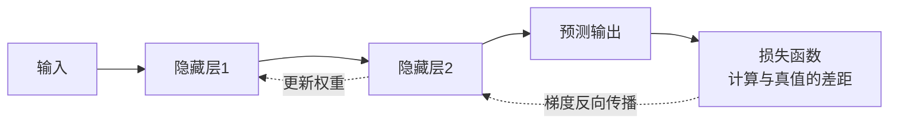

# 03 · 深度学习（Deep Learning）

## 1. 为什么需要深度学习

传统机器学习需要人工设计特征；深度学习用**多层神经网络自动学习特征**，层数越深，特征越抽象。

```
图像识别示例：
原始像素 → 第1层:边缘 → 第2层:纹理 → 第3层:部件(眼睛/轮子) → 输出:猫/汽车
```

## 2. 神经网络基础

### 单个神经元

$$y = f(w_1x_1 + w_2x_2 + \dots + w_nx_n + b)$$

- 输入加权求和，加偏置 b，再经过**激活函数** f 产生非线性
- 常用激活函数：ReLU（最常用）、Sigmoid、GELU

### 网络如何学习：前向传播 + 反向传播



- **损失函数（Loss）**：衡量预测错得有多离谱（交叉熵、MSE）
- **梯度下降（Gradient Descent）**：沿着让 Loss 下降最快的方向微调参数
- **学习率（Learning Rate）**：每步走多大；太大学过头，太小学得慢
- **Epoch / Batch**：完整过一遍数据为一个 Epoch；分批喂入为 Batch

## 3. 经典网络架构

| 架构 | 核心思想 | 擅长 | 代表 |
|------|----------|------|------|
| MLP 全连接网络 | 层层全连接 | 表格数据 | 基础网络 |
| CNN 卷积网络 | 卷积核滑动提取局部特征，参数共享 | 图像 | ResNet、YOLO |
| RNN / LSTM | 带"记忆"，处理序列 | 文本、时间序列 | LSTM、GRU |
| **Transformer** | **自注意力机制，并行处理全序列** | **文本/图像/一切** | **GPT、BERT、ViT** |

### CNN 核心概念

- **卷积（Convolution）**：小窗口在图上滑动提取特征（边缘→纹理→形状）
- **池化（Pooling）**：压缩尺寸、保留关键信息
- 类比：用不同的"放大镜"扫图，每个放大镜专找一种特征

### Transformer：现代 AI 的基石

**自注意力（Self-Attention）**：句子中每个词都能"关注"其他所有词，动态计算关联权重。

> 例："苹果发布了新手机，它很受欢迎" —— 模型通过注意力知道"它"指"手机"而非"苹果（公司）"。

- 优势：长距离依赖 + 高度并行 → 可堆超大数据和参数 → Scaling Law
- 2017 年论文《Attention Is All You Need》提出，此后 GPT、BERT、ViT、多模态模型全部基于它

## 4. 训练大模型的三种方式

| 方式 | 说明 | 成本 |
|------|------|------|
| 从零预训练 Pretrain | 海量数据从头训 | 千万美元级 |
| 微调 Fine-tuning | 在现成模型上用领域数据继续训 | 几百~几千美元 |
| **提示词 / RAG** | **不改模型，改输入和上下文** | **几乎为零（推荐个人）** |

## 5. 实践建议

1. 用 PyTorch 手写一个 MLP 识别 MNIST 手写数字（约 100 行），理解训练循环
2. 阅读 Transformer 图解博客 *The Illustrated Transformer*
3. 不必死记数学推导，先建立"前向预测 → 算 Loss → 反向更新"的直觉闭环

## 6. 延伸阅读

- [Transformer逐层拆解](./Transformer逐层拆解.md) —— 深入专题：带张量维度的逐层推导 + 手撕代码
- [机器学习与深度学习全面对比](./机器学习与深度学习全面对比.md) —— 深入专题：本质区别（特征从哪来）+ 十大维度 + 选型决策 + 面试速答
- [04-大语言模型](../04-大语言模型/README.md) —— Transformer 的巅峰应用
- 课程：吴恩达 Deep Learning Specialization、李沐《动手学深度学习》

## 重点·陷阱·工程注意事项

**必记重点**
- 训练闭环：前向 → Loss → 反向传播（链式法则）→ 梯度下降更新——一切 DL 都在这个环里
- Transformer 三胜因：长依赖（梯度路径=1）、可并行（吃算力红利）、可扩展（Scaling）
- 现代配方已成事实标准：Pre-Norm + RMSNorm + SwiGLU + RoPE + GQA

**工程陷阱**
- ❌ **学习率过大**：loss 飙升/发散的头号嫌疑人；不收敛先降学习率再查别的
- ❌ Dropout/BN 训练与推理行为不一致：忘记 `model.eval()` 导致线上结果莫名变差
- ❌ 因果掩码方向写反（下三角/上三角搞混）→ 模型"偷看未来"，训练指标虚高
- ❌ 盲目堆层数/加参数：小数据上深网络只会更快过拟合
- ❌ 忘了 √d_k 缩放或写错 dk 维度 → softmax 饱和、梯度消失（手撕题必查点）

**工程案例与注意事项**
- **Loss spike 排查顺序**：学习率 → 梯度爆炸（grad norm 监控）→ 脏数据 → 硬件故障；配梯度裁剪与 checkpoint 回滚
-  sanity check 三板斧：小数据过拟合 → 打印中间维度 → 手算一步梯度对比
- 大模型时代个人不必从零预训练——**微调/Prompt/RAG 的成本阶梯**要刻进脑子里（见 §4）

## 学完自测检查点

1. 画出"前向 → 算 Loss → 反向传播 → 更新参数"的完整闭环并口述每步
2. 梯度消失的成因和至少 3 种解法
3. CNN 的局部连接和参数共享为什么适合图像
4. 自注意力凭什么解决 RNN 的两个致命问题（串行、长依赖）
5. 三种训练方式（预训练/微调/提示）的成本差异与选型原则
6. 能手写带因果掩码的 self-attention（见[逐层拆解](./Transformer逐层拆解.md) §6）
7. 用"特征从哪来"说清传统 ML 与深度学习的本质区别，并给出 4 个选型约束维度（见[全面对比](./机器学习与深度学习全面对比.md)）
