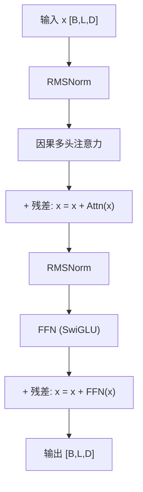

# 深入专题 · Transformer 逐层拆解（带张量维度）

> 目标：读完能"看着公式复述数据怎么流动"，达到面试手撕 self-attention 的水平。

## 0. 全局视角

以 Decoder-only（GPT 系）为例，一次前向传播：

```
输入文本 → Tokenize → [B, L] 整数序列
→ Embedding 查表 → [B, L, D]
→ × N 个 Transformer Block { 因果多头注意力 + FFN }
→ 输出头（线性层到词表）→ [B, L, V]
→ softmax 得到下一个 token 的概率分布
```

约定记号：`B`=batch，`L`=序列长度，`D`=隐藏维度（如 4096），`H`=头数，`d_k=D/H`（如 128），`V`=词表大小（如 128k）。

## 1. Token Embedding

- 本质是一个 `[V, D]` 的查找表，每个 token id 取出一行向量
- **无位置信息** → 需位置编码补足（现代用 RoPE，在注意力内部注入而非加在 embedding 上）
- 参数共享：很多模型输入 embedding 与输出头**共享权重**（weight tying），省参数且效果不差

## 2. 一个 Transformer Block 的数据流（Pre-Norm 结构）



**Pre-Norm 的意义**：残差通路 `x` 从头到尾不被归一化"阻挡"，梯度可直达浅层 → 百层网络可稳定训练（Post-Norm 深网易梯度爆炸）。

### 2.1 RMSNorm（比 LN 更省）

$$\text{RMSNorm}(x) = \frac{x}{\sqrt{\frac{1}{D}\sum_{i=1}^{D} x_i^2 + \epsilon}} \cdot g$$

省去均值中心化，只按均方根缩放，计算更快，效果与 LN 相当 → Llama/Qwen/DeepSeek 标配。

## 3. 注意力层：逐步拆解

### Step 1：生成 Q/K/V

$$Q = xW_Q,\quad K = xW_K,\quad V = xW_V$$

- `W_Q, W_K, W_V` 各为 `[D, D]`（GQA 时 K/V 投影维度更小）
- 得到 `Q,K,V: [B, L, D]` → 拆成 H 个头 `[B, H, L, d_k]`

### Step 2：注入位置（RoPE）

对 Q、K 按位置旋转（维度两两一组视为复数）：

$$f(q, m) = q \cdot e^{im\theta}$$

- m 为位置，θ 为旋转基频；旋转后内积 $\langle f(q,m), f(k,n) \rangle$ 只依赖**相对距离 m-n** → 天然相对位置编码
- V 不旋转（值不携带位置）

### Step 3：注意力分数 + 因果掩码

$$S = \frac{QK^T}{\sqrt{d_k}} \in [B, H, L, L]$$

- `S[i,j]` = 第 i 个 token 对第 j 个 token 的关注度（未归一化）
- **因果掩码**：上三角（j>i，即"未来"位置）置为 $-\infty$，softmax 后变 0 → 每个 token 只能看自己及之前

### Step 4：softmax + 加权求和

$$A = \text{softmax}(S),\quad O = AV \in [B, H, L, d_k]$$

- 每个位置的输出 = 所有历史位置 V 的加权和，权重即注意力分数

### Step 5：合并多头 + 输出投影

- 拼接 H 个头回 `[B, L, D]`，再乘 `W_O: [D, D]` 得到注意力层输出

### 复杂度分析（面试必考）

| 项目 | 复杂度 | 瓶颈 |
|------|--------|------|
| QK^T | $O(L^2 d_k)$ 每头 | 长序列 L² 主导 |
| 显存（朴素实现） | $O(L^2)$ 存注意力矩阵 | FlashAttention 用分块+在线 softmax 降到 $O(L)$ |
| 每 token 解码（无 KV Cache） | 重算全部历史 $O(L^2)$ | 有 KV Cache 后每步 $O(L)$ |

## 4. FFN（SwiGLU）

$$\text{FFN}(x) = (\text{Swish}(xW_1) \odot xW_3)\,W_2$$

- 三个矩阵：升维 `W1, W3: [D, 4D-ish]`、降维 `W2: [4D-ish, D]`（门控结构比传统两矩阵多一个，故中间维度缩为 ~8/3·D 保持参数量相当）
- **FFN 占全模型约 2/3 参数**，被认为是"知识存储"的主要场所；注意力负责"路由信息"，FFN 负责"加工知识"
- MoE 就是把这一个 FFN 换成 N 个专家 FFN + Router

## 5. 输出头与采样

- `logits = x · W_out ∈ [B, L, V]`，取最后一个位置的 logits
- 温度缩放：`softmax(logits / T)` → Top-p 截断 → 采样出下一个 token → 拼接回输入，循环

## 6. 手写自注意力（面试高频手撕题）

```python
import torch
import torch.nn.functional as F

def causal_self_attention(x, Wq, Wk, Wv, Wo, n_head):
    B, L, D = x.shape
    dk = D // n_head
    q = (x @ Wq).view(B, L, n_head, dk).transpose(1, 2)  # [B,H,L,dk]
    k = (x @ Wk).view(B, L, n_head, dk).transpose(1, 2)
    v = (x @ Wv).view(B, L, n_head, dk).transpose(1, 2)

    scores = q @ k.transpose(-2, -1) / dk**0.5           # [B,H,L,L]
    mask = torch.triu(torch.ones(L, L, dtype=torch.bool), diagonal=1)
    scores = scores.masked_fill(mask, float("-inf"))     # 因果掩码
    attn = F.softmax(scores, dim=-1) @ v                 # [B,H,L,dk]

    out = attn.transpose(1, 2).contiguous().view(B, L, D)
    return out @ Wo
```

**面试官检查点**：维度变换、√d_k 缩放、掩码位置（上三角）、-inf 的处理。

## 7. 从原理到现象：解释三个经典问题

1. **为什么 LLM 会复读？** 自回归 + 贪心解码时，上文出现的 token 通过注意力获得高权重 → 正反馈循环（重复惩罚 repetition penalty 的原理）
2. **为什么 Lost in the Middle？** 注意力分数分布呈 U 形（开头是"注意力锚点"，结尾离生成位置近），中段 token 获得的累积注意力最少
3. **为什么上下文越长越贵？** Prefill 计算 O(L²)，KV Cache 显存 O(L)，两头都在涨

## 8. 进阶阅读顺序

1. 论文：《Attention Is All You Need》→《RoFormer (RoPE)》→《FlashAttention》→《Llama 2 (GQA)》
2. 代码：Karpathy 的 nanoGPT（300 行读完全部原理）、minGPT
3. 动手：用 nanoGPT 在莎士比亚全集上训一个小 GPT（几小时可见成果）
