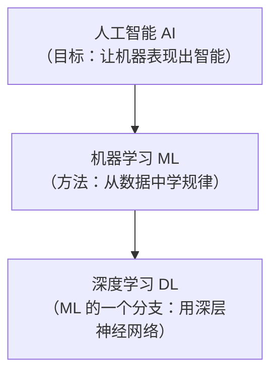
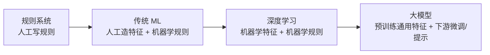

# 深入专题 · 机器学习 vs 深度学习 全面对比分析

> 这是初学者最容易混淆、面试最常追问的一组概念。本篇从定义、原理、工程、选型四个维度彻底讲清，并纠正几个流行误解。

## 1. 先纠正最大的误解：它们不是并列关系



**深度学习是机器学习的子集**——准确的说法是"传统机器学习（经典 ML） vs 深度学习"。日常说"机器学习和深度学习的区别"，实际对比的是**经典 ML 算法**（逻辑回归、XGBoost 等）与**深度神经网络**。

## 2. 本质区别：特征从哪来（一句话抓住灵魂）

| | 传统机器学习 | 深度学习 |
|--|--------------|----------|
| 特征 | **人工设计**（特征工程） | **自动学习**（表示学习） |
| 人的工作 | "把数据变成模型能懂的样子" | "设计网络结构和训练流程" |
| 瓶颈 | 特征工程师的领域经验 | 数据量 + 算力 |

**同一个任务对比（识别猫）**：
```
传统 ML：人工设计特征（耳朵形状？有没有胡须？毛发纹理？）
         → 喂给 SVM/决策树 → 分类
         特征没设计好，模型再强也没用（"特征决定上限"）

深度学习：原始像素 → 神经网络逐层自动提取
         第1层学边缘 → 第2层学纹理 → 第3层学局部形状 → 高层学"猫的特征"
         → 分类
```

**这是所有其他差异的总根源**——数据需求、算力需求、可解释性、适用场景，都由"特征谁来做"派生出来。

## 3. 十大维度全面对比

| 维度 | 传统机器学习 | 深度学习 | 说明 |
|------|--------------|----------|------|
| **特征工程** | 人工设计（核心工作量 60~80%） | 自动提取（端到端） | 最本质区别 |
| **数据需求** | 小~中（几百~几万样本可工作） | 大（通常万级起步，越多越好） | DL 要从数据自学特征，少了学不到 |
| **算力需求** | CPU 即可，分钟~小时级 | 需要 GPU，小时~月级 | 矩阵运算量差几个数量级 |
| **性能-数据曲线** | 数据增加到一定程度后**性能饱和** | 数据越多性能**持续提升**（Scaling Law） | 见下图 |
| **可解释性** | 较好（树规则、线性系数、特征重要性） | 差（黑盒，需可解释性技术补救） | 金融/医疗等强监管场景关键 |
| **模型结构** | 相对简单（一个决策边界/一组树） | 极复杂（百万~千亿参数，多层非线性） | |
| **训练时间** | 分钟~小时 | 小时~月（大模型以月计） | 影响迭代速度 |
| **硬件依赖** | 普通服务器 | GPU/TPU 集群 | 成本结构完全不同 |
| **调参重点** | 特征工程 + 少量超参 | 网络结构 + 学习率 + 训练策略 | 技能树不同 |
| **过拟合对策** | 正则化、剪枝、交叉验证 | Dropout、数据增强、早停、更多数据 | 思路相通手段不同 |

**性能-数据量曲线（经典认知图）**：
```
性能
 ↑
 │              深度学习（数据越多越强）
 │           ╱
 │        ╱
 │  传统ML ────（饱和：特征工程定了上限）
 │ ╱────
 └────────────────→ 数据量
   小数据区：传统ML赢   大数据区：深度学习反超
```

## 4. 适用场景对比（选型的核心依据）

| 场景 | 推荐 | 原因 |
|------|------|------|
| 结构化表格数据（风控、评分卡、销售预测） | **传统 ML（XGBoost）** | 特征含义明确，树模型是表格天花板，DL 无明显优势 |
| 小数据集（几百~几千样本） | **传统 ML** | DL 学不动，容易过拟合 |
| 需要向业务/监管解释"为什么" | **传统 ML（决策树/线性/评分卡）** | 可解释性是硬需求 |
| 图像识别、检测、分割 | **深度学习（CNN/ViT）** | 人工无法设计像素级特征 |
| 文本理解、机器翻译、问答 | **深度学习（Transformer）** | 语言特征无法手工穷举 |
| 语音识别与合成 | **深度学习** | 同上 |
| 推荐系统 | 混合 | 召回用传统（协同过滤），排序用深度（DeepFM/双塔） |
| 实时性极高、算力受限（嵌入式） | 传统 ML / 小模型 | 推理成本是硬约束 |
| 数据持续快速增长 | 深度学习 | 性能随数据持续增长，传统 ML 会饱和 |

**经验法则（工业界共识）**：
> **表格数据用 XGBoost，非结构化数据（图/文/音）用深度学习。**
> 这是 Kaggle 竞赛和工业实践反复验证的结论——不是深度学习万能。

## 5. 工程流程对比

```
传统 ML 流程：
  数据收集 → 【特征工程★占60-80%工作量】→ 选算法 → 训练 → 评估 → 部署
              （分桶/交叉/编码/归一化，靠领域知识）

深度学习流程：
  数据收集 → 数据清洗/增强 → 【设计网络结构★】→ 训练（GPU）→ 评估 → 部署 → 持续迭代
              （人的工作从"造特征"变成"设计结构+喂好数据+调训练"）
```

**人力成本的转移**：传统 ML 贵在**特征工程师**，深度学习贵在**算力 + 数据标注**。这就是为什么小团队做表格业务常选传统 ML（人比机器贵），而大厂做视觉/语言必选 DL（机器比人便宜，且人能做的特征设计根本不够用）。

## 6. 代码对比（同一任务，直观感受）

```python
# ── 传统 ML：特征要自己造，模型三行代码 ──────────────
import pandas as pd
from xgboost import XGBClassifier

df = pd.read_csv("churn.csv")
# ★ 特征工程：人的核心工作
df["月均消费"] = df["总消费"] / df["在网月数"]
df["最近活跃"] = (pd.Timestamp.now() - pd.to_datetime(df["最后登录"])).dt.days
df["高价值"] = (df["月均消费"] > 100).astype(int)
X = df[["月均消费", "最近活跃", "高价值", "投诉次数"]]

model = XGBClassifier(max_depth=5)
model.fit(X, df["是否流失"])          # CPU 秒级训练完

# ── 深度学习：特征不用造，但要设计结构和喂数据 ─────────
import torch.nn as nn

model = nn.Sequential(                # ★ 网络结构：人的核心工作
    nn.Linear(4, 64), nn.ReLU(),
    nn.Linear(64, 32), nn.ReLU(),
    nn.Linear(32, 1), nn.Sigmoid(),
)
# 还要写训练循环：前向 → 算 loss → 反向传播 → 更新参数（多个 epoch）
# 需要更多数据 + GPU 才可能超过上面的 XGBoost
# （这个任务本质是表格数据——传统 ML 往往更合适，见 §4）
```

## 7. 演进关系：深度学习不是"取代"，而是"扩展边界"



- 每一步都是**人的工作进一步减少，机器自动化的范围进一步扩大**
- 但旧技术没有消亡：表格场景 XGBoost 仍是王者，规则系统在高合规场景仍是兜底
- 大模型时代的新分工：**通用特征靠预训练大模型，垂直适配靠微调/RAG/Prompt**（见 [04](../04-大语言模型/README.md)）

## 8. 常见误区纠正

| 误区 | 真相 |
|------|------|
| "深度学习一定比机器学习好" | 表格数据上 XGBoost 常胜；小数据 DL 反而过拟合 |
| "深度学习不需要特征工程" | 只是特征自动化了——数据清洗、增强、标签质量依然是"新特征工程" |
| "传统 ML 已经过时" | 工业界表格业务（风控/推荐/定价）仍大量用，且更好维护 |
| "深度学习就是更深的神经网络" | 关键是**表示学习**（自动分层提取特征），深度只是手段 |
| "数据多就该用深度学习" | 还要看数据类型（表格 vs 非结构化）与可解释性要求 |

## 9. 面试速答模板（被问"区别"时的三层回答）

**第一层（一句话）**：深度学习是机器学习的子集，核心区别是**特征学习自动化**——传统 ML 靠人工特征工程，DL 靠神经网络自动分层提取特征。

**第二层（派生差异）**：由此派生出数据需求（DL 要大数据）、算力（DL 要 GPU）、可解释性（DL 黑盒）、适用场景（DL 擅非结构化，传统 ML 擅表格）的差异。

**第三层（展现判断力）**：所以选型不是"哪个先进用哪个"，而是看**数据类型（表格/非结构化）、数据规模、可解释性要求、算力预算**四个约束——表格业务我首选 XGBoost，图像文本才上深度学习。

**追问应对**：
- "为什么 DL 需要更多数据？" → 它要从零学特征，假设空间巨大，小数据必然过拟合；传统 ML 靠人工特征已经把先验知识注入，缩小了搜索空间
- "什么场景你绝不选 DL？" → 小数据 + 强可解释 + 表格 + 快速迭代（如金融评分卡）
- "特征工程在大模型时代还重要吗？" → 变形为"数据工程"（清洗/配比/质量）和"上下文工程"——人的工作没有消失，只是上移了

## 10. 学完自测检查点

1. 用"特征从哪来"一句话说清两者本质区别
2. 画出性能-数据量曲线，标出传统 ML 和 DL 各自的优势区间
3. 表格数据 / 图像 / 小样本 / 强可解释 四个场景各该选什么？为什么？
4. 传统 ML 流程中人的核心工作是什么？DL 流程中呢？
5. 解释"深度学习没有取代传统 ML，而是扩展了边界"
6. 被问"为什么不都用深度学习"时，能给出至少 4 个约束维度

## 延伸阅读

- [02-机器学习/经典算法详解](../02-机器学习/经典算法详解.md) —— 传统 ML 各算法详解
- [README](./README.md) —— 深度学习原理入门
- [Transformer逐层拆解](./Transformer逐层拆解.md) —— DL 最强架构的深度剖析
- [14-技术对比与选型](../14-技术对比与选型/README.md) —— 更多横向对比表
