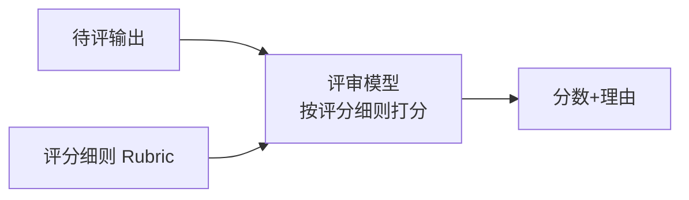
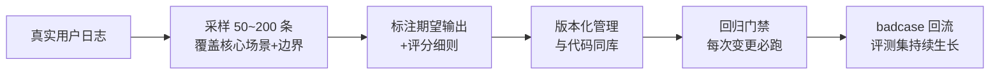

# 深入专题 · LLM 评估与评测（概率系统的质量度量）

> 传统软件"测过就对"，LLM"测过也可能错"——评估不是上线前的一次动作，而是贯穿开发全周期的基础设施。本篇统一讲清：评什么、怎么评、怎么防被骗。

## 1. 为什么 LLM 评估难（先理解问题）

| 难点 | 说明 |
|------|------|
| 输出开放 | 没有唯一标准答案（一千种"对"的说法） |
| 概率性 | 同一输入多次输出不同 → 单次测试无意义，要看分布 |
| 维度多 | 正确性只是其一，还有忠实度/格式/语气/安全/延迟/成本 |
| 榜单失真 | 数据污染 + 针对性优化 → 公开榜单 ≠ 你的业务表现 |
| 评估者本身也是概率系统 | LLM-as-Judge 有偏差（偏好长答案、偏好自己家族模型的输出） |

**核心结论**：**公开榜单用于初筛，自建评测集用于决策**——这是全篇最重要的一句话。

## 2. 评估方法四大类

### 2.1 基准测试（Benchmark）

| 类型 | 代表 | 测什么 | 局限 |
|------|------|--------|------|
| 知识理解 | MMLU、C-Eval、CMMLU | 多学科知识 | 选择题形式与真实对话差距大 |
| 推理数学 | GSM8K、MATH、GPQA | 逐步推理 | 易被针对性训练"刷分" |
| 代码 | HumanEval、MBPP、SWE-bench | 函数生成/真实 issue 修复 | HumanEval 已严重污染，SWE-bench 更可信 |
| 指令遵循 | IFEval | 格式约束遵守 | 单一维度 |
| 综合对话 | Arena（人类投票 Elo） | 真实偏好 | 偏好≠正确，长而自信的答案占便宜 |

**使用姿势**：看趋势不看绝对值；多个互补榜单交叉看；**优先看"模型发布后新建"的榜单**（防污染）。

### 2.2 LLM-as-Judge（模型评审）

- **三种模式**：单输出打分（pointwise）、两两对比（pairwise，更稳）、参考答案对比（reference-based）
- **必备工程细节**：
  1. **评分细则 Rubric 要具体**（"事实错误 -2 分、未引用来源 -1 分"，而非"好不好"）
  2. **位置偏差控制**：pairwise 时交换 A/B 顺序各评一次取平均
  3. **用强模型评、评完抽样人审**：先建立"LLM 评审 vs 人工评审"的一致率（>85% 才可信）
  4. 评审 prompt 与生成 prompt **不要让同一模型既当运动员又当裁判**（同家族偏差）

### 2.3 人工评估

- 抽样比例：日常 5%、重大变更 20%、上线初期 50%
- 标注规范先行：多人标注时先算**标注一致率**（Cohen's Kappa > 0.7 才可聚合）
- 成本控制：让 LLM 预筛（只人审"模型不确定"和"模型判错"的样本）

### 2.4 规则与程序评估（最便宜最可靠，优先用）

- 格式类：JSON Schema 校验、正则、长度约束
- 事实类：NLI 忠实度检测（答案句 vs 来源段）、数值与数据库对账
- 代码类：**直接跑测试**（可执行评估是最强评估——能跑测试就别让人/模型看）
- **优先级原则**：能用程序评的不用 LLM 评，能用 LLM 评的不用人评

## 3. 业务评测集：怎么建（决定成败的工程）

**七个实践要点**：
1. **从真实分布采样**，不要拍脑袋编题（编的题和真实用户问的分布完全不同）
2. 覆盖核心场景 + 已知边界 + 历史 badcase（比例约 6:2:2）
3. 每题附"期望 + 评分细则"，开放式题目用关键点核对而非全文比对
4. 与 Prompt/模型版本**同库管理**——变更要能回溯"哪次改动影响了哪题"
5. 设回归门禁：总分下降 > 阈值（如 3%）即阻断发布
6. 线上 badcase 每周回流 → 评测集是"活"的资产
7. 防过拟合评测集：定期更换部分题目，避免团队"针对评测集优化"

## 4. 数据污染：怎么防被骗

- **检测**：n-gram 重叠分析（评测题与训练语料比对）；把题目**改写/换数字/换语境**后重测，性能骤降即疑似污染
- **对策**：用模型发布日期之后新建的评测集；自建私有评测集不公开（公开即可能被爬）
- **态度**：榜单分数高 2 分可能是污染或噪声，**低 10 分一定是真不行**——负面信号比正面信号可信

## 5. 场景化评估方案速查

| 场景 | 核心指标 | 评估组合 |
|------|----------|----------|
| 通用对话 | 满意度、多轮一致性 | Arena 初筛 + 人工抽检 + 线上信号 |
| RAG 问答 | 检索命中率、忠实度、答案相关性 | RAGAS + 自建"问题→答案块"评测集 |
| 代码生成 | 测试通过率、缺陷率 | 可执行测试（HumanEval/SWE-bench + 私有单测） |
| Agent | 任务完成率、平均步数、工具调用正确率、成本 | 轨迹评估（LLM-as-Judge 评 Trace）+ 端到端任务集 |
| 内容生成 | 事实错误率、品牌合规 | NLI 校验 + 规则扫描 + 人工抽审 |
| 分类/抽取 | 准确率/P/R/F1 | 程序评估（标注集）——最传统最可靠 |

## 6. 线上质量信号（评估的下半场）

离线评测再好也覆盖不了真实分布，线上要看：
- **显性信号**：点踩率、复制采纳率（代码场景）、改写率（用户让 AI 重写=不满意）
- **隐性信号**：追问"你确定吗"（不信任）、会话中途放弃、转人工率、重复提问（没答到点上）
- **对比方法**：任何变更走 A/B 灰度，看相对变化不看绝对值

## 7. 常见误区

- ❌ 用 MMLU 分数向老板证明"我们的客服机器人很好"（维度错位）
- ❌ 评测集只有 20 条还全是 happy path（统计噪声 + 无边界覆盖）
- ❌ LLM-as-Judge 直接用不校准（先测人机一致率）
- ❌ 只看平均分不看分布（平均分 4.2 但 5% 严重错误，C 端就是事故）
- ❌ 改 Prompt 不跑回归（"感觉变好了"是最贵的错觉）

## 8. 学完自测检查点

1. 为什么说"公开榜单用于初筛，自建评测集用于决策"
2. LLM-as-Judge 的四个必备工程细节
3. 评估优先级原则（程序 > LLM > 人工）为什么成立
4. 评测集七要点中，哪两条防止"越优化越偏"
5. 检测数据污染的两种方法
6. 为"RAG 客服"设计完整评估方案（离线 + 线上）

## 延伸阅读

- RAG 专项评估 → [07/RAG进阶实战 §2](../07-RAG与知识库/RAG进阶实战.md)
- 上线质量闭环 → [15/非功能设计清单 §6](../15-AI系统设计/03-非功能设计清单.md)
- 面试考点（榜单污染/RLHF 评估）→ [题库03](../12-AI面试题库/03-预训练微调与对齐.md) Q18-Q19
