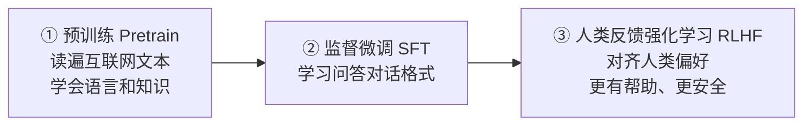

# 04 · 大语言模型（LLM）

## 1. 本质：下一个词预测机

大语言模型（Large Language Model）的核心任务极其简单：**给定前面的文字，预测下一个最可能的 token**。但海量数据 + 巨量参数让它"涌现"出推理、翻译、编程等能力。

```
输入："中国的首都是" → 模型计算所有可能下一个词的概率 → "北京"(95%) "上海"(2%) ...
```

- **涌现能力（Emergent Ability）**：参数规模跨过阈值后突然出现的未训练能力
- **Scaling Law**：模型性能与参数量、数据量、算力呈可预测的幂律关系

## 2. LLM 的训练三部曲



| 阶段 | 产出 | 类比 |
|------|------|------|
| 预训练 | Base 模型（知识渊博但不会对话） | 博览群书但没学会待人接物 |
| SFT | 会按指令回答 | 学会了职场沟通 |
| RLHF | 回答更符合人类喜好 | 有了"情商" |

**推理模型（如 DeepSeek-R1、o 系列）**：在 RL 阶段强化"思维链"能力，回答前先自我推理，数学/代码表现大幅提升。

## 3. 主流模型速览

> 注：模型迭代极快，最新格局请让「AI学习小能手」用 web-search-free 联网核实。

| 系列 | 厂商 | 特点 |
|------|------|------|
| GPT 系列 | OpenAI | 综合能力标杆，生态最完整 |
| Claude 系列 | Anthropic | 长文本、编程、写作出色，重视安全 |
| Gemini 系列 | Google | 原生多模态、超长上下文 |
| DeepSeek | 深度求索 | 国产开源标杆，推理能力强，性价比高 |
| Qwen 通义千问 | 阿里 | 开源生态活跃，多尺寸全 |
| Llama 系列 | Meta | 开源鼻祖，衍生模型众多 |

**开源 vs 闭源**：开源（可私有化部署、可微调）vs 闭源（API 调用、能力通常最强）。

## 4. 关键概念

- **Token 与计费**：API 按 token 计费，输入输出分开计价；约 1000 汉字 ≈ 1000~2000 token
- **上下文窗口**：从 4K 到 100 万+ token；窗口越大能"记住"的对话/文档越长，但成本越高
- **温度（Temperature）**：控制随机性。0 = 稳定保守（适合事实问答/代码），1+ = 发散创造（适合头脑风暴）
- **幻觉（Hallucination）**：模型会一本正经地编造不存在的事实 → 对策：RAG、让模型引用来源、人工核查
- **蒸馏（Distillation）**：用大模型教小模型，得到便宜又强的小模型
- **MoE 混合专家**：每次只激活部分"专家"参数，DeepSeek、Mixtral 用此降低成本

## 5. 能力边界

| 擅长 | 不擅长 |
|------|--------|
| 写作、翻译、总结、改写 | 精确计算（应调用计算器/代码） |
| 代码生成与解释 | 训练截止后的最新信息（应联网/RAG） |
| 通用推理与问答 | 保证事实 100% 正确（幻觉） |
| 多轮对话、角色扮演 | 访问你的私有数据（应 RAG/Agent） |

## 6. 实践建议

1. 同一问题分别用 temperature=0 和 1 提问，感受输出差异
2. 申请一个 API（DeepSeek 等国产 API 便宜适合练手），用 curl/Python 发出第一次调用
3. 对比 2~3 个模型回答同一复杂问题，建立"模型各有擅长"的体感

## 7. 延伸阅读

- [训练推理全链路详解](./训练推理全链路详解.md) —— 深入专题：从数据到部署的完整工程链路
- [LLM评估与评测专题](./LLM评估与评测专题.md) —— 深入专题：榜单/LLM-as-Judge/自建评测集/数据污染/线上信号
- [05-Prompt工程](../05-Prompt工程/README.md) —— 用好 LLM 的第一技能
- [07-RAG与知识库](../07-RAG与知识库/README.md) —— 解决幻觉与私有知识

## 重点·陷阱·工程注意事项

**必记重点**
- 本质一句话：下一个 token 预测机，能力来自规模涌现；训练三部曲（预训练→SFT→对齐）顺序不能乱
- **知识归 RAG，能力归微调**——LLM 应用的第一性原理
- 温度/上下文/token 计费是使用层三要素；幻觉是特性不是 bug，要靠工程手段对冲

**高频陷阱**
- ❌ **指望微调注入新知识**：会加剧幻觉且更新困难，知识必须走 RAG
- ❌ 把模型输出当事实直接交付：关键场景必须引用来源 + 人工抽检
- ❌ 用 Prompt 塞几十页资料当"知识库"：成本爆炸 + Lost in the Middle，该上 RAG
- ❌ 看榜单选模型：数据污染普遍存在，**必须用自建评测集**复测
- ❌ 对推理模型（R1 类）写"让我们一步步思考"：内置思维链会被干扰，直接提问即可

**工程案例与注意事项**
- 成本粗算：训练 FLOPs ≈ 6NT；推理成本 ≈ 每轮（输入+输出）token × 单价 × 调用量——上线前必须算
- API 省钱四招：小模型路由、Prompt 瘦身、缓存命中、离线任务走批量 API（半价）
- 时效敏感内容（模型排名/价格）以"季度"为单位过期，**用 web-search-free 联网核实后再引用**

## 学完自测检查点

1. 用"下一个词预测"解释 LLM 的本质，以及涌现能力的含义
2. 训练三部曲各自的目标，为什么顺序不能乱
3. 推理模型（R1 类）与普通模型的差异在哪训出来的
4. 温度、上下文窗口、token 计费三个概念，及各自的使用建议
5. 幻觉的成因与 4 种缓解手段
6. "知识归 RAG，能力归微调"——能解释这句话并举例
