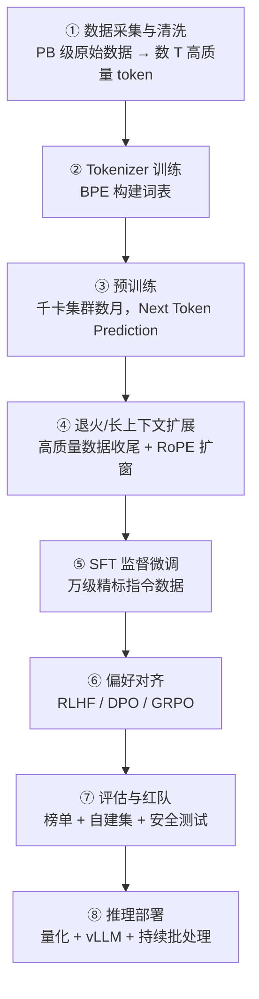
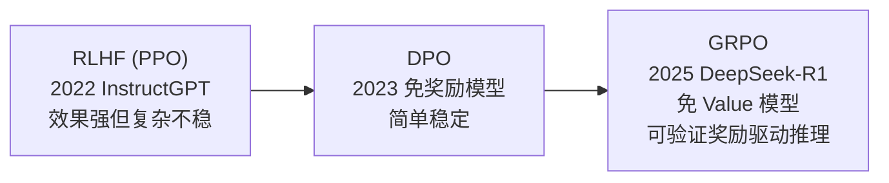

# 深入专题 · LLM 训练与推理全链路详解

> 从原始网页文本到一个能对话的模型，每一步的工程决策。理解全链路，才能真正理解"为什么大模型这么贵"以及各优化技术在优化什么。

## 1. 全链路地图

## 2. 数据：决定上限的隐形战场

### 2.1 数据配比（为什么不是"全扔进去"）

| 数据类型 | 作用 | 典型占比思路 |
|----------|------|--------------|
| 网页（Common Crawl 清洗） | 通用知识与语言 | 主体（60%+） |
| 书籍/论文 | 长文逻辑与深度知识 | 10%± |
| 代码 | 提升推理与结构化能力（即使非代码模型也加） | 10~20% |
| 数学/推理 | 逻辑思维 | 5%± |
| 多语言 | 跨语言能力迁移 | 按需 |

### 2.2 清洗流水线

去重（MinHash 近似去重 + 精确去重）→ 质量过滤（启发式规则 + 小模型打分）→ 有害/隐私过滤 → 去污染（剔除评测集 n-gram 重叠）。

**关键认知**：GPT-3 时代"量取胜"，Llama3/R1 时代"质取胜"——数据质量每提升一档，胜过参数扩一倍。

## 3. 预训练工程

### 3.1 算力估算（面试常考）

$$\text{FLOPs} \approx 6 \times N \times T$$

- N=参数量，T=token 数；系数 6 = 前向 2 + 反向 4（每参数每 token 的乘加运算）
- 例：70B 模型训 2T token ≈ 8.4×10²³ FLOPs ≈ 数千张 H100 跑数月

### 3.2 训练超参的关键决策

- **学习率**：Warmup（前几千步线性升到峰值）→ 余弦衰减到峰值 10%；峰值 lr 随模型变大而变小（7B 约 3e-4，70B 约 1.5e-4）
- **Batch Size**：全局数百万 token/步，配合梯度累积实现
- **稳定性三件套**：BF16 混合精度、梯度裁剪（clip 1.0）、Loss spike 监控与回滚

### 3.3 分布式并行（见 [面试题库 06](../12-AI面试题库/06-推理部署与工程落地.md) Q9）

DP + TP + PP + ZeRO 组合使用：机内 TP、机间 PP/DP，是千亿模型的标准配方。

## 4. 后训练（Post-Training）：从"博学的复读机"到"好用的助手"

### 4.1 SFT：教格式，不教知识

- 数据：数千~数万条高质量 (指令, 回答) 对；LIMA 证明 1000 条精标即可显著对齐
- 关键：Loss 只算回答部分（prompt 部分 mask 掉）
- 误区：指望 SFT 注入大量新知识 → 不可靠，会加剧幻觉（知识应走预训练/RAG）

### 4.2 偏好对齐的演进

- **RLHF**：训奖励模型 → PPO 在线采样优化；痛点：reward hacking、训练不稳
- **DPO**：直接拿 (chosen, rejected) 偏好对做分类式训练，数学上等价于某种隐式奖励的 RLHF
- **GRPO**：同一 prompt 采 G 个回答，组内相对优劣作为优势信号，省掉 Value 模型 → 配合"可自动判分"的数学/代码奖励，规模化训练出长思维链

### 4.3 推理模型的"aha moment"

R1-Zero 实验证明：纯 RL（无 SFT 冷启动）也能涌现出**自我反思、验证、延长思考**行为。Test-time Scaling 成为与预训练 Scaling 并列的新维度。

## 5. 推理部署：让模型跑得起、跑得快

### 5.1 推理的两大阶段与瓶颈

| 阶段 | 行为 | 瓶颈 | 优化 |
|------|------|------|------|
| Prefill | 并行处理全部输入 | 算力 | Prefix Cache、分块 Prefill |
| Decode | 逐 token 自回归 | **显存带宽** | 量化、投机采样、KV Cache 压缩 |

- 核心公式：Decode 每步理论耗时 ≈ 模型参数字节数 ÷ 显存带宽（读一遍权重才能算一步）→ 这解释了为什么**量化（权重复变小）能近线性提速**

### 5.2 部署技术栈选型

- 框架：vLLM（吞吐首选，PagedAttention + Continuous Batching）、SGLang（复杂调度/RadixAttention）、TensorRT-LLM（极致性能、NVIDIA 绑定）、llama.cpp（CPU/端侧）
- 量化：W8A8（ SmoothQuant）/ W4A16（AWQ、GPTQ）/ KV Cache FP8
- 服务化：流式 SSE、动态批处理、多 LoRA 热加载

### 5.3 成本核算直觉

- 自托管盈亏平衡点：日调用 token 量稳定超过某阈值（视模型大小，通常百亿级 token/月）时，自部署开源模型 < 调 API
- API 定价本质 = 硬件折旧 + 电力 + 利用率利润 → 夜间/离线批量 API 半价（填谷）

## 6. 全链路视角的经典面试问题

1. **"数据、算法、算力，哪个最重要？"** —— 分阶段：预训练数据是上限，后训练算法（对齐/RL）定体验，推理期算力工程定成本
2. **"为什么开源模型追得快？"** —— 架构趋同（Decoder-only + RoPE + SwiGLU + GQA）后，竞争本质是数据配方与训练工程，这些可以被蒸馏数据部分绕过
3. **"下一步瓶颈在哪？"** —— 高质量文本 token 即将耗尽（数据墙）→ 合成数据、推理时计算（o1/R1 范式）、多模态与 Agent 交互数据是新增长点
