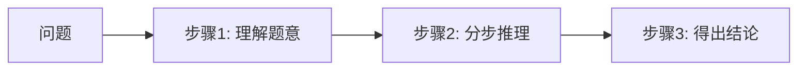

# 05 · Prompt 工程（提示词工程）

> 投入产出比最高的 AI 技能：不改模型，只改"怎么问"，效果天差地别。

## 1. 好 Prompt 的黄金公式

```
好 Prompt = 角色 + 任务 + 背景 + 要求 + 输出格式 + 示例
```

**反面**：`帮我写个方案`
**正面**：
```
你是一位有10年经验的产品经理（角色）。
请为一款面向大学生的记账 App 撰写推广方案（任务）。
目标用户是18-24岁大学生，预算5万元（背景）。
要求包含渠道选择、活动设计、预算分配（要求）。
用 Markdown 表格输出预算部分（输出格式）。
参考结构：1.目标 2.策略 3.执行 4.预算（示例/结构）。
```

## 2. 核心技巧速查表

| 技巧 | 说明 | 示例 |
|------|------|------|
| 角色扮演 | 给模型设定专家身份 | "你是一位资深 Go 架构师" |
| Zero-shot | 直接提问 | "把这段话翻译成英文" |
| Few-shot | 给几个示例让模型模仿 | 提供 2~3 组"输入→输出"样例 |
| 思维链 CoT | 让模型一步步推理 | "请逐步思考后再给出答案" |
| 结构化输出 | 指定 JSON/Markdown/表格 | "用 JSON 输出，字段为..." |
| 分隔符 | 用 ``` 或 --- 隔离内容 | 防止指令与数据混淆 |
| 迭代追问 | 先草稿再优化 | "很好，再把语气改得更正式" |
| 自我检查 | 让模型自查 | "请检查你的答案是否有遗漏" |

## 3. 进阶模式

### 思维链（Chain-of-Thought）



适合数学、逻辑、复杂分析。写法："让我们一步步思考"（Let's think step by step）。

### ReAct（推理 + 行动）

Agent 的基础模式：`思考(Thought) → 行动(Action) → 观察(Observation) → 再思考...` 循环，直到解决问题。

### 提示词注入防御

恶意用户在输入中夹带指令（"忽略之前的所有指令"）。防御：用分隔符隔离用户输入、在系统提示中明确边界、对输出做校验。

## 4. 常见场景模板

### 代码生成
```
你是资深 {语言} 工程师。需求：{具体描述}。
约束：{框架版本/风格规范}。
请先说明实现思路，再给出完整可运行代码，最后列出注意事项。
```

### 学习辅导（苏格拉底式）
```
你是我的学习导师。不要直接给答案，而是通过提问引导我自己思考。
当我答错时，指出思路中的问题而不是给出正确答案。
```

### 文档总结
```
请总结以下文档，要求：
1. 一句话核心观点
2. 3-5 个要点（每条不超过30字）
3. 文中提到的关键数据
文档：```{内容}```
```

## 5. 实践建议

1. 把同一个需求用"一句话"和"黄金公式"各问一次，对比输出质量
2. 建立自己的 Prompt 模板库，存到本目录 `templates/` 下持续迭代
3. 复杂任务拆成多轮：先大纲 → 再逐段 → 最后润色

## 6. 延伸阅读

- [Prompt工程进阶](./Prompt工程进阶.md) —— 深入专题：系统提示词架构、AGENTS.md、PromptOps、注入攻防
- [06-AI-Agent智能体](../06-AI-Agent智能体/README.md) —— Prompt 是 Agent 的"灵魂"
- OpenAI / Anthropic 官方 Prompt 指南

## 学完自测检查点

1. 默写 Prompt 黄金公式六要素，并现场改写一个"一句话烂 prompt"
2. Few-shot 和 CoT 分别在什么任务上最有效
3. 什么是提示注入，至少说出 3 种防御手段
4. 为什么复杂任务要拆多轮而不是一次问完
5. 对推理模型（R1 类）还该不该写"让我们一步步思考"？为什么（见[进阶篇](./Prompt工程进阶.md) §1）
