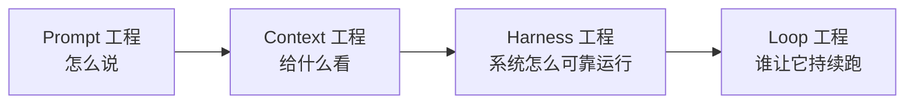

# 深入专题 · Agent 工程体系总览（Prompt → Context → Harness → Loop）

> 2022-2026 年 AI 工程的核心叙事演进。理解这条线，就理解了"为什么模型能力趋同后，竞争力在工程"。

## 1. 四代工程范式演进

| 时期 | 范式 | 核心问题 | 驱动者 |
|------|------|----------|--------|
| 2022-2024 | **Prompt Engineering** 提示词工程 | 这句话怎么写，模型才能更好理解？ | 人 |
| 2025 | **Context Engineering** 上下文工程 | 这一步该给模型**看什么**信息？ | 人 |
| 2026 初 | **Harness Engineering** 外壳工程 | 如何把模型变成**可信赖的 Agent**？ | 人（启动） |
| 2026 中 | **Loop Engineering** 循环工程 | 如何让 Agent **持续自主**工作？ | 系统（自驱动） |

**本质**：不是上下级替代，而是**抽象层次的演进**——从"调模型"到"调系统"、从"单次调用"到"持续运行"、从"人工驱动"到"系统驱动"。后者包含前者。



**核心公式**：`Agent = Model + Harness`（模型之外的一切都是 Harness）
**核心信条**：*"It's not a model problem. It's a configuration problem."*（瓶颈常不在模型，在配置）

## 2. 各范式一句话定位

| 范式 | 一句话 | 详见 |
|------|--------|------|
| Prompt 工程 | 让单次调用更准更稳（"调参"） | [05-Prompt工程](../05-Prompt工程/README.md) + [进阶](../05-Prompt工程/Prompt工程进阶.md) |
| Context 工程 | 在合适时机给正确且必要的信息 | [上下文工程详解](./上下文工程详解.md) |
| Harness 工程 | 文件系统/沙箱/约束/反馈回路/观测，让长链路任务持续正确 | [Harness工程实战](./Harness工程实战.md) |
| Loop 工程 | 自我触发（cron/事件/条件），跨 session 自主运行 | 本文 §5 |

**佐证（为什么工程 > 模型）**：
- 同一模型仅替换文件编辑接口，编码评测得分 **6.7% → 68.3%**
- LangChain 不换模型，只优化文档组织与验证回路，Terminal Bench 排名 **30 → 5**（52.8% → 66.5%）

## 3. Harness 的五层结构（重要框架）

借 **Mechanism vs Policy（机制与策略分离）** 理解，从底到顶：

| 层 | 名称 | 性质 | 回答的问题 | 典型内容 |
|----|------|------|-----------|----------|
| L5 | Design Instance 设计实例 | 具体 Policy | 为某个目标怎么组合？ | Claude Code、Stripe Minions、AGENTS.md 配置 |
| L4 | Pattern 可复用模式 | 可复用 Policy | 一组能力该怎么组合？ | Plan-Act-Verify、渐进式披露、Loop |
| L3 | Design Axes 设计轴 | 上层 Mechanism | 有哪些可选项？ | 10 个设计轴（见下） |
| L2 | Framework 机制/运行时 | 底层 Mechanism | 能做什么？ | 工具调度、沙箱、MCP、Skill、Trigger |
| L1 | Cross-cutting 横切基础 | 贯穿所有层 | 基础能力 | Prompt 工程、Context 工程 |

### L3 的 10 个设计轴（Design Axes）

| 组 | 轴 | 取值范围 |
|----|-----|----------|
| 结构 | topology 拓扑 | 单 Agent ↔ 多 Agent |
| 结构 | coordination 协同 | 编排 orchestration ↔ 协作 cooperation |
| 结构 | session span 会话跨度 | 单会话 ↔ 跨会话 |
| 行为 | control loop 控制循环 | ReAct / Plan-Execute / Tree Search |
| 行为 | autonomy 自主度 | 全自动 ↔ 审批制 ↔ 监督制 |
| 行为 | execution isolation 执行隔离 | 无 ↔ git worktree ↔ 沙箱 ↔ 完整 VM |
| 资源 | memory 记忆 | 工作记忆 / 长期记忆 / 共享记忆 |
| 资源 | tool type 工具类型 | 函数 / 环境 / 验证 / 工作流 |
| 资源 | verification 验证 | 计算式（跑测试）↔ 推断式（LLM 评审） |
| 资源 | compaction 压缩 | 7 种上下文压缩策略 |

**关键认知**：Multi-Agent 只是 topology 轴上的一个取值，不是什么高级独立层；用**连续设计轴**思考，而非离散贴标签。

### L4 的 9 个经典模式（Pattern）

Plan-Act-Verify（计划-执行-验证）、Progressive Disclosure（渐进式披露）、State Outside Context（状态存上下文之外）、Clean-Context Continuation（干净上下文接续）、Approval Checkpoints（审批检查点）、Initializer + Coding Agent、Planner/Evaluator Split（规划/评审分离）、Approved Fixtures（核准测试基座）、Ralph Loop（自触发循环）。

## 4. Graph Engineering（图编排工程）

把 Agent 系统建模为**有向图**：节点 = Agent/工具/人工审批，边 = 流转条件，配套状态（State）、检查点（Checkpoint，可中断恢复）、并行分支。

- 适用：多步骤、有明确主干但分支复杂的生产流（审批流、多 Agent 流水线）
- 代表：LangGraph；Stripe Minions 用"确定性节点 + Agent 节点"混合状态机
- 与 Loop 区别：图编排管"一次任务内怎么走"，Loop 管"任务何时被发起"
- 与 GraphRAG 无关（名字相似，一个是 Agent 编排，一个是知识图谱检索）

## 5. Loop Engineering（循环工程）

**定位**：Harness Pattern 层的一个成员（与 Plan-Act-Verify 平级），不是独立新层。

**唯一新增能力：Self-triggering（自我触发）**
- 触发方式：Cron 定时 / Event 事件（webhook）/ Condition 条件阈值
- 分类：Polling 主动扫描 vs Event-driven 事件推送

**依赖的三个既有能力**：
1. Self-prompting：触发后自动生成结构化 prompt
2. State persistence：跨 session 状态传递（文件/artifact，靠 State Outside Context 模式）
3. Trigger 系统：框架层的定时/事件机制

**与 ReAct 的本质区别（正交可组合）**：

| 维度 | ReAct | Loop 工程 |
|------|-------|-----------|
| 循环位置 | Agent **内部** | Harness **外部**调度 |
| 循环范围 | 单 session 内 | **跨 session** |
| 主导者 | 模型 | 系统 |

**实例**：Stripe Minions 每周自动合并 1300+ PR（PR webhook 触发，CI 失败两次升级人工）；CI Auto-Fix（定时扫描→自动生成 prompt→修复→校验→自动开 PR→通知）。

**范式意义**：人从"Agent 的老板"变成"系统的架构师"——Agent 7×24 自主工作，人设计环境和把关质量。

## 6. Spec-Driven Development（规约驱动开发）

AI 编程的矫枉过正：模糊 Prompt → 看似能跑实则错的代码。SDD 把流程拉回工程纪律：

```
规格（Spec，写什么/为什么）→ 计划（Plan，怎么做/技术选型）→ 任务（Tasks，可验证的小步）→ AI 实现 → 验证
```

- 核心：AI 对**明确规格**的实现能力远强于对**模糊意图**的猜测能力
- 规格即契约：review 的对象从代码前移到规格（人审规格比审代码快 10 倍）
- 代表实践：GitHub Spec Kit、OpenSpec、Kiro

## 7. 落地顺序建议

```
Prompt 写好 → Context 管好 → 加 Harness Pattern（先验证闭环）
→ 需要时上 Framework（沙箱/MCP）→ 最后自动化（Loop）
```

**不要跳级**：没有验证闭环就上多 Agent + Loop，等于把混乱自动化。先补最短的环（入口约束 → 编译测试 → 失败反馈为可执行操作）。

## 8. 延伸阅读

- [上下文工程详解](./上下文工程详解.md) —— Smart/Dumb Zone、压缩策略、渐进式披露
- [Harness工程实战](./Harness工程实战.md) —— 六层检查框架、成熟度阶梯、OpenAI/Stripe 案例
- [面试题库 05](../12-AI面试题库/05-Agent与MCP.md)、[09 专项](../12-AI面试题库/09-Agent-MCP-Skills专项题库.md) —— 对应面试题
