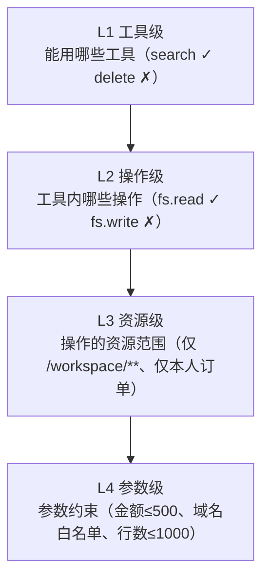
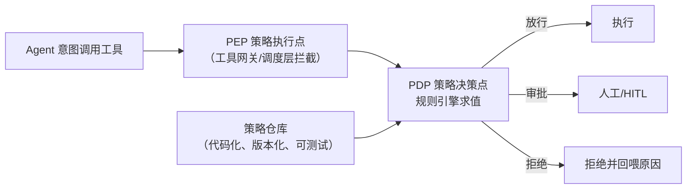

# 深入专题 · Agent 权限体系与动态授权

> 核心命题：传统权限管"人按按钮"，Agent 权限要管"**一个概率系统以用户名义自主行动**"——它可能犯错、可能被注入、可能在半夜运行。本篇讲清权限怎么规划、怎么实现、以及人机交互中怎么**动态升降权限**。

## 1. Agent 权限与传统权限的四大差异

| 维度 | 传统应用权限 | Agent 权限 |
|------|--------------|-----------|
| 行为主体 | 人（每个动作有明确意图） | **概率系统**（动作由模型即兴决策） |
| 行为可预测性 | 高（代码路径固定） | 低（路径动态生成，包括意料之外的组合） |
| 攻击面 | 应用漏洞 | 漏洞 + **Prompt 注入劫持意图** |
| 授权时机 | 登录时一次授权 | 需要**运行时动态升降**（JIT 提权/异常降权） |

**由此得出的三条设计铁律**：
1. **Agent 不继承用户全量权限**——只拿完成任务的最小集（最小权限原则）
2. **权限不能只在启动时配置**——必须支持运行时动态调整（本文重点）
3. **权限判定在代码层，不在 Prompt 层**——Prompt 是"劝阻"，策略引擎才是"保险"

## 2. 权限模型选型（Agent 场景适配分析）

| 模型 | 原理 | Agent 场景适配 | 结论 |
|------|------|----------------|------|
| ACL（访问控制表） | 每个资源挂允许列表 | 粒度太粗，工具多了管不过来 | 不用 |
| RBAC（角色） | 角色→权限集，人挂角色 | Agent 任务差异大，角色爆炸（"订机票的""查日志的"各要一个角色） | 可作粗粒度底座 |
| **ABAC（属性）** | 按属性（资源类型/操作/金额/时间/风险级）算策略 | **最适合**：策略=规则函数，天然支持"金额>500 需审批"这类细粒度 | **主力模型** |
| Capability（能力凭证） | 持有什么令牌就能做什么，令牌可委派可收窄 | 与 Agent 工具调用天然契合（每个工具调用带一个受限 capability） | MCP/A2A 生态方向 |
| OAuth Scope | 令牌带范围声明（read:orders） | 代理用户调用第三方 API 的标准做法 | 外部集成必选 |

**推荐架构**：**RBAC 定角色底座（管理员/操作员/只读）+ ABAC 做细粒度策略 + OAuth Scope 对接外部服务**。

## 3. 权限粒度的四层（规划时逐层定义）



**示例策略（ABAC 风格，伪代码）**：
```
允许: tool=db_query  AND 操作=SELECT AND 表∈{orders, products} AND 行数≤1000
审批: tool=payment   OR  金额>500    OR  收件人∉公司域
拒绝: tool=shell     AND 命令匹配 /(rm\s+-rf|curl.*\|.*sh)/
```

**MCP 生态的标准化信号**：工具可声明注解（`readOnlyHint`、`destructiveHint`、`openWorldHint`），平台据此自动定初始风险档——描述即权限元数据。

## 4. 实现架构：PDP / PEP 分离 + 策略即代码



- **PEP**：拦截点必须**唯一且强制**——所有工具调用都要过这一道闸（绕过路径=权限体系失效）
- **PDP**：独立策略引擎（开源方案：**OPA/Rego**、AWS **Cedar**），策略与代码解耦
- **策略即代码**：策略文件进 git、有单测（"金额 501 必须触发审批"要测）、变更走评审——策略变更 = 权限变更 = 高危操作
- **决策可解释**：每次判定输出"命中了哪条策略"（审计与调试都靠它）

## 5. 动态授权：人机交互中的权限实时调整（本篇核心）

### 5.1 运行时提权：JIT 审批 + 三级授权记忆

Agent 执行中碰到超出当前权限的动作 → 暂停并发起**即时授权请求**，人可选择授权范围：

| 选项 | 效果 | 适用 |
|------|------|------|
| 仅本次 | 放行这一次，下次再触发再问 | 偶发操作 |
| 本会话内允许 | 当前任务/会话内同类动作不再询问 | 批量同类操作（防审批疲劳） |
| 永久允许 | 写入策略仓库成为长期规则 | 反复出现的低风险动作 |

**关键设计**：
- 永久允许 = **修改权限策略**，本身要走二次确认 + 入审计（防止注入诱导用户点"永久"）
- 记忆按"动作签名"匹配（工具+操作+资源模式），不是模糊记忆（"允许读文件"≠"允许读所有文件"）
- 三级记忆都可随时在权限面板中**查看与撤销**

### 5.2 权限滑块（Autonomy Slider）：人主动调档

把自主度做成用户可拖动的连续档位（而非二元开关），运行中随时可改：

```
档位 1 只读建议：Agent 只能看和说，任何动作需人执行
档位 2 审批模式：只读自动 + 写入需审批（默认）
档位 3 监督模式：低风险自动 + 高风险审批 + 人抽检
档位 4 委托模式：白名单内全自动，例外升级（需先解锁+确认风险）
```

**实现要点**：
- 档位映射到策略引擎的**规则集开关**（每档一组策略模板），切换即时生效、入审计
- 升档（放权）需确认风险告知；**降档（收权）必须即时且无确认**——安全相关的操作不能有摩擦
- 档位粒度可到单工具：全局档位 3，但"删除"类永远档位 2（关键动作权限地板）

### 5.3 风险自适应降权：系统自动收紧（最被低估的机制）

人不在线时也要能自动降权。触发信号 → 动作：

| 触发信号 | 自动动作 |
|----------|----------|
| 检测到 Prompt 注入特征 | 本会话降为"审批模式"，并通知用户 |
| 越权尝试（访问白名单外资源） | 冻结该工具 + 审计告警 |
| 异常高频调用（脚本化行为） | 限流 + 降档 |
| 连续失败/被拒 2 次（two-strike） | 停止重试，升级人工 |
| 任务漂移（偏离原始目标） | 暂停并请求人确认新目标 |

**设计原则**：**升权要人批，降权自动化**——权限系统的非对称性：放宽需谨慎，收紧要果断。

### 5.4 审批疲劳防护（动态权限最大的 UX 敌人）

- **批量审批**：一次列出多个待批动作勾选（"批准全部 3 个文件读取"）
- **授权记忆**（§5.1 三级）减少重复询问
- **风险分级展示**：低风险动作折叠为一行摘要，高风险才展开卡片
- **静默阈值学习**（谨慎使用）：统计某类动作历史批准率 100% 且零事故 → 建议用户转为自动（**建议需人确认，系统不得自行转正**）

### 5.5 授权界面三件套（每次请求必须展示）

1. **做什么**：动作 + 参数（人话描述，不是 JSON）
2. **为什么**：Agent 的决策理由（哪一步推理导致这个需求）
3. **影响与回滚**：影响范围 + 撤销方式（无回滚的要红标）

缺任何一项的审批 = 逼人盲签，等于没有审批。

## 6. 真实系统案例

| 系统 | 权限做法 | 可借鉴点 |
|------|----------|----------|
| CodeBuddy / Claude Code | 危险命令审批 + `allowedTools` 白名单 + 三种权限模式 | 权限模式就是"滑块"的简化版（建议/编辑需批/全自动） |
| Stripe Minions | 写操作走混合状态机：确定性节点卡死边界，Agent 节点只在白名单内自主 | **确定性规则做硬边界，Agent 在边界内自由** |
| AWS AgentCore Identity | 凭证中介：Agent 永不持长期密钥，每次调用发 TTL<15min 的受限令牌 | 时间维度也是权限（短时=动态收窄） |
| MCP 生态 | 工具注解声明风险（readOnly/destructive）+ Host 端审批配置 | 权限元数据标准化，工具自带"风险标签" |

## 7. 工程陷阱清单

- ❌ **权限判定写在 Prompt 里**（"请不要删除文件"）——注入一句话就能绕过，必须在代码层强制
- ❌ 绕过 PEP 的旁路调用（Agent 直接 import 工具函数）→ 工具只能经网关暴露
- ❌ 授权记忆粒度太粗（"允许过 bash" → 永久所有命令免审）→ 按动作签名匹配
- ❌ "永久允许"无二次确认无审计 → 注入可以诱导用户点一次就永久开门
- ❌ 降权也要人确认 → 紧急时刻没人点，风险窗口被拉长
- ❌ 权限面板只展示当前快照，没有"谁、何时、为什么被授予"的溯源
- ❌ 把 Agent 的服务账号配成管理员图省事 → 一个注入全完
- ❌ 策略变更不走评审 → 一条策略改动可能静默打开一扇门

## 8. 落地路线图

```
第 1 步：工具清单 + 风险分级（L0 只读 / L1 可逆 / L2 不可逆）
第 2 步：唯一 PEP 拦截 + 三档滑块（建议/审批/监督）
第 3 步：JIT 审批三件套 + 三级授权记忆
第 4 步：ABAC 策略引擎（OPA/Cedar）+ 策略即代码
第 5 步：风险自适应降权 + 权限溯源面板
```

配套可运行演示：[project8_dynamic_permissions.py](../10-AI应用实战/code/project8_dynamic_permissions.py)（实现前 3 步 + 降权机制）。

## 9. 与其他专题的关系

- 风险分级与审批交互 → [人机交互与协作用例](./人机交互与协作用例.md)、[用例库](./人机交互用例库.md)
- 执行环境隔离（权限失效时的最后防线）→ [沙盒与执行隔离详解](./沙盒与执行隔离详解.md)
- 多租户身份传播链 → [云端智能体系统设计方案](./云端智能体系统设计方案.md) §4.3
- 攻击面（注入/越狱）→ [13-AI安全与伦理](../13-AI安全与伦理/README.md)

## 10. 学完自测检查点

1. 为什么"权限判定在 Prompt 层"等于没有权限？应该在哪一层实现？
2. 权限粒度四层各是什么？为"查数据库"写出一条四层策略
3. JIT 三级授权记忆的区别与各自的风险控制（哪一级需要二次确认+审计？）
4. 权限滑块升档与降档的交互为什么不对称？
5. 风险自适应降权的五个触发信号，能再补充两个吗？
6. 审批请求三件套是什么？缺了哪一项都等于盲签？
