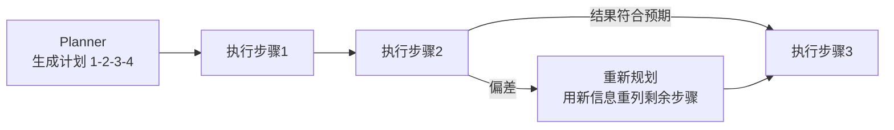
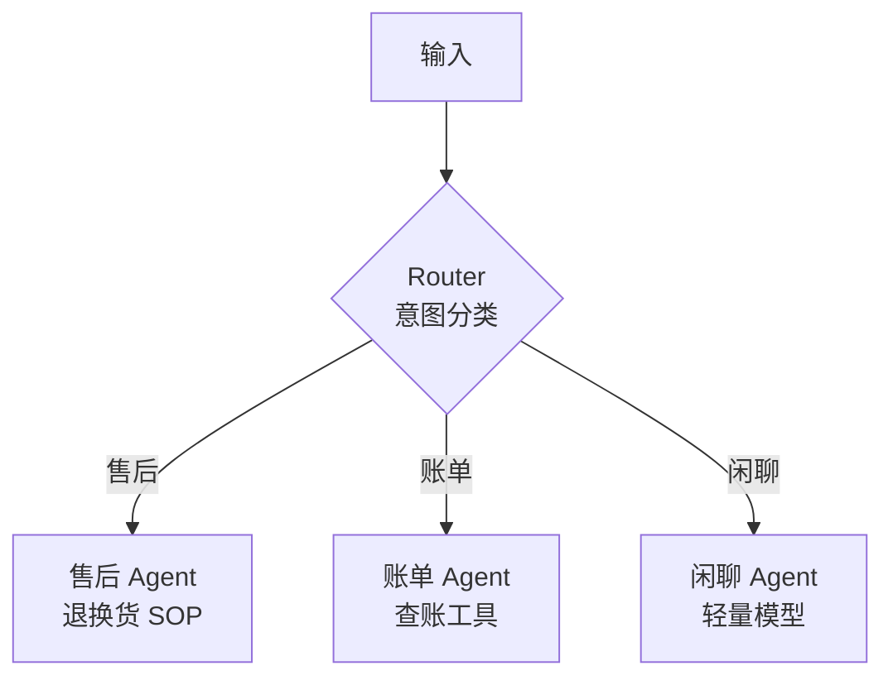
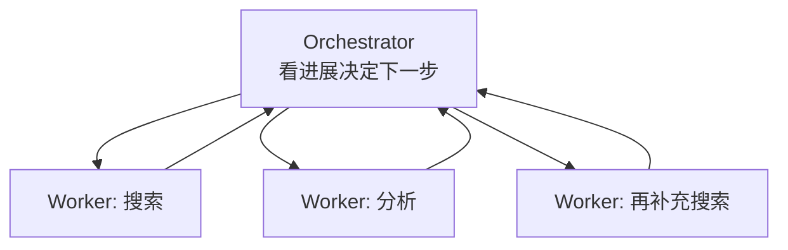
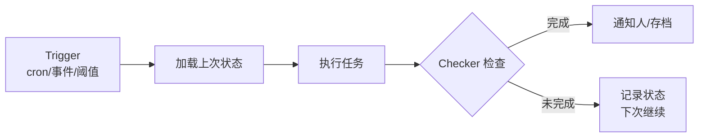

# 学习笔记 · Agent 设计模式大全（含详细示例）

> 设计模式（Pattern）是"在某种约束下被反复验证有效的结构"。本篇把 Agent 领域主流模式按五大类整理，每个模式给出：**定义 → 结构 → 适用场景 → 详细示例 → 优缺点 → 组合建议**。配套可运行代码见 [project7_agent_patterns.py](../10-AI应用实战/code/project7_agent_patterns.py)。

## 0. 模式全景图与选型速查

| 类别 | 模式 | 一句话 | 什么时候用 |
|------|------|--------|------------|
| 推理循环 | [ReAct](#1-react-推理行动循环) | 边想边做，T-A-O 循环 | 路径不可预知、需动态决策 |
| 推理循环 | [Plan-and-Execute](#2-plan-and-execute-先规划后执行) | 先列计划再执行 | 步骤可预知、成本敏感 |
| 推理循环 | [Reflection](#3-reflection-反思评估优化) | 生成-评审-修订循环 | 质量优先于成本 |
| 工作流 | [Prompt Chaining](#4-prompt-chaining-链式分解) | 大任务拆成串行小步 | 每步可独立验证 |
| 工作流 | [Routing](#5-routing-路由分发) | 先分类再交给专家 | 输入类型多样且处理方式不同 |
| 工作流 | [Parallelization](#6-parallelization-并行化) | 分段并行 / 多路投票 | 子任务独立 或 需提升置信度 |
| 工作流 | [Orchestrator-Workers](#7-orchestrator-workers-编排工作者) | 主 Agent 动态分派子 Agent | 子任务无法预先枚举 |
| 上下文 | [State Outside Context](#8-state-outside-context-状态外置) | 状态存外面，上下文只放当前所需 | 长任务、上下文紧张 |
| 上下文 | [Progressive Disclosure](#9-progressive-disclosure-渐进式披露) | 信息按需加载，不全量塞入 | 工具/知识量大 |
| 上下文 | [Clean-Context Continuation](#10-clean-context-continuation-干净上下文接续) | 新阶段用新上下文+交接文档 | 上下文将满、阶段切换 |
| 人机自治 | [Human-in-the-Loop](#11-hitl-人在回路) | 关键动作人审批 | 不可逆/高风险操作 |
| 人机自治 | [Loop / Self-Triggering](#12-loop-自我触发循环) | 定时/事件驱动跨会话运行 | 持续监控、自动化任务 |
| 记忆 | [Memory Pattern](#13-memory-pattern-记忆模式) | 短期上下文+长期外存 | 个性化、跨会话连续 |
| 多 Agent | [Multi-Agent](#14-multi-agent-协作) | 上下文隔离+并行的团队 | 单 Agent 装不下时（谨慎使用） |

**选型心法**：先用最简单的模式（单 Agent + ReAct），**只有当它的具体短板显现时才引入更复杂的模式**——每个模式都是用复杂度换某种能力。

---

## A. 推理循环模式（单个 Agent 怎么"想"）

### 1. ReAct（推理-行动循环）

**定义**：`思考(Thought) → 行动(Action) → 观察(Observation)` 循环，直到得出答案。

```
┌─────────────────────────────────────────┐
│ Thought: 我需要知道北京天气              │
│ Action: get_weather("北京")              │
│ Observation: 晴 26°C                    │
│ Thought: 还需要上海的数据                │
│ Action: get_weather("上海")              │
│ Observation: 多云 29°C                  │
│ Thought: 信息足够，可以回答              │
│ Answer: 上海比北京热 3 度                │
└─────────────────────────────────────────┘
```

**示例**：见 [project4_agent.py](../10-AI应用实战/code/project4_agent.py)（完整实现含防死循环）。
**适用**：路径不可预知（下一步依赖上一步结果）——客服排障、代码修复、深度调研。
**优缺点**：透明可审计、灵活；但 token 大（每步带全上下文）、可能死循环（需步数上限+重复检测+超时三招）。
**关键实现点**：LLM 只输出"调用意图"，真正执行在外层；结果以 `role:"tool"` 回喂。

### 2. Plan-and-Execute（先规划后执行）

**定义**：Planner 一次性生成完整计划 → Executor 逐步执行 →（可选）偏差时触发**重新规划检查点**。



**示例**：写论文——计划：查资料→列大纲→写初稿→润色；执行中发现资料不足 → 重新规划为"先补 2 篇核心文献再列大纲"。
**适用**：步骤可大致预知、成本敏感（token 消耗约为 ReAct 的 **20%**，因为不每步全上下文思考）。
**优缺点**：省 token、流程可控；但计划僵化（必须有重规划机制兜底）。

### 3. Reflection（反思 / Evaluator-Optimizer）

**定义**：生成者产出 → 评审者按标准打分 → 不通过则带反馈修订 → 循环至达标或达轮次上限。


**详细示例**（代码审查场景）：
- 第 1 轮：Generator 写出 SQL 查询 → Evaluator："没加索引提示，WHERE 用了函数会导致全表扫描"→ 驳回
- 第 2 轮：Generator 修订 → Evaluator："索引加了，但没处理 NULL 情况"→ 驳回
- 第 3 轮：通过

**适用**：质量优先的任务（代码生成、法律文书、对外发布内容）。
**优缺点**：质量显著提升；token 与延迟翻倍 → 不适合实时对话。
**关键实现点**：**评审与生成必须用不同上下文/角色**（自己查自己等于没查）；评审标准要具体可执行，不能只说"写得不好"。

---

## B. 工作流模式（任务怎么拆解流转）

### 4. Prompt Chaining（链式分解）

**定义**：把大任务拆成固定串行小步，**每步之间设质量闸门**（gate）。

```
原文 → [步骤1: 提取要点] → 闸门: 要点完整? → [步骤2: 写成摘要] → 闸门: 无遗漏? → 输出
```

**示例**：合同审查——先切条款（步骤1）→ 每条判风险（步骤2）→ 汇总分级（步骤3）；步骤2 失败就重试该条而非整份重来。
**适用**：每步可独立验证、串行依赖明确。
**优缺点**：每步上下文小而准、出错可定位到具体环节；但不适合需要全局视角的动态任务。

### 5. Routing（路由分发）

**定义**：先分类，再分发给对应的专家处理。



**示例**：客服系统——Router 用轻量模型分类（成本低），账单类走有查账工具的 Agent，闲聊直接小模型回复。
**适用**：输入类型多样且处理方式差异大。
**优缺点**：每个分支上下文聚焦、可用不同模型（省钱）；但分类错误会级联（需设"不确定"兜底分支）。

### 6. Parallelization（并行化）

两种子模式：

**6a. Sectioning（分段并行）**：独立子任务同时跑，结果合并。
```
主题 → ┬ 子任务A ─┐
       ├ 子任务B ─┼→ 合并（去重）
       └ 子任务C ─┘
```
示例：同时研究 3 个子问题（见 [project5](../10-AI应用实战/code/project5_multi_agent.py)），墙钟时间 = 最慢那个，而非累加。

**6b. Voting（投票并行）**：同一任务跑多次/多视角，取多数或最优。
示例：内容安全审核——3 个视角（规则/语义/上下文）分别判"是否违规"，2/3 通过才放行，提高置信度。

**适用**：子任务独立（Sectioning）或需提升可靠性（Voting）。
**优缺点**：快/稳；但 token 成倍增加（Voting 是 N 倍），且并行结果必须**去重合并**。

### 7. Orchestrator-Workers（编排-工作者）

**定义**：主 Agent 根据中间结果**动态决定**派什么子任务（区别于 Chaining 的固定流程）。



**示例**：修复一个 bug——Orchestrator 先派"定位报错文件"，看结果后决定派"读相关函数"还是"查 git 历史"，无法预先枚举。
**适用**：子任务本身依赖中间结果、无法预先规划。
**优缺点**：最灵活；但最难调试（需完整 Trace），成本最高。

---

## C. 上下文与状态模式（信息怎么放）

### 8. State Outside Context（状态外置）

**定义**：任务状态存上下文**之外**（文件/Redis/结构化存储），上下文只放当前这一步需要的。

**示例**：批量处理 100 个文件——不把所有结果堆在上下文里，而是每处理完一个写入 `progress.json`，下一步只读"当前第几个"。上下文永远只有几百 token，不会爆。
**适用**：长任务、上下文紧张、需要可恢复（进程重启不丢进度）。
**关键实现点**：状态要**结构化**（JSON 带 schema），而非依赖模型从长文本中"记住"。

### 9. Progressive Disclosure（渐进式披露）

**定义**：信息分层，只把当前需要的加载进上下文。

**示例**：Agent 有 50 个工具——不把 50 个 schema 全塞进 prompt，而是先给 5 个"目录级"描述，模型选定后再加载完整 schema。AGENTS.md 只当目录（~100 行），细则按需读取（Skill 机制就是这一思想）。
**适用**：工具/知识/规则量大，全量塞入会稀释注意力。
**关键实现点**：目录要足够让模型"知道去哪找"，而不是"知道所有内容"。

### 10. Clean-Context Continuation（干净上下文接续）

**定义**：上下文将满或任务阶段切换时，**开启全新上下文 + 结构化交接文档**（而非无限堆积）。

**交接文档五要素**：目标 / 已完成 / 当前状态 / 失败原因 / 验证命令。
**示例**：子任务 A 完成后，不把它的全部探索过程带入子任务 B，只交接"结论 + 关键文件路径"。
**适用**：长任务、上下文焦虑（模型快满时提前收工）、上下文污染。
**风险**：交接文档遗漏关键信息会让"新 Agent"从错误状态继续 → 交接清单必须完整。

---

## D. 人机与自治模式（人放在哪）

### 11. HITL（人在回路）

**定义**：按风险分级决定哪些动作自动执行、哪些必须人审批。

**分级参考**：
- L0 只读 → 自动放行
- L1 可逆写入 → 自动 + 日志
- L2 不可逆/对外 → **人工审批**（审批需展示"做什么+为什么+影响+回滚"三件套）

**详细示例**：见 [project6_hitl.py](../10-AI应用实战/code/project6_hitl.py)（含澄清、计划确认、分级审批、升级转交、审计）。
**关键实现点**：审批点放在"最贵返工点"和"不可逆动作"前；防审批疲劳（批量审批/记住选择）。

### 12. Loop（自我触发循环）

**定义**：Agent 不再等人启动，由**定时（cron）/ 事件（webhook）/ 条件阈值**自动触发，跨会话持续运行。



**示例**：竞品监控——每周一 9 点触发 → 加载"上次已报告的竞品动态"（去重）→ 采集新动态 → 生成简报 → 异常时升级人工。
**与 ReAct 的区别**：ReAct 是**单次任务内**的循环（模型主导）；Loop 是**跨会话**的循环（系统主导）——正交可组合。
**关键实现点**：状态持久化 + 去重是难点（详见 [Agent工程体系总览](./Agent工程体系总览.md) §5）。

### 13. Memory Pattern（记忆模式）

**定义**：分层管理记忆——短期（上下文）/ 中期（会话摘要、任务快照）/ 长期（用户偏好、历史结论，向量库存储）。

**读写时机**：
- 写入：任务完成、发现偏好、学到新知识、**记录失败原因**（最有价值）
- 读取：任务开始加载背景、遇陌生问题检索经验

**示例**：个人助理 Agent——记住"用户喜欢简洁的 Markdown 表格"（长期偏好），下次自动生成时无需再交代；记住"上次调试失败是因为端口被占"（失败教训），下次先查端口。
**关键实现点**：记忆要有**遗忘机制**（TTL/重要性衰减）与**冲突解决**（新覆盖旧），否则会越记越乱。

---

## E. 多 Agent 模式

### 14. Multi-Agent 协作

**定义**：多个独立上下文的 Agent 分工协作（主从编排 / 流水线 / 生成-评审 / 黑板 / 辩论）。

**何时才用**：单 Agent 上下文装不下、或需要并行提速、或需要关注点隔离——**至少占一条才拆**。
**关键认知**：拆分的本质是**上下文隔离**，不是角色扮演。
**详细内容**：架构与 15 个行业用例见 [多Agent协作详解](./多Agent协作详解.md)、[多Agent用例库](./多Agent用例库.md)。

---

## 模式组合实战（真实系统都是组合的）

| 系统 | 组合的模式 |
|------|-----------|
| 智能客服 | Routing（意图分发）+ ReAct（排障循环）+ HITL（退款审批）+ Memory（用户历史） |
| 代码 Agent | Plan-and-Execute（任务计划）+ ReAct（调试循环）+ Reflection（自评审）+ State Outside Context（进度文件） |
| 深度研究 | Orchestrator-Workers（动态分派）+ Parallelization（并行检索）+ Reflection（事实核查） |
| 运维巡检 | Loop（定时触发）+ Routing（告警分类）+ HITL（修复审批）+ Memory（故障经验库） |
| 内容工厂 | Prompt Chaining（选题→大纲→初稿）+ Routing（平台分发）+ Reflection（审校） |

**组合原则**：每个模式只负责解决一个具体问题，不要为了"用上模式"而堆砌。

## 面试高频问答

1. **ReAct 和 Plan-and-Execute 怎么选？** → 路径可预知选 P&E（省 80% token），不可预知选 ReAct；生产中常混合（Workflow 骨架 + ReAct 处理分支）。
2. **Reflection 为什么必须不同 Agent/上下文？** → 自我评价存在偏差，独立评审才能发现问题。
3. **Orchestrator 和 Chaining 的区别？** → Chaining 流程预先写死，Orchestrator 动态决定下一步。
4. **Voting 和 Sectioning 的区别？** → Sectioning 是"分头做不同的事"，Voting 是"多头做同一件事取多数"。
5. **什么时候该引入 Memory？** → 需要跨会话连续性或个性化时；先短期后长期，不要一上来建复杂记忆系统。

## 学完自测检查点

1. 不看笔记画出 5 种工作流模式的结构图
2. 给一个真实需求（如"自动处理用户退款申请"）选择合适的模式组合并说明理由
3. 说出 Reflection 的两个关键实现点
4. ReAct 的三招防死循环是什么
5. Loop 和 ReAct 的本质区别（哪一层循环、跨不跨会话）
6. 跑通 [project7_agent_patterns.py](../10-AI应用实战/code/project7_agent_patterns.py)，对比四种模式的 token 消耗
