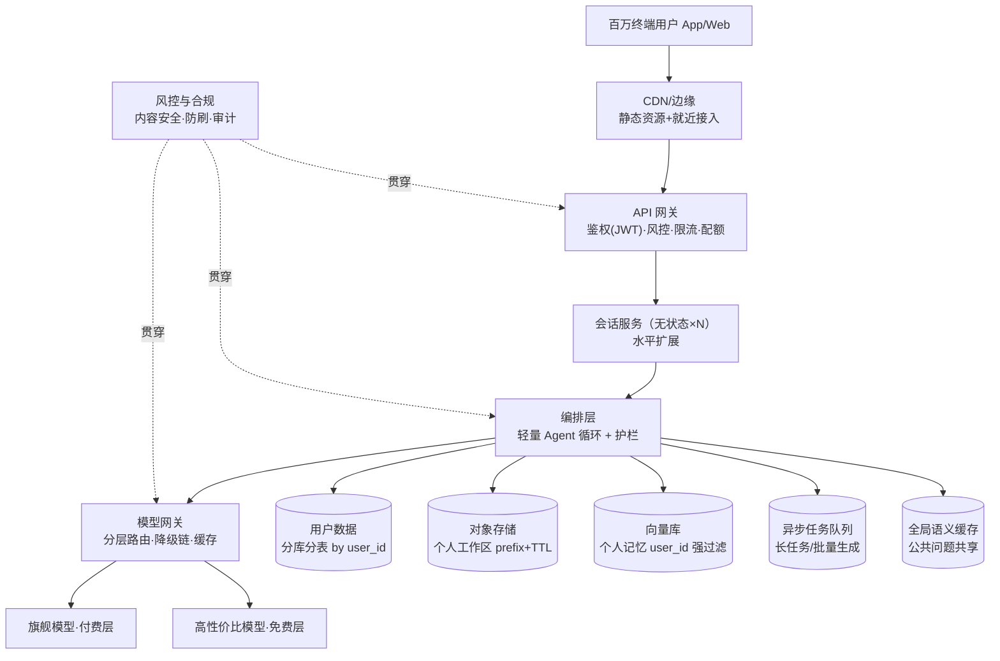

# 系统设计 · C 端智能体：百万用户下的资源与数据隔离

> 定位：面向消费者的智能体产品（AI 助手/角色扮演/学习陪伴/代码工具类 App），DAU 百万级。与 [云端智能体系统设计方案](./云端智能体系统设计方案.md)（B 端多租户视角）互补——**B 端隔离的本质是"企业间不信任"，C 端隔离的本质是"个人数据主权 + 单位经济学"**。

## 1. C 端与 B 端智能体的本质差异（设计前提）

| 维度 | B 端（企业客户） | C 端（百万个人用户） |
|------|------------------|----------------------|
| 租户数量 | 几十~几千，客单价高 | **百万级，人均收入极低（¥0~30/月）** |
| 隔离策略 | 可为高合规客户独立实例 | **不可能人均实例 → 全部共享池化 + 强逻辑隔离** |
| 用量分布 | 相对均衡 | **长尾极端**：1% 重度用户消耗 50% 成本 |
| 数据特点 | 企业文档（价值高、量小） | 个人对话（量巨大、隐私敏感、价值密度低） |
| 核心矛盾 | 安全合规 > 成本 | **单位经济学 > 一切**（毛利为负则产品死亡） |
| 攻击面 | 商业竞争对手 | 薅羊毛、脚本刷量、账号农场、注入攻击（海量） |

**三条设计前提**：
1. 单用户月成本必须 < 单用户收入（否则模型再好也死）
2. 隔离靠**架构强约束**，不靠运营规范——百万用户不可能都守规矩
3. 为 1% 滥用者设计的风控，不能惩罚 99% 正常用户（体验与安全的平衡）

## 2. 总体架构（C 端形态）



## 3. 资源隔离：C 端怎么做（池化 + 配额 + 分层）

### 3.1 核心决策：共享池 + 强逻辑隔离（不是人均沙箱）

- B 端方案里"高合规租户独立 Firecracker 实例"在 C 端**不存在**——百万用户人均沙箱成本不可承受
- C 端做法：**沙箱/计算资源全局池化**（Warm Pool 预热），用户间靠**严格的会话绑定与数据标记**隔离
- Agent 大多数 C 端场景（对话/问答）**根本不需要沙箱**——只有"跑代码/生成文件"类产品才需要，且用完即焚（TTL 5~30 分钟自动回收）

### 3.2 三级配额体系（防"1% 用户吃掉 50% 成本"）

| 层级 | 限额 | 实现 |
|------|------|------|
| **全局** | 总 token 吞吐、总沙箱数 | 保护平台不死 |
| **用户级** | 每日对话次数/长度、生成次数、文件存储上限 | 计费层配额（免费层/会员层不同额度） |
| **突发** | 每秒请求数、并发会话数 | 令牌桶限流 + 排队 |

**分层路由（C 端成本杀手）**：
```
免费用户  → 高性价比模型 + 每日限额 + 高峰期排队
会员用户  → 旗舰模型 + 更高限额 + 优先排队
重度异常  → 触发风控审查（用量突增 10 倍 = 可能是脚本）
```

### 3.3 公平调度与削峰

- **无状态会话服务**水平扩展（会话数据外置，任何实例可服务任何用户）
- **队列削峰**：高峰期免费用户请求进队列（体感排队 2~5s），付费用户走优先通道
- **热点识别**：某话题爆发（如新模型发布）→ 该类查询进全局缓存 + 预生成热门答案
- **优雅降级**：过载时先降免费层（切小模型/缩短回复上限），再降会员层（保底不中断）

## 4. 数据隔离：C 端怎么做（个人数据主权）

### 4.1 数据分域全景

| 数据 | 规模（百万 DAU） | 存储与隔离 | 关键约束 |
|------|------------------|-----------|----------|
| 会话历史 | 日增 TB 级 | **按 user_id 哈希分库分表** + Row-Level Security | 任何查询强制带 user_id |
| 用户偏好/记忆 | 中等 | 向量库统一实例 + **user_id 强制过滤 + 结果二次校验** | 个人记忆绝不进全局缓存 |
| 个人文件/工作区 | 中等 | 对象存储 `bucket/user_{id}/` prefix + **TTL 自动清理**（如 30 天未访问删除） | 路径 `realpath` 校验防越权 |
| 全局知识库 | 大而稳定 | 独立向量库（只读共享） | 与个人数据**物理分离**，杜绝混查 |
| 审计日志 | 巨大 | Append-only + PII 脱敏 + 按月分区 | 每条必带 user_id |

**核心原则**：**共享只读数据（平台知识）与个人数据物理分域**——个人查询只检索"共享知识库 + 本人个人域"两路，结构上杜绝串数据。

### 4.2 语义缓存的隔离红线（C 端特有陷阱）

C 端命中率高、缓存价值大，但**缓存是跨用户共享的**——必须区分：
- ✅ **可共享缓存**：公共知识问题（"什么是量子计算"）、平台功能问答 → 全局缓存
- ❌ **绝不共享**：含个人上下文的查询（"我的订单""我上次说的"）→ 只能用 user 维度私有缓存
- 实现：缓存 key 前缀 = 用户身份分类（personal/public），personal 缓存带 user_id 且过期短；入库前 PII 检测（含个人信息的问题不入全局缓存）

### 4.3 隐私与合规（个保法/GDPR 视角）

- **最小收集**：对话数据默认保留期（如 90 天）+ 用户可关闭"用于改进服务"
- **数据清单**：能回答"某用户的数据在哪些存储"（分库分表/向量/对象存储/日志/缓存——**缓存别忘了**）
- **删除权**：按 user_id 级联删除 + **Crypto-Shredding**（per-user DEK 销毁，覆盖难清理的备份与缓存）
- **导出权**：一键导出个人全部对话与文件
- **加密**：静态加密 + per-user 密钥（高敏感场景）；日志 PII 脱敏前置

## 5. 防滥用与风控（百万用户必然伴随的攻击）

| 攻击 | 特征 | 对策 |
|------|------|------|
| 脚本刷量薅羊毛 | 单账号高频、注册设备聚集 | 设备指纹 + 注册风控 + 用量突增审查 |
| 账号农场 | 批量新号同一行为模式 | 新号限额递增（信任分级）、异常注册拦截 |
| Prompt 注入 | 诱导 Agent 越权/泄露他人数据 | 输入过滤 + 权限最小化 + 个人数据域隔离（即使注入，拿到的也只有注入者本人数据） |
| 内容滥用 | 违规生成内容 | 输入输出双向内容安全 + AIGC 标识 |
| 成本攻击 | 故意拉长上下文/反复触发昂贵工具 | 轮次上限、输出长度上限、昂贵工具单独配额 |

**风控与体验的平衡**：限额触发时给**明确反馈与升级路径**（"今日额度已用完，升级会员或明天再来"），静默限流是最差体验。

## 6. 单位经济学（C 端产品能否活下来的计算题）

```
单用户月成本 = 月 token 消耗 × 单价 × (1 - 缓存命中率) × 路由加权 + 存储/基础设施摊销
示例：人均 3 万 token/月，旗舰 ¥8/百万输出 + ¥2/百万输入（假设对半）
     = 3万 × (4+1) / 1e6 ≈ ¥0.15/月（缓存命中 40% → ≈ ¥0.09）
     + 基础设施摊销 ≈ ¥0.05~0.2
     → 单用户月成本 ≈ ¥0.15~0.4
免费层可承受；会员 ¥19/月毛利率 97%+ → 结论：成本结构成立，关键是防 1% 重度滥用
```

**运营杠杆**：人均 token 每降 10%（Prompt 瘦身/缓存/路由）≈ 毛利率直接提升；**C 端架构的一半工作量在省钱**。

## 7. 演进路线（按用户规模）

| 阶段 | 规模 | 架构重点 |
|------|------|----------|
| MVP | <1 万 DAU | 单体 + 托管 API + 共享向量库（user_id 过滤）+ 基础限流 |
| 成长 | 1~10 万 | 模型网关 + 语义缓存 + 会话分库 + 免费会员分层 |
| **百万** | 10 万~500 万 DAU | **分库分表 + 多级缓存 + 分层路由 + 风控体系 + 异步任务化** |
| 千万 | 500 万+ | 区域化部署（数据主权+延迟）、多活、成本精细化运营 |

**每阶段的隔离不变量**：user_id 强制过滤 + 个人/公共数据分域 + 三级配额——从小到大只加架构，不改隔离原则。

## 8. 与 B 端方案的关键差异对照

| 主题 | B 端方案（见[云端设计](./云端智能体系统设计方案.md)） | C 端方案（本篇） |
|------|------|------|
| 隔离单元 | 租户（企业） | 用户（个人） |
| 沙箱 | 按需强隔离（gVisor/Firecracker） | 池化共享 + 用完即焚 |
| 向量隔离 | Namespace/Shard/Instance 分级 | 统一库 + user_id 强过滤 + 个人/公共分域 |
| 缓存 | 租户内缓存 | **全局公共缓存（命中率是成本命门）** |
| 合规重点 | 企业数据主权、SOC2 | 个人信息保护、删除权、内容合规 |
| 首要矛盾 | 安全合规 | **单位经济学** |

## 9. 学完自测检查点

1. C 端为什么不能照搬 B 端的"高合规租户独立实例"？替代方案是什么
2. 三级配额体系是什么？1% 重度用户吃掉 50% 成本的问题在哪层解决
3. 语义缓存在 C 端的红线是什么？personal/public 缓存怎么区分
4. 个人/公共数据分域如何从结构上杜绝串数据？
5. 删除权的完整链路（含缓存与备份）怎么实现？
6. 现场估算：DAU 100 万、人均 3 万 token/月，单用户月成本是多少？免费层能否覆盖？

## 参考与交叉阅读

- 多租户沙箱/调度/合规的技术底座 → [云端智能体系统设计方案](./云端智能体系统设计方案.md)
- 个人数据与内容合规 → [13-AI安全与伦理](../13-AI安全与伦理/README.md)
- 容量估算公式 → [15-AI系统设计/01](../15-AI系统设计/01-通用架构蓝图与容量估算.md)
- 风控相关面试题 → [题库06](../12-AI面试题库/06-推理部署与工程落地.md)
