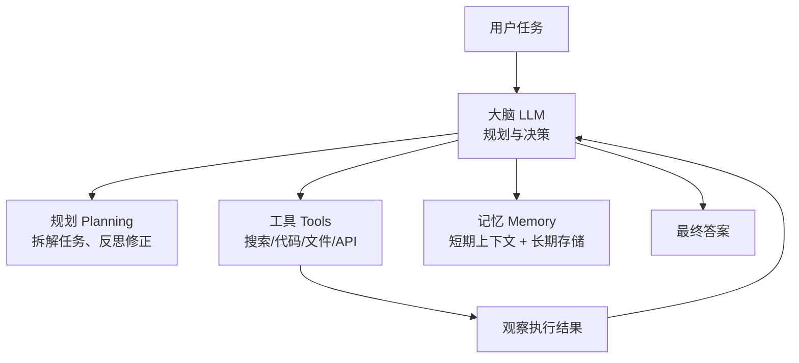
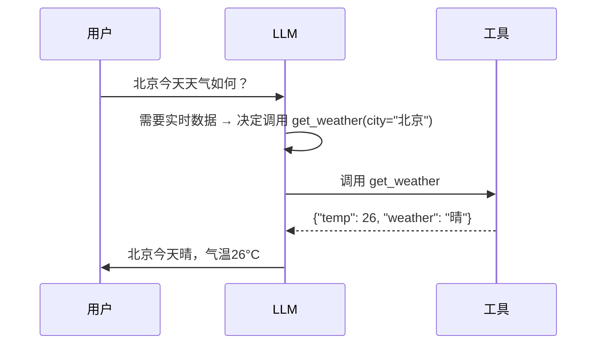
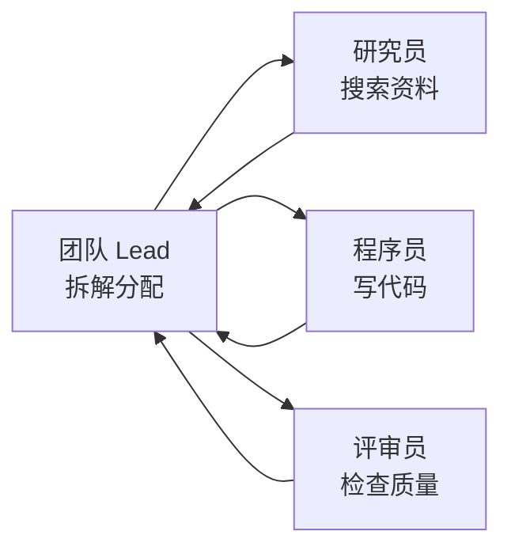

# 06 · AI Agent 智能体

## 1. 什么是 Agent

普通 LLM 只能"说"；Agent 能"做"——它是一个**以 LLM 为大脑，能感知环境、规划任务、调用工具、多步执行**的自主系统。

> 类比：LLM 是一个聪明但关在房间里的人；Agent 给了他电话、电脑和手，让他能真正办事。

## 2. Agent 的核心架构

| 组件 | 作用 | 实现方式 |
|------|------|----------|
| 规划 Planning | 拆解复杂任务、自我反思 | CoT、Plan-and-Execute、反思机制 |
| 工具 Tools | 突破 LLM 能力边界 | Function Calling、MCP 协议 |
| 记忆 Memory | 跨轮次/跨会话记住信息 | 上下文窗口 + 向量数据库 |
| 行动 Action | 执行具体操作 | 调用 API、操作浏览器、读写文件 |

## 3. 工具调用（Function Calling）原理

LLM 本身不执行工具，只是**生成结构化的调用请求**，由外层程序执行后把结果喂回 LLM。

## 4. MCP 协议（Model Context Protocol）

Anthropic 提出的开放标准，相当于"AI 界的 USB-C"：统一 LLM 与外部工具/数据源的连接方式。

- **MCP Server**：暴露工具/资源的程序（如文件系统、数据库、浏览器）
- **MCP Client**：Agent 端，发现并调用 Server 能力
- 优势：一次开发，处处可用，CodeBuddy、Claude、Cursor 等均支持

## 5. 多智能体（Multi-Agent）

- 单一 Agent 装不下所有专业知识 → 分角色协作
- 典型模式：Lead 分派、成员并行、互相通信、汇总产出
- 代表框架：Claude Code 子代理、CodeBuddy Team、AutoGen、CrewAI

## 6. 常见 Agent 应用形态

| 形态 | 说明 | 例子 |
|------|------|------|
| 编程 Agent | 读写代码、跑命令、修 bug | CodeBuddy、Claude Code、Cursor |
| 深度研究 Agent | 自动搜索-阅读-综合出报告 | Deep Research 类产品 |
| 浏览器 Agent | 自动操作网页完成任务 | Browser Use、Operator |
| 办公 Agent | 处理文档、表格、邮件 | 各类办公 Copilot |

## 7. 实践建议

1. 观察身边的 Agent（你正在用的 CodeBuddy 就是）：注意它如何"思考→调用工具→观察→再思考"
2. 给一个 LLM 配一个工具（如联网搜索），手写最小 ReAct 循环（约 50 行 Python）
3. 阅读本项目的 `.codebuddy/agents/ai-learning-assistant.md`，理解一个 Agent 定义文件的构成

## 8. 延伸阅读

- [Agent工程体系总览](./Agent工程体系总览.md) —— 深入专题：Prompt→Context→Harness→Loop 演进、五层结构、10 设计轴
- [上下文工程详解](./上下文工程详解.md) —— 深入专题：六维度、Smart/Dumb Zone、压缩与渐进披露
- [Harness工程实战](./Harness工程实战.md) —— 深入专题：六层检查框架、成熟度阶梯、OpenAI/Stripe 案例
- [多Agent协作详解](./多Agent协作详解.md) —— 深入专题：五种协作架构、通信与一致性、真实用例拆解
- [多Agent用例库](./多Agent用例库.md) —— **15 个行业场景**：研发/内容/企业/专业领域的多 Agent 落地套路
- [沙盒与执行隔离详解](./沙盒与执行隔离详解.md) —— 深入专题：隔离六级光谱、六种技术方案对比选型、六道防线、反模式
- [云端智能体系统设计方案](./云端智能体系统设计方案.md) —— **系统设计**：多租户隔离/沙箱/持久化/弹性调度/可观测/合规 + 业界对标与选型路线
- [C端智能体百万用户架构设计](./C端智能体百万用户架构设计.md) —— **系统设计**：资源池化与三级配额、个人/公共数据分域、语义缓存红线、防滥用风控、单位经济学
- [Agent设计模式详解](./Agent设计模式详解.md) —— **模式大全**：14 种设计模式（ReAct/Plan/Reflection/Chaining/Routing/并行/编排/状态/披露/HITL/Loop/记忆/多Agent）+ 组合实战
- [Agent权限体系与动态授权](./Agent权限体系与动态授权.md) —— **权限专题**：四层粒度模型、PDP/PEP 架构、JIT 三级授权记忆、权限滑块、风险自适应降权
- [人机交互与协作用例](./人机交互与协作用例.md) —— 深入专题：人机协作光谱、六种 HITL 模式、信任设计
- [人机交互用例库](./人机交互用例库.md) —— **15 个协作场景**：档位选择、交互设计、审批点位置
- [07-RAG与知识库](../07-RAG与知识库/README.md) —— Agent 的"长期记忆"
- [09-AI开发工具与框架](../09-AI开发工具与框架/README.md) —— LangChain 等 Agent 框架
- [14-技术对比与选型](../14-技术对比与选型/02-方案与工具对比.md) —— Workflow vs Agent、单/多 Agent、协议四层对比

## 学完自测检查点

1. 画出 Agent 四大组件（大脑/规划/记忆/工具）的循环图
2. Function Calling 的完整四步流程，为什么说"模型自己不执行函数"反而是安全特性
3. MCP 解决的 N×M 问题是什么，三类能力（Tools/Resources/Prompts）各是什么
4. ReAct 死循环的三招防御
5. 说出 Prompt → Context → Harness → Loop 四代工程范式各自的核心问题（见[工程体系总览](./Agent工程体系总览.md)）
6. 什么任务该用 Workflow 而非 Agent？判断标准是什么
7. 多 Agent 拆分的两个本质收益是什么？什么时候**不该**拆分（见[多Agent协作](./多Agent协作详解.md)）
8. 人机协作五档光谱中，"付款""写文案草稿""批量审核"各应放在哪一档（见[人机交互](./人机交互与协作用例.md)）
9. Agent 要执行代码，隔离方案怎么选（个人/CI/多租户三档），以及"有网+有凭证+可写"为何最危险（见[沙盒专题](./沙盒与执行隔离详解.md)）
10. 给你的云端智能体平台画出分层架构，并回答"如何防跨租户向量泄露""HPA 为什么不能用 CPU 指标"（见[系统设计方案](./云端智能体系统设计方案.md) §13）
11. 给一个需求（如"自动处理退款"）选择设计模式组合并说明理由；说出 Reflection 与 ReAct 的关键实现差异（见[设计模式详解](./Agent设计模式详解.md)）
12. 权限判定为什么不能写在 Prompt 里？JIT 三级授权记忆各适用什么场景？升档与降档的交互为何不对称（见[权限专题](./Agent权限体系与动态授权.md)）
13. C 端百万用户下，资源隔离为什么选"池化+配额"而非人均实例？语义缓存的 personal/public 红线是什么（见[C端架构设计](./C端智能体百万用户架构设计.md)）
