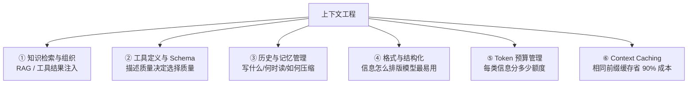
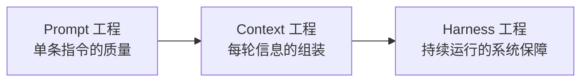

# 深入专题 · 上下文工程（Context Engineering）详解

> 定义：在合适的时间，把正确且必要的信息，以恰当的形式放进有限的上下文窗口。2025 年由 Shopify CEO Tobi Lütke 与 Karpathy 公开背书，取代"提示词工程"成为新叙事中心。

## 1. 为什么从 Prompt 升级到 Context

- Prompt 工程关心"**怎么说**"（指令措辞）；Context 工程关心"**给什么看**"（信息选择与组织）
- 单次问答时代措辞是主要矛盾；Agent 时代模型每轮看到的信息是**动态组装**的（系统提示 + 记忆 + 检索 + 工具结果 + 历史），组装质量决定一切
- 一句话：**上下文是 Agent 的 RAM**——易失、有限、断电就没；怎么用好这块 RAM 就是上下文工程

## 2. 六大关键维度

### ① 知识检索与组织
- 不是"检索到就塞"：重排、去重、压缩（抽取相关句）、按重要性排序（重要内容放首尾，防 Lost in the Middle）
- 工具返回大结果 → 截断/分页/摘要，只回传 Agent 需要的部分

### ② 工具定义与 Schema
- 描述即接口：LLM 靠 description 决策 → 写清"何时用、何时不用、参数边界"
- 工具数量控制：全量注入稀释注意力 → 按任务动态加载子集（Tool RAG）
- 错误信息"模型可读"：返回具体原因帮助自我修正

### ③ 历史与记忆管理
- 短期：上下文窗口内对话；中期：任务状态快照（结构化 TODO/结论）；长期：向量库/数据库
- 写入时机：任务完成、用户偏好、新知识、**失败原因（最有价值）**
- 读取时机：任务开始加载背景、遇陌生问题检索经验

### ④ 格式与结构化
- 结构化 > 自然语言堆砌：任务状态用 JSON/Markdown 表格而非段落叙述
- 统一标记分区：`<context>`、`<tool_result>` 等边界标签，防指令与数据混淆（兼防注入）
- 关键事实单独存放，不依赖模型从长文本中"记住"

### ⑤ Token 预算管理
- 给上下文做预算分配：系统提示 10%、工具定义 15%、记忆/检索 25%、对话历史 40%、输出预留 10%（示例比例，按任务调）
- 每轮自问：这条信息**这一步**用得上吗？用不上就不放（渐进式披露）

### ⑥ Context Caching
- 相同前缀（系统提示、工具定义、长文档）的 KV 缓存复用 → 成本最高省 90%、TTFT 大降
- 工程要点：把稳定内容放**前缀**，变动内容放后缀（缓存按前缀匹配）

## 3. 核心痛点：上下文越多越蠢（Smart Zone / Dumb Zone）

| 区间 | 占比（168K 窗口观察值） | 表现 |
|------|------------------------|------|
| Smart Zone | 0 ~ 40% | 推理聚焦、工具调用准、代码质量高 |
| Dumb Zone | > 40% | 幻觉增多、兜圈子、格式混乱、代码变差 |

- 注意：40% 是特定模型/任务的观察值，**不是通用阈值**——生产上应监控自己的质量-利用率曲线定压缩触发点
- 三大劣化机制：**注意力稀释**（关键信息被淹没）、**上下文污染**（错误信息被当事实持续引用）、**上下文焦虑**（模型察觉窗口快满时提前收工、敷衍作答）

## 4. 四大应对策略

### 4.1 压缩（Compaction）
- 摘要压缩：LLM 总结旧对话，保留最近 N 轮原文
- 选择性保留：工具原始输出只留结论；重要性过滤
- 时机：达阈值触发（Auto-Compact），而非等到溢出

### 4.2 状态外置（State Outside Context）
- 任务进度、关键结论、文件清单存上下文**之外**（文件/Redis/结构化存储），需要时读回
- 上下文只放"当前这一步需要的"，而非"全部历史"

### 4.3 上下文重置（Context Resets）
- 窗口将满或任务阶段切换时：**清空上下文，但用结构化交接文档保留关键状态**
- 交接文档必须含：目标、已完成、当前状态、失败原因、验证命令、关键文件清单——遗漏会让"新 Agent"从错误状态继续
- 即 Clean-Context Continuation 模式：子任务用全新上下文 + 精简简报，而非背负全部历史

### 4.4 分层与渐进式披露（Progressive Disclosure）
- L1 常驻：角色 + 当前任务 + 少量索引（如 AGENTS.md 只当目录，约 100 行）
- L2 按需：详细规则/领域知识放子文档，需要时才读入（Skill 机制就是这一思想）
- L3 外置：历史与参考资料入库检索
- 反例：把所有规则、工具、文档一次性塞进系统提示 → Dumb Zone 直奔

## 5. 与其他工程的关系

- Context 工程是 Harness 的**横切基础层**（Harness 的每个组件都在生产或消费上下文）
- 局限：Context 工程回答不了"Agent 如何主动找信息、出错怎么恢复、跨 session 怎么持续"——那是 Harness 与 Loop 的地盘

## 6. 实操清单

- [ ] 测量：给你的 Agent 加上下文利用率监控（每轮 token 占比）
- [ ] 预算：为各类信息设定 token 配额并告警
- [ ] 排序：关键指令与数据放首尾，中段放次要信息
- [ ] 压缩：实现摘要压缩 + 结构化状态快照
- [ ] 缓存：稳定内容上移到前缀，开启 Prompt Cache
- [ ] 评测：建任务集，对比"全量塞入 vs 渐进披露"的完成率与成本

## 7. 延伸阅读

- [Agent工程体系总览](./Agent工程体系总览.md) —— 四大工程范式的演进全景
- [Harness工程实战](./Harness工程实战.md) —— 上下文管理只是六层之一
- [面试 08 深度解析 · 解析12](../12-AI面试题库/08-核心题深度解析.md) —— ReAct 成本与防死循环
