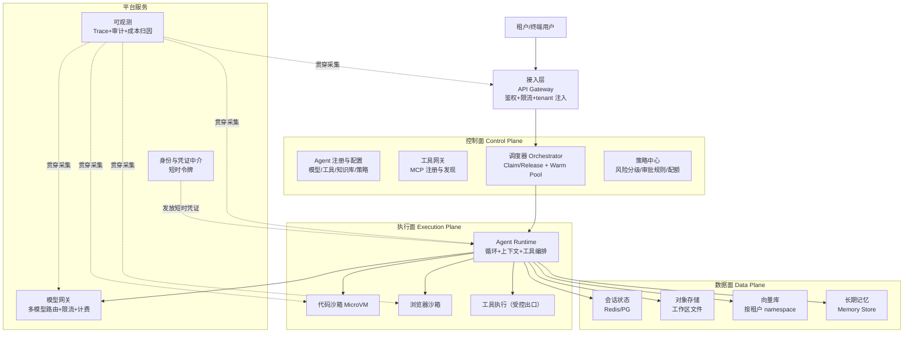

# 系统设计方案 · 云端智能体平台（多租户 Agent as a Service）

> 综合 2026 年业界实践（AWS Bedrock AgentCore、Kubernetes Agent Sandbox CRD、E2B/Blaxel 云沙箱、腾讯云多租户沙箱方案）编写的完整设计方案。适用于架构评审、面试系统设计题、真实项目立项。

## 0. 一句话立项

**把"Agent 能不能跑通"变成"Agent 能不能安全、稳定、可计量地服务一万个互不信任的租户"**——这是云端智能体平台与单机 Agent 的本质差别。

## 1. 需求与约束

### 1.1 功能需求
- 多租户：注册/账号体系、配额、计费、按租户隔离的数据与执行环境
- Agent 生命周期：创建（配置模型/工具/知识库）→ 运行（会话）→ 暂停/恢复 → 归档
- 能力供给：LLM 网关（多模型）、工具接入（MCP）、RAG 知识库、代码执行沙箱、浏览器沙箱、长期记忆
- 人机协作：审批检查点、人工接管、审计回溯
- 可观测：全链路 Trace、Token/成本归因、质量看板

### 1.2 非功能需求（设计真正的难点）
| 维度 | 目标（示例） | 关键设计 |
|------|--------------|----------|
| 隔离 | 租户间零数据越权（含向量库、文件、日志） | 运行时强隔离 + 数据命名空间 + 身份传播链 |
| 弹性 | 空闲率 90%+ 场景下按需伸缩，冷启动 < 500ms | Warm Pool + 基于活跃沙箱数的 HPA |
| 成本 | 空闲零成本（暂停即免费） | Pause/Resume、Scale-to-Zero、Spot 实例 |
| 延迟 | 首 token < 2s，工具调用 P95 < 1s | 就近调度、连接池、缓存 |
| 合规 | 可回答"某租户数据散落在哪里"并能一键删除 | 数据清单 + Crypto-Shredding |
| 可靠 | 会话可恢复，单节点故障不丢会话 | 状态外置 + 检查点 |

## 2. 业界方案对标

### 2.1 AWS Bedrock AgentCore（托管套件范式，2025-10 GA）

| 组件 | 职责 | 我们的对应模块 |
|------|------|----------------|
| **Runtime** | 框架无关的无服务器 Agent 托管与扩缩容 | 执行面 · Agent 运行时 |
| **Memory** | 托管的多轮/跨会话记忆（与 Runtime 并列，非嵌套） | 数据面 · 记忆服务 |
| **Gateway** | 把既有 API/Lambda 自动转为 MCP 工具 | 控制面 · 工具网关 |
| **Identity** | 非人类身份：范围受限的**短时令牌**（凭证中介） | 安全面 · 凭证代理 |
| **Browser Tool** | 沙箱内网页浏览与填表 | 执行面 · 浏览器沙箱 |
| **Code Interpreter** | 沙箱内代码执行（只回结果，不回执行权） | 执行面 · 代码沙箱 |
| **Observability** | 贯穿所有组件的逐步轨迹 | 观测面 · 全链路追踪 |

**设计启发（三条）**：
1. **框架 / 运行时 / 模型 / 协议四分离**——框架可替换，运行时不属于框架，避免被单一生态锁定
2. **凭证中介**：Agent 永不持有长期密钥，每次工具调用由平台发放短时受限令牌
3. **沙箱边界必须在架构图上显式画出**：浏览器与代码执行面对的是**不可信内容**（开放网络 + 模型生成代码），与访问自有内部系统严格区分

### 2.2 其他形态对比

| 形态 | 代表 | 特点 | 适合谁 |
|------|------|------|--------|
| 托管套件 | Bedrock AgentCore、阿里百炼、腾讯云智能体开发平台 | 组件化、免运维、按量计费、多云绑定 | 业务团队快速上线 |
| 托管沙箱 API | E2B、Blaxel、Modal | Firecracker/MicroVM、Pause/Resume、低运维 | 需要执行隔离的产品团队 |
| 自建 K8s + 强隔离 | EKS + Kata/gVisor、K8s Agent Sandbox CRD（2026-03） | 完全可控、可定制、运维复杂 | 大规模/高合规企业 |
| 低代码编排 | Dify、Coze | 拖拽搭建，隔离弱化 | 业务验证 |

## 3. 总体架构



**分层职责要点**：
- 接入层**强制注入 tenant context**（用确定性 token claim，绝不用 LLM 指令传递租户身份）
- 调度器负责沙箱的申请/释放与预热池，Runtime 只关心"我要一个沙箱"
- 所有出网与工具调用经**受控出口**（egress allowlist + 凭证代理）

## 4. 核心设计一：多租户隔离（Workspace 模型）

### 4.1 与 Web 多租户的本质差异
| 项 | 传统 SaaS | Agent 平台 |
|----|-----------|------------|
| 执行代码 | 开发者编写、经审查 | **LLM 实时生成、未审计** |
| 失效后果 | 数据串租户 | 数据串租户 **+ 推理链污染 + 工具副作用** |
| 攻击面 | 应用漏洞 | 应用漏洞 + **Prompt 注入 + 生成代码** |

> 结论：隔离等级必须比传统 SaaS 更保守——因为输入永远不可信。

### 4.2 四类数据隔离（一个都不能漏）

| 数据 | 存储 | 隔离方式 | 强制措施 |
|------|------|----------|----------|
| 会话状态 | Redis/PG | Row-Level Security | 所有查询带 tenant_id |
| 工作区文件 | 对象存储 | Per-tenant prefix | 路径 `realpath` 校验，禁止越界 |
| 向量索引 | 向量库 | Namespace / Shard / Instance | **四铁律**（见下） |
| 长期记忆 | Memory Store | Schema per tenant | 删除时纳入数据清单 |

**向量库四铁律**（跨租户泄露最高发区）：
1. 每个向量必带 `tenant_id` metadata
2. 所有查询**强制**携带 `tenant_id` 过滤（非可选参数）
3. 结果返回后**二次校验** tenant_id（防向量库自身 bug 串数据）
4. 高合规租户用**独立索引/实例**，不依赖逻辑隔离

### 4.3 身份传播链（杜绝"Agent 继承用户全量权限"）

```
用户 OIDC Token
  → API Gateway（校验并注入 tenant_id + Authorization Envelope）
  → Agent Runtime（Workload Identity 换取 STS/OIDC 短期凭证，TTL < 15min）
  → 工具执行（Scoped Context：文件路径白名单 + 域名白名单 + 最小权限）
```

### 4.4 防"嘈杂邻居"：三层限流
全局（总沙箱数/总 GPU 配额）→ 租户（沙箱数上限、LLM QPS、带宽）→ 会话（最大执行时长、内存、文件 I/O）

## 5. 核心设计二：沙箱执行环境

### 5.1 运行时选型对比

| 技术 | 隔离级别 | 冷启动 | 安全性 | 结论 |
|------|----------|--------|--------|------|
| Docker | namespace+cgroups | ~100ms | ⭐⭐ 共享内核 | 仅可信代码 |
| gVisor | 用户态内核（syscall 拦截） | ~300ms | ⭐⭐⭐ | **多租户生产底线** |
| Kata Containers | 轻量 VM + 独立内核 | ~500ms | ⭐⭐⭐⭐ | 高安全需求 |
| **Firecracker** | MicroVM 硬件级 | ~150ms | ⭐⭐⭐⭐⭐ | **不可信代码首选**（~5MB 开销、最小设备模型） |

**推荐基线**：生产多租户至少 gVisor；执行模型生成代码/外部内容用 Firecracker 或托管云沙箱。

### 5.2 Day-1 安全加固基线（`SandboxSecurityConfig`）

| 维度 | 基线配置 |
|------|----------|
| 文件系统 | 只读根 + 可写 tmpfs（默认 512MB）+ 仅挂载 `/workspace` |
| 网络 | 默认断网；需网走 egress allowlist + 自定义 DNS（防 DNS 隧道） |
| 资源 | CPU 2 核 / 内存 4Gi / `pids_limit=256`（防 fork 炸弹） |
| 系统调用 | seccomp RuntimeDefault + AppArmor |
| 权限 | 非 root、禁止提权、`drop_capabilities=[ALL]` |
| 凭证 | **密钥不进沙箱**，由凭证代理注入占位符/短时令牌 |
| 生命周期 | 最大存活 24h、空闲超时 30min |
| 强制校验 | `validate()` 启动前逐项校验，不满足拒绝启动（配置漂移防护） |

## 6. 核心设计三：状态持久化

### 6.1 Pause / Resume 模式（成本杀手锏）
- `onTimeout: pause`——空闲自动暂停，**保存文件系统 + 内存 + 进程状态**后释放计算
- `autoResume: true`——下次连接毫秒级恢复（业界已做到 < 25ms 量级）
- 收益：**空闲零成本**（Agent 的真实负载是"长时间空闲 + 突发活跃"，Always-On 是巨大浪费）

### 6.2 向量库隔离三种模式权衡

| 模式 | 安全性 | 成本 | 运维 | 适用 |
|------|--------|------|------|------|
| Namespace | ⭐⭐⭐ | 低 | 低 | 大多数 SaaS 租户 |
| Shard | ⭐⭐⭐⭐ | 中 | 中 | B2B 企业客户 |
| Instance | ⭐⭐⭐⭐⭐ | 高 | 高 | 金融/医疗/政府 |

## 7. 核心设计四：弹性调度

### 7.1 三层弹性架构
`API Gateway（路由/限流）→ Orchestrator（Claim/Release + Warm Pool + 生命周期）→ Agent Runtime（MicroVM 内跑循环与工具）`，底层 K8s HPA + Cluster Autoscaler。

**关键反直觉点**：HPA 应基于**活跃沙箱数**而非 CPU/内存——Agent 大量时间处于 idle，CPU 指标会导致无效扩容。

### 7.2 Warm Pool 解决冷启动
维护预热沙箱池（如 `minReady: 10 / maxReady: 50`，预测性伸缩），编排器通过 `SandboxClaim` 瞬间交付已隔离环境 → 冷启动从 ~1s 降到 ~100ms。

### 7.3 四种调度策略 trade-off

| 策略 | 冷启动 | 资源利用率 | 成本 | 适用 |
|------|--------|-----------|------|------|
| Always-On | 0ms | 低 | 高 | VIP/高并发租户 |
| **Warm Pool** | ~100ms | 中 | 中 | **主流生产** |
| Scale-to-Zero | 1~5s | 高 | 低 | 低频/开发环境 |
| Predictive | ~100ms | 高 | 中 | 有峰谷规律 |

### 7.4 K8s 原生抽象（2026-03 Agent Sandbox）
用 CRD 而非 StatefulSet+Headless Service+PVC 裸管（后者规模化即运维噩梦）：`runtimeClassName: gvisor`、`workspace: PVC 10Gi`、`idleTimeout: 30m`、`scaleToZero: true`、NetworkPolicy 仅白名单出站。

## 8. 核心设计五：可观测与评测

### 8.1 全链路 Trace（Agent 的决策非确定性，请求/响应日志不够）
必须采集：推理步骤、工具调用与参数、检索命中片段、记忆读写、上下文 token 占比、耗时、成本、终止原因。

### 8.2 审计日志字段（`AgentAuditEntry`）
`timestamp / tenant_id / user_id / sandbox_id / event_type(tool_call|file_access|memory_retrieval|network_request) / action / resource / result / workload_identity / source_ip / tenant_context_verified / 脱敏摘要`

要求：**每条必带 tenant_id**、记录推理链摘要、PII 写入前脱敏、**Append-only 不可篡改**。

### 8.3 平台级指标
| 类别 | 指标 |
|------|------|
| 质量 | 任务完成率、平均步数、人工介入率、幻觉抽检率 |
| 成本 | 单会话 token 成本、单租户成本、缓存命中率、沙箱空闲成本占比 |
| 性能 | TTFT、工具 P95、沙箱冷启动 P95、并发沙箱数 |
| 安全 | 越权拦截次数、注入检测命中、审批拒绝率 |

## 9. 核心设计六：合规治理（Day-1 约束，不是事后补救）

| 合规要求 | Agent 平台的特殊挑战 | 设计对策 |
|----------|----------------------|----------|
| GDPR 删除权 | 记忆散落在会话/向量/日志/对象存储 | **Crypto-Shredding** + 全局数据清单 |
| SOC 2 审计 | 推理链含敏感上下文 | 结构化审计 + PII 脱敏 + 不可篡改存储 |
| 数据主权 | 沙箱可能跨 region 调度 | Per-tenant region pinning |
| OWASP LLM Top10（LLM08 向量泄露） | RAG 跨租户泄露 | 强制 namespace filter + 二次校验 |
| MITRE ATLAS（Prompt 注入提权） | 注入 → 工具越权 | 输入验证 + 沙箱 + 运行时监控 |
| 国内合规 | 生成式 AI 备案、AIGC 标识 | 内容安全过滤（双向）+ 输出标识 + 备案（见 [13 目录](../13-AI安全与伦理/README.md)） |

**Crypto-Shredding 原理**：KMS 按租户维护 KEK → 加密各存储的 DEK；删除租户时销毁其 KEK，所有相关密文立即不可读——无需物理清理散落数据块，满足"被遗忘权"。

## 10. 技术选型总表

| 维度 | 早期（<100 并发） | 中期（100~1000） | 大规模/高合规（>1000） |
|------|-------------------|------------------|------------------------|
| 沙箱 | 托管（E2B/Blaxel） | K8s + gVisor | K8s Agent Sandbox CRD + Firecracker |
| 持久化 | 托管对象存储 + 托管向量库 | 自建 PG/Redis + 向量库 namespace | 多 region 复制 + per-tenant 索引 |
| 调度 | 平台托管 | HPA + Warm Pool | 预测性伸缩 + Spot 实例 |
| 合规 | 基础审计 | 审计 + PII 脱敏 | Crypto-Shredding + 独立审计后端 |
| 运维复杂度 | 低 | 中 | 高（需专职基础设施团队） |

**选型原则**：能用托管就别自建（自建微虚拟机编排是专门的基础设施工程）；把复杂度留给自己的业务逻辑，而非沙箱编排。

## 11. 演进路线（Day 1 基线 → 进阶）

| 维度 | Day 1 基线 | 进阶 |
|------|-----------|------|
| 隔离 | gVisor + namespace 过滤 + Gateway 注入 tenant | Firecracker + per-tenant KMS |
| 持久化 | Pause/Resume + 对象存储 + 向量 namespace | 永续沙箱 + 多 region 复制 |
| 调度 | HPA + Warm Pool + 三层限流 | 预测性伸缩 + Spot |
| 合规 | 审计日志 + PII 脱敏 + per-tenant KEK | Crypto-Shredding + 独立审计后端 |

## 12. 失败模式清单（真实平台踩过的坑）

| 失效模式 | 症状 | 对策 |
|----------|------|------|
| 隔离失效 | 租户 Agent 通过 `/proc` 读到其他租户 API Key | 强隔离运行时 + 只读 /proc + 环境变量清理 |
| 持久化缺失 | 会话结束代码丢失，用户无法继续 | Pause/Resume + 对象存储工作区 |
| 弹性失控 | 单一大客户占满配额，其他租户超时 | 三层限流 + 租户配额隔离 + 公平调度 |
| 合规不清 | 无法回答"删除某租户数据要动哪些存储" | 数据清单 + Crypto-Shredding |
| 成本失控 | Always-On 沙箱大量空转 | 暂停即零成本 + 按活跃数伸缩 |
| 可观测缺失 | 线上质量下降却无法归因 | 全链路 Trace + 分环节指标 |

## 13. 架构评审 / 面试问答（10 问）

1. **为什么不能只用 Docker？** → 共享内核，多租户不可信代码存在逃逸风险；至少 gVisor，关键场景 Firecracker
2. **Agent 为什么不能持有长期密钥？** → 凭证中介发短时（<15min）范围受限令牌，注入后损失可控
3. **如何防跨租户向量泄露？** → 四铁律：打标、强制过滤、二次校验、高合规独立索引
4. **为什么 HPA 不能用 CPU 指标？** → Agent 高空闲率，CPU 指标失真 → 用活跃沙箱数
5. **冷启动怎么解决？** → Warm Pool 预热 + Claim 秒级交付（~100ms）
6. **空闲成本怎么降？** → Pause/Resume + Scale-to-Zero（暂停期间不消耗）
7. **如何满足"被遗忘权"？** → Crypto-Shredding + 全局数据清单
8. **多 Agent 在云端怎么部署？** → 每个子 Agent 独立沙箱 + 工件传递（见 [多Agent协作详解](./多Agent协作详解.md)），避免共享上下文
9. **审批停在哪一层？** → 平台策略中心统一定义风险分级，网关/工具层强制拦截（不依赖模型自觉）
10. **如何避免被单一模型/框架锁定？** → 模型网关 + 运行时与框架解耦（对齐 AgentCore 的"三无关"）

## 14. 参考来源

- [云端大规模 Agent 沙箱：多租户隔离、持久化、弹性调度与合规治理](https://hugozhu.site/post/2026/189-cloud-agent-sandbox-architecture/)
- [Amazon Bedrock AgentCore 架构（Runtime/Gateway/Memory/Identity/Browser/Code Interpreter/Observability）](https://architecturediagram.ai/blog/aws-bedrock-agentcore-architecture)
- [腾讯云：多租户智能体的沙箱设计方案](https://cloud.tencent.com/developer/article/2662744)
- Kubernetes SIG Apps Agent Sandbox（2026-03 CRD 抽象）

## 15. 交叉阅读

- 沙箱技术细节与选型 → [沙盒与执行隔离详解](./沙盒与执行隔离详解.md)
- Harness 六层检查框架 → [Harness工程实战](./Harness工程实战.md)
- 人机协作与审批设计 → [人机交互与协作用例](./人机交互与协作用例.md)
- 成本/协议/框架横向对比 → [14 技术对比与选型](../14-技术对比与选型/README.md)
- 合规要求 → [13-AI安全与伦理](../13-AI安全与伦理/README.md)
