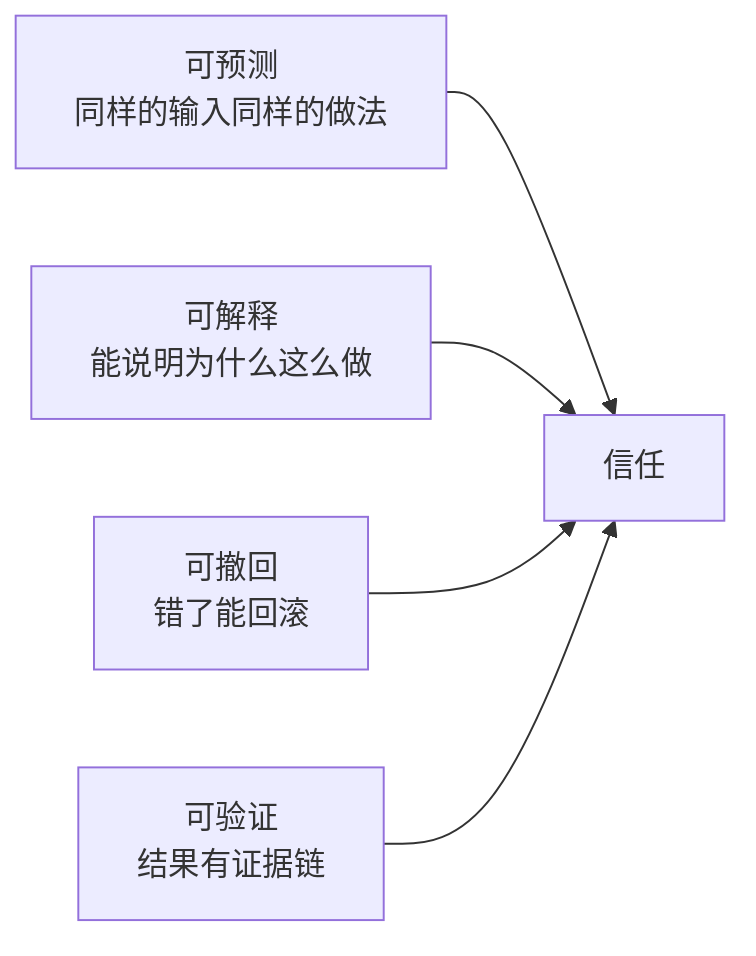

# 深入专题 · 人机交互与协作（HITL 模式 + 真实用例）

> Agent 不是"替代人"，而是"重新分工"。本篇讲人与 Agent 的协作光谱、交互模式与落地用例。

## 1. 人机协作光谱（Autonomy Slider）

```
全手动        辅助          共驾           委托           自治
Copilot ──→ 建议模式 ──→ 审批模式 ──→ 监督模式 ──→ Autopilot
人做 AI 看   AI 建议人决定  AI 做人审关键点  AI 做人抽检  AI 做人例外介入
```

| 档位 | 人的角色 | 典型交互 | 适用 |
|------|----------|----------|------|
| Copilot 辅助 | 执行者 | 补全、问答、草稿 | 低风险创作（写文案、写代码片段） |
| 建议模式 | 决策者 | AI 给方案+理由，人选择/修改 | 分析类（数据解读、方案比选） |
| 审批模式（HITL） | 审批者 | AI 执行，关键操作暂停等人批准 | 有不可逆动作（发布、付款、删除） |
| 监督模式 | 抽检员 | AI 全自动，人抽查 + 看板告警 | 高频重复（审核、分类、巡检） |
| 自治模式 | 例外处理者 | AI 闭环，只有异常升级给人 | 成熟稳定场景（Stripe Minions） |

**核心原则**：风险越高、越不可逆，档位越靠左；**先右移试错、站稳再左移放权**——自治是挣来的，不是默认的。

## 2. 六种 HITL 交互模式

### 2.1 审批检查点（Approval Checkpoint）
- Agent 执行到高危动作前暂停 → 展示"要做什么+为什么+影响"→ 人批准/拒绝/修改
- **设计要点**：审批界面必须给足上下文（盲批 = 没批）；支持"批准并记住同类"避免审批疲劳
- 用例：CodeBuddy 的危险命令审批、财务 Agent 的付款确认

### 2.2 主动澄清（Clarification）
- 需求模糊时 Agent 反问（"你说的'近期'是近 7 天还是 30 天？"）而非硬猜
- **设计要点**：澄清要给出选项而非开放提问（选择题比问答题省事）；限制澄清轮次（≤2 次，问多了人烦）
- 反模式：什么都不问直接干（错得离谱）；事事都问（不如自己干）

### 2.3 中途纠偏（Steering）
- 人在 Agent 执行中插入指令（"方向不对，改用方案 B"），Agent 带着新指令继续
- 依赖：可中断的循环（每步检查新消息）+ 状态可快照（能从纠偏点继续而非重来）
- 用例：CodeBuddy Team 运行中给成员发消息调整方向

### 2.4 计划确认（Plan Approval）
- Agent 先出计划（步骤清单）→ 人审计划 → 批准后才执行（Plan 模式的本质）
- 价值：纠偏成本最低的时间点是"动手之前"——审计划比审结果快 10 倍
- 进阶：Spec-Driven Development 就是把这一模式固化成开发流程

### 2.5 升级与转交（Escalation）
- Agent 识别"超出能力/权限"主动升级：置信度低、连续失败（two-strike）、涉及敏感事项
- **设计要点**：升级时交接完整上下文（做了什么、卡在哪、试过什么），不让人从零排查
- 用例：客服 Agent 转人工时附上对话摘要与已尝试方案

### 2.6 异步委托与回访（Fire-and-Report）
- 人布置任务后离开，Agent 长时运行，完成后推送结果+待办（适合 Loop 工程场景）
- **设计要点**：结果通知=结论+置信度+需要人做的动作；长时间任务要有进度心跳（"还在跑，已完成 60%"）

## 3. 交互信任的建立（为什么人愿意放权）



- 四条缺一，人就会退回"事事亲为"——这也是 Harness 工程（观测/验证/回滚）对**用户体验**的直接贡献
- 反面教材：AI 悄悄改了不该改的文件（不可预测+不可撤回）→ 用户从此关掉自动模式

## 4. 真实用例拆解

### 用例 1：AI 编程伙伴（CodeBuddy / Claude Code）
- 协作流：人写需求 → Agent 出计划（可批准/修改）→ 分步实现（每步 diff 可审）→ 跑测试自验 → 人 review 合并
- 交互亮点：危险命令需审批；子代理并行时人可随时插入纠偏；出错时 Agent 带着错误日志自我修正
- 人的角色迁移：从"写代码的人"变成"写规格、审 diff、把质量关的人"

### 用例 2：智能客服（审批模式 + 升级模式）
- L1 机器人直接答（FAQ 命中率 ~70%）→ 低置信自动转 L2（检索+生成，附引用）→ 敏感诉求（退款/投诉）走审批给人 → 无法解决升级人工（附摘要）
- 关键指标：解决率、转人工率、审批平均耗时（审批太慢 = 用户流失）

### 用例 3：数据分析助手（建议模式）
- 人问"上月销售为什么下滑"→ Agent 查数、出 3 个假设+各自证据 → 人选一个方向 → Agent 深挖出报告
- 设计要点：给假设不给定论（数据解读的最终判断权在人），每个数字可下钻来源

### 用例 4：运维巡检 Agent（监督模式 → 自治模式演进）
- 第一阶段：AI 只出诊断建议，人执行（建议模式）
- 第二阶段：低风险操作（重启、清理）自动执行+事后报告（审批→监督）
- 第三阶段：常规故障自愈，只有新类型故障升级（自治 + 例外介入）
- **启示**：同一系统不同操作可以有不同档位，渐进放权

### 用例 5：深度研究助手（异步委托）
- 人下课题 → Agent 多小时检索阅读 → 产出带引用的报告 + "建议人复核的 3 个存疑点"
- 交互精髓：不是交"最终答案"，而是交"带置信度标注的工作成果"

## 5. 人机交互设计清单

- [ ] 每个动作标了风险档位吗？（只读/可逆/不可逆 → 对应自动/审批）
- [ ] 审批请求带足上下文了吗？（做什么/为什么/影响面/回滚方式）
- [ ] Agent 会主动澄清吗？有轮次上限吗？
- [ ] 执行中人能插入纠偏吗？纠偏后能续跑吗？
- [ ] 失败升级的交接信息完整吗？（进展/卡点/已尝试）
- [ ] 结果带证据链吗？（引用/日志/diff 可查验）
- [ ] 有"审批疲劳"防护吗？（高频低风险审批会逼人盲目点同意 → 合并/降级/记住选择）

## 6. 与其他专题的关系

- 权限分级的工程实现 → [Harness 工程](./Harness工程实战.md) L6 层、[题库 09 Q40](../12-AI面试题库/09-Agent-MCP-Skills专项题库.md)
- 自主运行的触发机制 → [Agent 工程体系总览](./Agent工程体系总览.md) §5 Loop 工程
- 多 Agent 场景下人管的是"Lead"还是"全员" → [多Agent协作详解](./多Agent协作详解.md)（人只对接 Lead，Lead 管理成员）

## 7. 动手作业

1. 观察自己今天与 AI 的 3 次交互，分别属于光谱哪一档？有没有该放权没放/不该放却放了的？
2. 给一个"AI 自动整理周报并群发"的需求设计档位方案：哪些步骤自动、哪一步必须审批？
3. 用 CodeBuddy 体验一次计划确认模式：让 Agent 先出实现计划，你修改后再让它执行，体会"审计划 vs 审代码"的效率差
