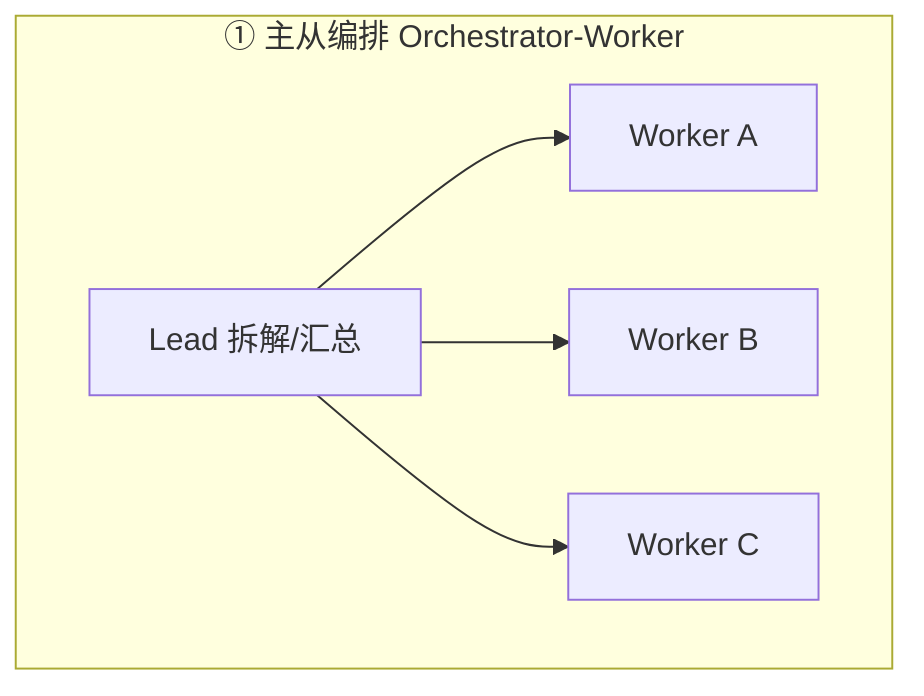

# 深入专题 · 多 Agent 协作（架构模式 + 真实用例）

> 基础概念见 [README](./README.md) §5，设计轴见 [Agent工程体系总览](./Agent工程体系总览.md) §3。本篇回答：多 Agent 系统怎么设计、怎么通信、什么时候真的需要。

## 1. 先记住三条军规

1. **能单 Agent 别上多 Agent**（Anthropic 官方提醒）：多 Agent 的 token 消耗约为单 Agent 的 4~15 倍，且引入通信、一致性、调试复杂度
2. **拆分理由是"上下文隔离"，不是"角色扮演好玩"**：每个子 Agent 拥有独立干净的上下文，这是多 Agent 的本质收益
3. **并行是第二收益**：独立的子任务同时跑，墙钟时间骤降（Anthropic 研究系统靠并行把调研时间压缩 90%）

## 2. 五种协作架构模式

| 模式 | 结构 | 适用 | 真实案例 |
|------|------|------|----------|
| ① 主从编排 | Lead 规划分派，Worker 执行汇报 | 任务可拆解、子任务相对独立（调研、批量处理） | Anthropic 多Agent研究系统、CodeBuddy Team |
| ② 流水线 | A 输出 → B 输入 → C 输入 | 工序明确的串行加工（写稿→审校→排版） | 内容生产流水线 |
| ③ 生成-评审（Generator-Critic） | 生成者与评审者循环对抗 | 质量优先任务（代码、法律文书） | Anthropic Planner→Generator⇄Evaluator（类 GAN） |
| ④ 黑板/共享状态 | 多 Agent 读写同一份结构化状态 | 需要持续共享中间结论的复杂任务 | 多机器人协同、运维诊断 |
| ⑤ 辩论/投票 | 多 Agent 独立作答 → 交叉质疑 → 收敛 | 开放性问题、提高鲁棒性（self-consistency 的多 Agent 版） | 多模型陪审团评估 |

## 3. 通信与状态：工程难点所在

### 3.1 通信方式

| 方式 | 说明 | 注意点 |
|------|------|--------|
| 消息信箱 | 异步消息，Lead 路由分发（CodeBuddy Team 的 send_message 模式） | 消息要**结构化**（类型/摘要/正文），防自由文本误解 |
| 共享文件/工件 | 子 Agent 把结论写成文件，其他 Agent 读取 | 最适合大产出（报告、代码），避免上下文搬运 |
| 黑板状态 | 共同读写结构化 State（LangGraph State） | 需要并发控制与 schema 约束 |

### 3.2 三大一致性坑

1. **上下文断裂**：子 Agent 不知道全局目标 → Lead 分派时必须给"任务+背景+验收标准"三件套，而非只丢一句话
2. **重复劳动**：两个 Agent 查了同样的资料 → 任务划分按"互斥且穷尽"原则；Anthropic 专门设**去重 Agent**
3. **错误级联**：A 的错误结论成为 B 的输入 → 关键交接点加校验（Verifier 节点），可追溯每个结论的来源 Agent

## 4. 真实用例拆解

### 用例 1：Anthropic 多 Agent 研究系统（Deep Research）
- **架构**：Lead（规划）→ 并行 3~5 个 Research 子 Agent（各自搜索+阅读+提炼）→ Lead 汇总 → Citation Agent 核对引用
- **效果**：内部评估比单 Agent 高 90.2%（广度优先的调研任务）；token 消耗约为聊天 15 倍 → 结论：**高价值任务才值得**
- **可借鉴**：子 Agent 只回传"提炼后的结论+来源"，不回传原始网页（省主上下文）

### 用例 2：Anthropic 16 Agent 写 C 编译器（Carlini 实验）
- 16 个并行 Agent、约 2000 会话，产出 10 万行代码，GCC torture test 99% 通过
- 关键设计：日志写文件且 grep 友好（Agent 可自查）、测试子采样（控成本）、**独立去重 Agent**（专职发现重复实现）

### 用例 3：CodeBuddy Team（本环境同款）
- Lead 用 Task 工具异步孵化成员（researcher/coder/reviewer），成员间 `send_message` 通信，历史持久化可恢复
- 适用：前端+后端并行开发、边研究边编码的长任务

### 用例 4：Stripe Minions（混合编排）
- 不是纯多 Agent：确定性状态机节点 + Agent 节点混合——**确定的部分不给 Agent**（稳定），不确定的部分才给（灵活）
- 每周 1300+ 无人值守 PR；two-strike 规则（失败两次升级人工）

### 用例 5：客服工单系统（业务落地范式）
- 路由 Agent（意图分类）→ 专业 Agent（售后/账单/技术）→ 升级 Agent（判断何时转人工）
- 价值：每个专业 Agent 的 prompt 和工具集聚焦，质量高于"全能 Agent"

## 5. 设计决策清单（动手前自查）

- [ ] 子任务之间**真的独立**吗？（强耦合任务拆分 = 通信成本 > 收益）
- [ ] 拆分是为了什么：上下文隔离 / 并行提速 / 专业分工？（至少要占一条）
- [ ] Lead 分派的任务描述包含验收标准吗？
- [ ] 子 Agent 的产出是"结论"还是"原文"？（必须前者）
- [ ] 有去重、校验、冲突仲裁机制吗？
- [ ] 失败时谁兜底？（重试上限 + 升级人工的路径）
- [ ] 成本预算？（多 Agent 先按单 Agent 的 5~10 倍估）

## 6. 反模式（不要这样做）

- ❌ 为"像公司组织"而拆分（经理/总监/员工角色扮演秀）——组织形态不等于计算效率
- ❌ 子 Agent 之间自由闲聊式多轮对话——token 燃烧且结论漂移，通信要克制结构化
- ❌ 所有 Agent 共享一个超长上下文——丧失了上下文隔离这个唯一大收益
- ❌ 没有验收标准就分派——垃圾进垃圾出的多 Agent 版

## 7. 动手作业

1. 用本环境的 Task 工具同时孵化 2 个子代理（一个调研、一个写代码），观察通信与产出质量
2. 把同一个复杂任务分别交给"单 Agent 长上下文"和"主从两个 Agent"，对比 token 消耗与结果质量
3. 阅读面试题 [09 专项 Q41](../12-AI面试题库/09-Agent-MCP-Skills专项题库.md)，准备"什么时候不该用多 Agent"的面试答案
