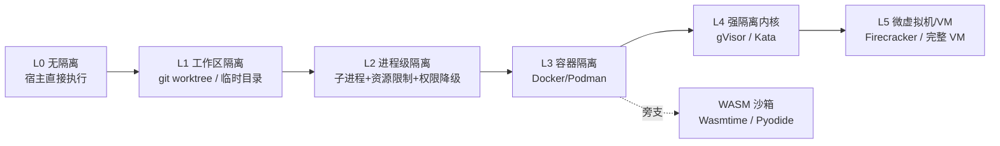

# 深入专题 · 沙盒与执行隔离（技术方案 + 对比选型）

> 为什么单独成篇：Agent 能跑代码就有了"手"，但**没有沙盒的 Agent 等于把 root shell 交给了一个会幻觉的程序**。这是 Harness 六层框架 L6（约束与恢复层）的核心实现。

## 1. 威胁模型：Agent 执行代码会出什么事

| 风险 | 具体表现 | 后果 |
|------|----------|------|
| 误删/误改 | `rm -rf` 路径写错、覆盖配置文件 | 数据不可逆丢失 |
| 越权访问 | 读取 `~/.ssh`、`.env`、云凭证 | 密钥泄露 → 账号被接管 |
| 数据外泄 | Agent 被提示注入后把敏感数据 POST 到外部 | 合规事故（且无法撤回） |
| 资源耗尽 | 死循环、fork 炸弹、内存泄漏 | 宿主被拖垮（雪崩） |
| 供应链风险 | 安装恶意依赖，执行 `postinstall` 脚本 | 后门植入 |
| 逃逸 | 容器配置不当导致逃逸到宿主 | 影响整个基础设施 |

**核心原则**：假设 Agent 一定会犯错或被注入——设计目标不是"让它不犯错"，而是**"犯错的爆炸半径可控"**。

## 2. 隔离等级光谱（从弱到强）



| 等级 | 隔离对象 | 冷启动 | 开销 | 逃逸风险 | 适用 |
|------|----------|--------|------|----------|------|
| L0 无隔离 | 无 | 0 | 0 | 极高 | ❌ 任何生产场景都不该用 |
| L1 工作区隔离 | 文件系统 | 极快 | 极低 | 高（进程仍裸奔） | 只读分析、纯文本编辑 |
| L2 进程级 | 进程/资源 | 毫秒 | 低 | 中 | 单机可信环境、个人开发 |
| L3 容器 | 内核命名空间+cgroups | 亚秒~秒 | 低~中 | 低（配置正确时） | **默认选择**（CI、团队环境） |
| L4 强隔离内核 | 系统调用层 | 亚秒 | 中 | 极低 | 多租户、执行不可信代码 |
| L5 微虚拟机 | 硬件虚拟化 | 毫秒级（Firecracker）~秒 | 中高 | 极低 | 云沙箱服务、多租户生产 |
| WASM | 字节码运行时 | 毫秒 | 低 | 极低（能力受限） | 纯计算、插件式扩展 |

> 选型口诀：**单机自用 L1~L2，团队 CI 用 L3，对外多租户必须 L4/L5**。

## 3. 主流技术方案详解

### 方案 A：Docker / Podman（最实用）
```bash
docker run --rm \
  --network none \                    # 默认断网（要网则走白名单代理）
  --read-only \                       # 根文件系统只读
  --tmpfs /tmp:size=512m \            # 只给临时可写区
  --memory 1g --cpus 1 --pids-limit 128 \
  --cap-drop ALL --security-opt no-new-privileges \
  -v "$PWD/work:/work:rw" \           # 只挂载工作目录
  -w /work python:3.12-slim \
  timeout 120 python script.py
```
- **优点**：生态成熟、镜像即环境、易与 CI 集成
- **缺点**：共享内核（逃逸风险存在）；冷启动亚秒到秒级
- **要点**：`--cap-drop ALL`、`no-new-privileges`、非 root 用户、只读根、PID 上限防 fork 炸弹

### 方案 B：gVisor / Kata Containers（强隔离内核）
- **gVisor**：在用户态实现系统调用接口（用户态内核），Agent 的 syscall 不直接进宿主内核 → 逃逸面大幅缩小
- **Kata**：每个容器配一个轻量 VM 内核，兼容 OCI 接口（对 Docker 命令透明）
- **代价**：系统调用密集场景性能下降（10%~数倍不等），兼容性偶有坑
- **选型**：多租户、执行外部用户代码、安全合规要求高时值得

### 方案 C：Firecracker 微虚拟机（云沙箱主流）
- AWS 出品，毫秒级启动的轻量 VM（Lambda/Fargate 底座）
- 每个沙箱一个独立内核 + 独立文件系统 → 隔离最强之一
- 代表产品：E2B、Daytona、Modal、Cloudflare Sandbox（各云厂商 Agent 沙箱）
- **用法**：不用自建，直接用托管沙箱 API（省掉最难的运维），本地开发可用其 SDK

### 方案 D：WASM 沙箱（Wasmtime / Pyodide）
- 编译为 WASM 后运行在能力受限的运行时：默认无文件/网络访问，需显式授权
- **优点**：毫秒启动、极低开销、跨平台、天然最小权限
- **缺点**：生态受限（不能随意跑任意 native 依赖与 shell 命令）
- **适用**：纯计算型工具（数据转换、公式计算、插件系统）——不给它 shell 是最好的保护

### 方案 E：进程级最小实现（Python 示例，无 Docker 时的底线方案）
```python
import subprocess, resource, os, tempfile

def run_sandboxed(code: str, timeout: int = 30):
    def limit():                       # 子进程资源限制（Linux）
        resource.setrlimit(resource.RLIMIT_CPU, (timeout, timeout))
        resource.setrlimit(resource.RLIMIT_AS, (512 * 1024**2, 512 * 1024**2))  # 512MB
        resource.setrlimit(resource.RLIMIT_NPROC, (64, 64))                     # 防 fork 炸弹
        resource.setrlimit(resource.RLIMIT_FSIZE, (10 * 1024**2, 10 * 1024**2))
        os.setsid()                     # 独立进程组，便于整组杀
    with tempfile.TemporaryDirectory() as workdir:
        proc = subprocess.run(
            ["python", "-c", code],
            cwd=workdir, env={"PATH": "/usr/bin", "HOME": workdir},  # 干净环境，不带宿主凭证
            preexec_fn=limit, capture_output=True, text=True, timeout=timeout,
        )
        return proc.stdout[:2000], proc.stderr[:2000]
```
- **优点**：零依赖、可嵌入任何程序
- **缺点**：**不是安全沙盒**（无内核隔离），只防"手滑"，防不住恶意代码——仅作兜底

### 方案 F：Jupyter Kernel / 语言级隔离
- 独立 kernel 进程 + 变量空间隔离，适合"数据分析型" Code Interpreter
- 局限：文件系统通常不隔离（需配合 chroot/容器）

## 4. 六道防线（沙盒之外的配套）

| 防线 | 手段 | 说明 |
|------|------|------|
| ① 文件系统 | 只读根 + 只挂载工作目录 + overlayfs 快照 | 快照让"随便改，随时回滚"成立 |
| ② 网络 | 默认无网；需要则**域名白名单代理** | 直接给全网出网 = 数据外泄通道 |
| ③ 凭证 | 密钥不进沙箱；由代理层注入 | Agent 看到的永远是占位符 |
| ④ 命令策略 | 白名单优先；危险模式检测（`rm -rf /`、`curl\|sh`） | 黑名单永远列不全 |
| ⑤ 资源 | CPU/内存/磁盘/PID/墙钟上限 | 每个沙箱都有"预算"，超限即杀 |
| ⑥ 审批 | L2 不可逆动作人工审批 | 见 [人机交互与协作用例](./人机交互与协作用例.md) |

**注**：①~⑥ 全部属于 Harness 组件——沙盒不是一个 Docker 命令，而是一套系统能力。

## 5. 对比选型决策表

| 场景 | 推荐方案 | 理由 |
|------|----------|------|
| 个人本地开发 Agent | L1 worktree + L2 进程限制 | 零运维、体验快 |
| 团队 CI 中跑 AI 生成的代码 | L3 容器（script 固定化） | 可复现、易集成 |
| 企业内部 Agent 平台（多部门） | L3/L4 容器 + 强隔离内核 | 部门间互不信任 |
| 对外的 Agent 产品（多租户） | **L5 托管云沙箱（E2B 等）** | 隔离最强、免运维、可弹性 |
| 纯计算工具（公式/转换） | WASM | 最小权限、毫秒启动 |
| 浏览器 Agent | 独立浏览器上下文 + 容器化 | 会话隔离 + 网络白名单 |
| 数据分析 Agent | 容器 + 只读数据挂载 + Jupyter | 便捷与隔离平衡 |
| 高合规行业（金融/医疗） | 私有部署 L4/L5 + 全审计 | 数据不出域、可追溯 |

**成本-隔离度权衡图（心智模型）**：
```
隔离强度：  无 < worktree < 进程 < 容器 < 强内核 < 微VM
运维成本：  0  <  极低   < 低   < 中   <   中高  < 高（或托管转嫁）
冷启动：    0  <  极快   < 毫秒 < 亚秒 <  亚秒  < 毫秒(Firecracker)/秒(VM)
```
> 结论：**先用容器，多租户再升级强隔离，能用托管云沙箱就别自建**（自建微虚拟机编排是专门的基础设施工程）。

## 6. 反模式（血的教训）

- ❌ 在宿主直接执行模型生成的代码（L0）——最常见也最致命
- ❌ 容器开着 `--privileged` 或挂载 docker.sock——等于没隔离
- ❌ 有网 + 有凭证 + 可写挂载 三者同时具备——数据外泄只差一次提示注入
- ❌ 只做黑名单命令过滤——`$(...)`、编码混淆、间接执行绕过方式无穷
- ❌ 沙箱内放云凭证"方便调试"——调试完忘记删是经典事故
- ❌ 无超时与资源上限——死循环 Agent 能把整台机器拖垮
- ❌ 沙箱快照有但没测过恢复——出事时才发现回滚脚本是坏的（定期演练）

## 7. 与其它专题的关系

- Harness 六层框架的 L6（约束/校验/恢复）→ [Harness工程实战](./Harness工程实战.md)
- 执行隔离是 10 个设计轴之一（execution isolation: none → worktree → sandbox → VM）→ [Agent工程体系总览](./Agent工程体系总览.md) §3
- 不可逆动作的人工审批 → [人机交互与协作用例](./人机交互与协作用例.md) §2.1
- 面试对应题 → [题库 09 Q40](../12-AI面试题库/09-Agent-MCP-Skills专项题库.md)、[题库 05 Q9](./README.md)
- 完整平台级落地（多租户/调度/合规）→ [云端智能体系统设计方案](./云端智能体系统设计方案.md)

## 8. 学完自测检查点

1. 说出隔离光谱六级，并指出"个人开发""团队 CI""对外多租户"各应选哪级
2. 容器方案必须加的三个安全参数是什么（cap-drop / no-new-privileges / 非 root）
3. 为什么"有网 + 有凭证 + 可写"是最危险的组合？举一个攻击链
4. 白名单与黑名单在命令过滤上的根本差异和结论
5. 六道防线分别属于"预防、限制还是恢复"？
6. 为什么"能用托管云沙箱就别自建"？自建的成本在哪
