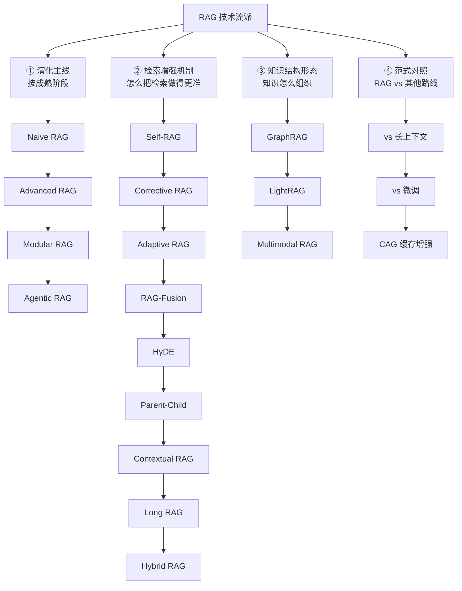

# 学习笔记 · RAG 技术流派全解析（18 种变体逐一拆解）

> 基础链路见 [README](./README.md)，生产优化见 [RAG进阶实战](./RAG进阶实战.md)。本篇回答：RAG 家族到底有哪些成员？各自解决基础 RAG 的什么痛点？怎么选、怎么组合？

## 0. 全景分类图（先建立坐标系）



---

## ① 演化主线（按成熟阶段）

### 1. Naive RAG（朴素 RAG / 基础 RAG）
- **流程**：文档切分 → Embedding → 向量检索 Top-K → 拼进 Prompt → 生成
- **解决**：知识截止、私有数据、幻觉三大问题（最低成本方案）
- **痛点**：检索不准（语义鸿沟）、切分伤语义、检索到了不照答、"检索-生成"单行道无法纠错
- **定位**：一切流派的起点和对照组；原型验证够用

### 2. Advanced RAG（增强 RAG）
- **核心思想**：在 Naive 的**前/中/后**三个环节各加优化层
  - 检索前：查询改写、指代消解、查询扩展
  - 检索中：混合检索、Rerank 精排、元数据过滤
  - 检索后：上下文压缩、去重、关键内容置首尾
- **解决**：Naive 的召回与信噪比问题（不改架构，只加优化件）
- **定位**：**生产系统的默认形态**——绝大多数业务 RAG 应止步于此（见 [进阶实战三梯队](./RAG进阶实战.md) §3）

### 3. Modular RAG（模块化 RAG）
- **核心思想**：把 RAG 拆成可插拔模块（检索模块/记忆模块/路由模块/融合模块…），像积木一样自由编排，不再固定"检索→生成"流水线
- **示例**：检索模块可以换成搜索 API、SQL、图谱查询；流程可以加循环、分支
- **解决**：Advanced 的优化件堆成一坨难以维护的问题
- **定位**：工程视角的演进——LlamaIndex 的 Query Pipeline、LangGraph 编排都是这一思想的落地

### 4. Agentic RAG（智能体化 RAG）
- **核心思想**：把 RAG 的决策权交给 Agent——**是否检索、检索哪个源、检索几轮、结果够不够、不够怎么办**全部由 LLM 自主判断
- **流程**：`收到问题 → 判断需不需要检索 → 选数据源 → 检索 → 自评结果 → 不够则换角度重检 → 生成`
- **对比普通 RAG**：

| 维度 | 普通 RAG | Agentic RAG |
|------|----------|-------------|
| 检索次数 | 固定 1 次 | 动态（0~N 次） |
| 检索策略 | 固定 pipeline | LLM 自主选择 |
| 结果不满意 | 硬生成 | 换策略重检 |
| 复杂问题 | 易答偏 | 可拆解子问题 |
| Token 成本 | 低 | 高 |

- **适用**：复杂知识问答（法律、医疗、金融）；简单问答别过度设计
- **定位**：RAG 与 Agent 的合流点（详见 [题库04 Q21](../12-AI面试题库/04-RAG与知识库.md)）

---

## ② 检索增强机制（怎么把检索做得更准）

### 5. Self-RAG（自我反思 RAG）
- **核心思想**：模型在生成过程中**自主决定**是否检索、检索结果是否相关、生成是否忠实——通过特殊"反思 token"训练实现
- **流程**：`问题 → 模型自评：需要检索吗？→ 检索 → 自评：这段相关吗？→ 生成 → 自评：我的答案有依据吗？`
- **解决**："不需要检索也硬检索"（浪费+噪声）与"检索到了却不照着答"（幻觉）
- **代价**：需要专门训练反思 token；通用模型可用 prompt 模拟（效果打折）
- **定位**：按需检索的思想源头

### 6. Corrective RAG（CRAG，纠正式 RAG）
- **核心思想**：检索之后**先评估检索质量**，再决定怎么用——
  - ✅ 正确：照常用
  - ❌ 错误：**丢弃，改用网络搜索兜底**
  - ⚠️ 模糊：精炼后混合使用
- **解决**：检索到垃圾还硬生成的问题
- **定位**：给 RAG 加"质量闸门"，工程上最容易模拟（评估器 + 分支逻辑），性价比极高

### 7. Adaptive RAG（自适应 RAG）
- **核心思想**：按**问题复杂度**动态选路径——
  - 简单问题：不检索，直接答
  - 中等问题：单步检索
  - 复杂问题：多步迭代检索
- **解决**："一刀切都检索"的浪费与"复杂问题检索一次不够"的不足
- **定位**：CRAG 的升级版，按需分配算力（分类器/小模型判断复杂度）

### 8. RAG-Fusion（融合 RAG）
- **核心思想**：一个问题 → LLM 生成**多个变体查询** → 并行检索 → **RRF 融合**排序
- **解决**：单一查询表达的偏差（换个问法结果完全不同）
- **代价**：检索成本 × N
- **定位**：多路召回的标准实现（与混合检索正交，可叠加）

### 9. HyDE（假设文档检索）
- **核心思想**：先让 LLM **凭空生成一个"假设答案"**，用假设答案（而非原问题）去检索——因为答案与文档的"语言分布"更接近
- **示例**：问"RAG 怎么降幻觉？"→ 先生成一段假设性回答 → 用这段话检索 → 命中的是真正讨论该主题的文档
- **解决**：问题短、文档长的语义鸿沟
- **代价**：多一次 LLM 调用；假设错了会带偏检索 → 与 CRAG 质量闸门搭配

### 10. Parent-Child RAG（小块检索、大块回答 / Small-to-Big）
- **核心思想**：**小块做检索**（语义精准），命中后**返回其父块**（上下文完整）
- **变体**：句子窗口检索（命中句返回其前后窗口）
- **解决**："切块两难"——大块稀释、小块断章（检索精度与上下文完整性兼得）
- **定位**：生产最实用的技巧之一，改造成本低收益大

### 11. Contextual RAG（上下文增强 RAG，Anthropic 提出）
- **核心思想**：切分每个 chunk 时，**用 LLM 为每个块生成"它在全文中的位置与作用说明"**，拼在块前再入库
- **解决**：块脱离原文语境导致的歧义（如"本方案成本降低 30%"——什么方案？）
- **代价**：入库时每块一次 LLM 调用（Anthropic 报告检索失败率降低约 35~49%，成本可用 prompt caching 压低）
- **定位**：入库贵、检索准——适合文档相对稳定的场景

### 12. Long RAG（长块 RAG）
- **核心思想**：借助长上下文模型，直接用**很长的块（整节/整文档）**检索，减少切分损失
- **解决**：切分破坏语义的问题
- **权衡**：块大了检索精度下降、成本上升 → 与 Parent-Child 是相反方向的两条路线，按场景选
- **定位**：长上下文模型红利下的新形态

### 13. Hybrid RAG（混合检索 RAG）
- **核心思想**：向量（语义）+ BM25（关键词）双路召回 + RRF 融合
- **解决**：专有名词、型号、代码符号召回差
- **定位**：**生产标配，没有之一**（详见 [题库04](../12-AI面试题库/04-RAG与知识库.md) Q5/Q27）

---

## ③ 知识结构形态（知识怎么组织）

### 14. GraphRAG（图谱 RAG）
- **核心思想**：LLM 抽取实体+关系建知识图谱 → 社区聚类 → 预生成社区摘要；全局问题查摘要、局部问题走向量+图谱邻居扩展
- **解决**：跨文档全局性问题、多跳推理（"A 的供应商的竞争对手"）
- **代价**：建图 LLM 调用量大（向量 RAG 的 5~20 倍成本）
- **详见**：[RAG进阶实战 §1](./RAG进阶实战.md)

### 15. LightRAG（轻量图谱 RAG）
- **核心思想**：简化 GraphRAG——双层检索（低层实体/关系、高层主题/摘要）、增量更新友好，去掉昂贵的社区层级
- **定位**：GraphRAG 想法好但太贵，LightRAG 是工程化的务实折中

### 16. Multimodal RAG（多模态 RAG）
- **核心思想**：知识库不止文本——图片/表格/PDF 版式/音视频都能检索与引用
- **三种技术路线**：
  1. 统一 embedding（CLIP 类图文同空间检索）
  2. 多模态 LLM 直接读图（视觉 token 入上下文）
  3. 先 OCR/描述转文本再入库（最简单，损失视觉信息）
- **适用**：含图表的技术文档、带截图的工单、设计素材库

---

## ④ 范式对照（RAG vs 其他路线）

### 17. RAG vs 长上下文（Long Context）
| 维度 | RAG | 塞长上下文 |
|------|-----|-----------|
| 成本 | 低（只注入 Top-K） | 高（全量 token 每轮计费） |
| 检索精度 | 依赖检索质量 | 不漏但利用率低（Lost in the Middle） |
| 权限控制 | 天然支持过滤 | 难 |
| **结论** | **生产默认** | 一次性分析超长文档；主流是"RAG 粗筛 + 长上下文细读"混合 |

### 18. CAG（Cache-Augmented Generation，缓存增强生成）
- **核心思想**：知识库小且稳定时，**不用检索**——把全部知识预加载进 KV Cache，直接"开卷背答"
- **对比 RAG**：无检索延迟、无检索失败风险；但知识必须塞得进上下文且更新要重建缓存
- **适用**：小知识库（政策手册、产品 FAQ）+ 高频问答
- **定位**：提醒我们"RAG 不是目的而是手段"——知识够小就不用检索

---

## 总对比表（一页速查）

| 流派 | 核心改进 | 成本 | 最佳场景 | 不适合 |
|------|----------|------|----------|--------|
| Naive | - | 最低 | 原型验证 | 生产直接上 |
| Advanced | 三环节优化 | 低 | **生产默认形态** | - |
| Modular | 模块可插拔 | 中 | 复杂编排维护 | 简单需求 |
| Agentic | 决策权交给 Agent | 高 | 复杂多源问答 | 简单问答 |
| Self-RAG | 按需检索+自评 | 中 | 减少无效检索 | 需专门训练 |
| CRAG | 检索质量闸门 | 低 | 检索源不稳定 | - |
| Adaptive | 按复杂度选路径 | 中 | 问题难度差异大 | 难度均匀场景 |
| RAG-Fusion | 多查询+RRF | 中 | 表述偏差大的问题 | 高频简单查询 |
| HyDE | 假设答案检索 | 中 | 短问题长文档 | 事实核查类 |
| Parent-Child | 小检大答 | 低 | **生产必上** | - |
| Contextual | 块加上下文说明 | 入库高 | 文档稳定的知识库 | 高频更新文档 |
| Long RAG | 长块少切分 | 中 | 长上下文模型可用 | 成本敏感 |
| Hybrid | 向量+BM25 | 低 | **生产标配** | - |
| GraphRAG | 知识图谱 | **高** | 全局/多跳问题 | 普通问答 |
| LightRAG | 轻量图谱 | 中 | 想要图谱又嫌贵 | - |
| Multimodal | 多模态检索 | 中高 | 图表/截图知识库 | 纯文本 |
| CAG | 全量预载缓存 | 低（小库） | 小而稳的知识库 | 大/常变知识库 |

## 选型决策树（组合式，不二选一）

```
知识库小且稳定？→ CAG（免检索）
     ↓ 否
文档里有大量图表/截图？→ Multimodal 路线（先选形态再选增强）
     ↓ 否
有跨文档全局/多跳问题？→ GraphRAG/LightRAG（评估成本，先试点）
     ↓ 否
→ Advanced RAG 起步：混合检索 + Rerank + Parent-Child（性价比三件套）
   ├ 检索源不稳/质量参差？→ + CRAG 质量闸门
   ├ 问题表述多变？→ + RAG-Fusion / 查询改写
   ├ 块语义脱离原文？→ + Contextual RAG（入库预算允许时）
   ├ 问题难度差异大？→ + Adaptive 路由
   └ 复杂多源调研类任务？→ 升级 Agentic RAG
```

**组合心法**：流派不是单选题——**生产系统 = Advanced 骨架 + 按痛点叠加增强件**。每加一个组件前先问：它解决的痛点在我的评测集上真实存在吗？

## 面试高频问答

1. **Naive/Advanced/Modular/Agentic 的演进逻辑？** → 补优化件 → 解耦可编排 → 引入自主决策；每一代解决上一代的结构性短板
2. **CRAG 和 Self-RAG 的区别？** → CRAG 在"检索后"加质量闸门（外部评估器+分支）；Self-RAG 让模型全程自评（需反思 token 训练）
3. **Parent-Child 解决什么两难？** → 检索精度（要小块）vs 上下文完整（要大块）——小块检索、大块作答
4. **GraphRAG 为什么贵？** → 建库需 LLM 逐文档抽取实体关系；换来了向量检索做不到的全局与多跳能力
5. **CAG 是什么？什么时候替代 RAG？** → 知识预载 KV Cache 免检索；知识小且稳定时更快更稳

## 学完自测检查点

1. 不看资料默画 §0 全景分类图（四大类 + 每类至少 3 个成员）
2. 说出 Agentic RAG 与普通 RAG 的五个维度差异
3. CRAG 的三分支处理逻辑是什么
4. Parent-Child、Long RAG、Contextual 三者分别解决切分的哪个问题？
5. 用决策树为一个"企业制度知识库问答"（文档稳定、含图表、问题难度差异大）设计完整技术方案
6. 用决策树为一个"客服 FAQ 机器人"（知识小而稳定、问题简单）设计方案——答案应该接近 CAG + 简单 Advanced

---

## 附录：切分（Chunking）实现方案详解（从策略到代码）

> 流派层面讲"用什么策略"，这一章落到**每一行怎么写**。"复制切片（overlap 滑动窗口）"是最常被问到的实现，从这里开始。

### A1. 固定长度切分 + Overlap 复制切片（滑动窗口）

**原理**：按固定长度切，且**相邻块复制一段重叠区域**（overlap）——这就是"复制切片"。重叠部分保证跨块边界的信息在两个块里都完整出现，检索时任一块命中都能提供完整语义。

```
原文：  [████████████████████████████████]
chunk1: [███████████████]
chunk2:        [███████████████]   ← 前面复制了 overlap 区域
chunk3:               [███████████████]
```

```python
def fixed_chunk(text: str, size: int = 400, overlap: int = 80) -> list[str]:
    """固定长度 + 重叠滑动窗口（字符级，最简实现）"""
    assert 0 <= overlap < size, "overlap 必须小于 chunk_size"
    step = size - overlap                      # 每次前进的步长
    chunks, start = [], 0
    while start < len(text):
        chunk = text[start:start + size]
        if chunk.strip():
            chunks.append(chunk.strip())
        if start + size >= len(text):          # 已覆盖到末尾
            break
        start += step
    return chunks
```

**参数经验值**：
| 参数 | 中文建议 | 说明 |
|------|----------|------|
| chunk_size | 300~500 字 | 太大稀释相似度、太小丢上下文 |
| overlap | size 的 10~20%（约 50~100 字） | **太大 → 存储与检索结果大量冗余；太小 → 边界信息仍会丢** |
| 步长 | size - overlap | 步长 = size 时就是无重叠切分 |

**升级版：按句子边界对齐的滑动窗口**（避免把句子拦腰切断）：

```python
import re

def sliding_window_by_sentence(text: str, size: int = 400, overlap_sentences: int = 2):
    """按句切分成原子单元，再组块；重叠单位从"字符"变成"句子""""
    sentences = re.split(r'(?<=[。！？!?；;\n])', text)     # 中文按句末标点切
    sentences = [s for s in sentences if s.strip()]
    chunks, cur, cur_len = [], [], 0
    for sent in sentences:
        if cur_len + len(sent) > size and cur:
            chunks.append("".join(cur))
            cur = cur[-overlap_sentences:]                  # 复制尾部 N 句作为重叠
            cur_len = sum(len(s) for s in cur)
        cur.append(sent)
        cur_len += len(sent)
    if cur:
        chunks.append("".join(cur))
    return chunks
```

**复制切片的三个陷阱**：
1. **冗余放大**：overlap=50%、块数翻倍 → 向量库存储与检索成本翻倍，且同一信息命中两次（需去重或降低 top_k）
2. **重叠区截断语义**：overlap 落在句子中间照样断章 → 用"句子对齐版"
3. **重复命中污染**：一个事实在相邻两块各出现一次，占掉 top_k 两个名额 → 命中后按"来源段落"去重

### A2. 递归字符切分（RecursiveCharacterTextSplitter 的原理与实现）

**原理**：不盲目按长度切，而是按**分隔符优先级**递归降级——先尝试按段落切，超长的段落再按句子切，超长的句子再按逗号切……**在"自然边界"上切出"接近目标长度"的块**（LangChain 默认切分器的原理）。

```python
def recursive_split(text: str, size: int = 400,
                    separators: list[str] = None) -> list[str]:
    seps = separators or ["\n\n", "\n", "。", "；", "，", " "]   # 优先级从大到小
    # 1) 找到第一个"存在且能切开"的分隔符
    for sep in seps:
        if sep and sep in text:
            parts = text.split(sep)
            break
    else:
        # 所有分隔符都切不动（超长无标点），硬切
        return [text[i:i + size] for i in range(0, len(text), size)]
    # 2) 贪心组块：拼接相邻片段直到接近 size
    chunks, cur = [], ""
    for part in parts:
        candidate = (cur + sep + part) if cur else part
        if len(candidate) <= size:
            cur = candidate
        else:
            if cur:
                chunks.append(cur)
            if len(part) > size:                 # 该片段自身超长 → 递归降级细切
                chunks.extend(recursive_split(part, size, seps[seps.index(sep) + 1:]))
            else:
                cur = part
    if cur:
        chunks.append(cur)
    return [c for c in chunks if c.strip()]
```

**为什么生产默认用它**：块长均匀 + 边界自然 + 实现简单；配合 overlap 即为 80% 场景的答案。

### A3. 结构感知切分（Markdown / 代码 / 表格 / FAQ）

| 文档类型 | 切法 | 实现要点 |
|----------|------|----------|
| Markdown | 按**标题层级**切：`#` 一级、`##` 二级… | 每块携带"标题路径"元数据：`["第三章 部署", "3.2 环境要求"]`——检索命中时标题路径可拼进上下文（Contextual 思想的低成本版） |
| 代码 | 按**函数/类**切（语法单元完整） | Python 用 `ast` 模块，其余语言用正则/Tree-sitter；超长函数再按逻辑段降级 |
| 表格 | **整表保留，不切**；转 Markdown | 行列关系被切碎 = 灾难；超大表拆"表头+行组"且每块重复表头 |
| FAQ/问答对 | **一问一答一个块** | 绝不跨问答切分；问题与答案分开存（问题做检索锚点） |
| PDF | 先解析（版式/表格/图片）再切 | PyMuPDF/unstructured；扫描件先 OCR；解析质量决定上限 |

```python
# Markdown 标题路径切分（核心思路）
import re

def split_markdown(md_text: str, max_size: int = 800) -> list[dict]:
    chunks, path, buf = [], [], []
    for line in md_text.splitlines():
        m = re.match(r'^(#{1,6})\s+(.*)', line)
        if m:                                   # 遇到标题：结算上一块，更新标题路径
            if buf:
                chunks.append({"title_path": path.copy(), "text": "\n".join(buf)})
                buf = []
            level = len(m.group(1))
            path = path[:level - 1] + [m.group(2)]
        buf.append(line)
    if buf:
        chunks.append({"title_path": path.copy(), "text": "\n".join(buf)})
    # 超长块再交给 recursive_split 降级，并继承 title_path
    return chunks
```

### A4. 语义切分（Embedding 断点法）

**原理**：把文本按句切成原子单元并逐句 embedding → 计算相邻句的余弦相似度 → **相似度骤降的位置 = 话题转换点** → 在断点处切分。

```python
def semantic_split(sentences: list[str], embeddings: list[list[float]],
                   threshold_percentile: float = 90) -> list[str]:
    import numpy as np
    def cos(a, b):
        a, b = np.array(a), np.array(b)
        return float(a @ b / (np.linalg.norm(a) * np.linalg.norm(b)))
    sims = [cos(embeddings[i], embeddings[i + 1]) for i in range(len(sentences) - 1)]
    cut = np.percentile(sims, 100 - threshold_percentile)   # 相似度低于此值 = 话题断点
    chunks, cur = [], [sentences[0]]
    for i, s in enumerate(sims):
        if s < cut:                                          # 话题转换 → 在此断开
            chunks.append("".join(cur)); cur = []
        cur.append(sentences[i + 1])
    if cur:
        chunks.append("".join(cur))
    return chunks
```

- **优点**：块边界即语义边界，质量上限最高
- **代价**：每句一次 embedding（入库成本上升数倍）
- **结论**：核心知识库值得，长尾文档用递归切分即可

### A5. 父子切片（Small-to-Big）完整实现方案

**原理**：两层（或多层）切分——**子块（小）用于检索命中，父块（大）用于返回给 LLM**。检索精度与上下文完整性兼得。这是"切分粒度二选一"困境的标准解法，也是生产性价比最高的增强之一。

#### A5.1 数据模型与元数据设计（先定 schema 再写代码）

```python
# 向量库中每个"子块"记录的结构
child_record = {
    "id": "doc42#p3#c7",            # 全局唯一：文档#父块序号#子块序号
    "text": "子块正文（被 embedding 的部分）",
    "metadata": {
        "doc_id":    "doc42",        # 文档级：用于权限过滤 / 文档删除
        "parent_id": "doc42#p3",     # 父块指针：命中后回取正文
        "chunk_seq": 7,              # 子块序号：用于恢复阅读顺序
        "title_path": ["第三章 部署", "3.2 环境要求"],   # 标题路径：拼进上下文
        "page": 45,                  # 页码：引用溯源
        "version": 3,                # 文档版本：增量更新时清理旧版本
    },
}
# 父块正文不进向量库，单独存 KV 存储（Redis/对象存储/PG），按 parent_id 取
# ——父块大，进向量库只会白白占内存且永不参与相似度计算
```

#### A5.2 两级版：完整可运行实现（含 Chroma 集成）

```python
import chromadb
from openai import OpenAI

llm = OpenAI(base_url="https://api.deepseek.com/v1", api_key="...")  # 伪代码
PARENT_STORE = {}   # 演示用内存 KV；生产用 Redis/PG

def build_parent_child(doc_id: str, text: str,
                       parent_size: int = 1200, child_size: int = 200,
                       parent_overlap: int = 0, child_overlap: int = 40):
    """两级切分 + 双存储。父块：大而完整；子块：小而精准。"""
    parents = fixed_chunk(text, parent_size, parent_overlap)      # 复用 A1 的滑动窗口
    col = chromadb.Client().get_or_create_collection(f"kb_{doc_id}")

    all_children = []
    for p_idx, parent in enumerate(parents):
        pid = f"{doc_id}#p{p_idx}"
        PARENT_STORE[pid] = parent                                # 父块进 KV 存储
        # 子块在父块内部再切（不跨父块边界——这是与"全文滑动窗口"的关键区别）
        for c_idx, child in enumerate(recursive_split(parent, child_size)):
            all_children.append({
                "id": f"{pid}#c{c_idx}",
                "text": child,
                "metadata": {"doc_id": doc_id, "parent_id": pid, "chunk_seq": c_idx},
            })
    col.add(ids=[c["id"] for c in all_children],
            documents=[c["text"] for c in all_children],
            metadatas=[c["metadata"] for c in all_children])
    return len(all_children)


def retrieve_parent_child(col, query: str, top_k: int = 5, max_parents: int = 3):
    """检索：子块命中 → 父块回取 → 父块级去重 → 按最高分排序"""
    hits = col.query(query_texts=[query], n_results=top_k * 2)    # 多召回一些再按父块合并
    parent_best = {}                                              # parent_id -> 最高分
    for cid, meta in zip(hits["ids"][0], hits["metadatas"][0]):
        pid = meta["parent_id"]
        rank_score = 1.0 / (hits["ids"][0].index(cid) + 1)        # 排名分（也可用距离）
        if pid not in parent_best or rank_score > parent_best[pid]:
            parent_best[pid] = rank_score

    # 父块级去重 + 截断：多个子块命中同一父块，只返回一次（这就是"天然去重"）
    selected = sorted(parent_best.items(), key=lambda x: -x[1])[:max_parents]
    contexts = []
    for pid, score in selected:
        parent_text = PARENT_STORE[pid]
        contexts.append(f"[来源 {pid} 相关度 {score:.2f}]\n{parent_text}")
    return "\n\n---\n\n".join(contexts)
```

#### A5.3 三层版：章 → 段 → 句（Grandparent 检索）

当文档层级很深（手册/法律文件），可扩展为三层树：

```
文档
 └─ 父块（章节，~2000字，用于返回给 LLM）      ← L2
     └─ 中块（段落，~400字，用于 Rerank 精排）  ← L1
         └─ 子块（句子组，~100字，用于向量检索）← L0 被索引
```

- **检索链路**：句子级向量召回 → 聚合到段落级（Rerank 精排）→ 聚合到章节级返回
- **收益**：三层各自最优——检索细、排序准、上下文足
- **代价**：聚合逻辑复杂度上升；层级数 > 3 后收益递减（LLM 上下文有限，返回粒度到"章节"即可，不必到"文档"）

#### A5.4 句子窗口检索（Sentence Window）——更细粒度的兄弟方案

```python
def sentence_window_retrieve(sentences: list[str], hit_index: int, window: int = 2):
    """命中某句 → 返回该句 ± 前后 window 句（窗口滑动替代父子层级）"""
    lo = max(0, hit_index - window)
    hi = min(len(sentences), hit_index + window + 1)
    return "".join(sentences[lo:hi])

# 入库：逐句 embedding（可给每句拼上前后句草稿信息增强）
# 检索：句子命中 → 用 hit_index 取窗口 → 窗口内容进 Prompt
```

- **与父子切片的区别**：无固定层级，窗口动态滑动；实现更简单，但窗口外的上下文仍可能缺失
- **参数**：window=2~3（前后各 2~3 句）是常用值

#### A5.5 Auto-Merging（自动合并检索）——层级方案的进化

多层级树的另一种用法：**叶子命中达到阈值时，自动用上层节点替换其所有子节点**。
```
例：某章节 10 个子块中有 7 个被命中（阈值 70%）
  → 不返回 7 个碎片，而是直接返回整个章节
  → 上下文完整、token 更省（去掉 3 个未命中子块的噪声）
```
- LlamaIndex 的 `AutoMergingRetriever` 即此实现
- 本质：**返回粒度由"命中率"动态决定**——命中分散返回碎块，命中集中返回整章

#### A5.6 参数设计速查表

| 参数 | 建议值 | 说明 |
|------|--------|------|
| 父块大小 | 800~1500 字 | 太大挤占上下文（top-3 父块 = 3000~4500 字）|
| 子块大小 | 150~300 字 | 检索粒度，太小语义不全 |
| 子块 overlap | 20~50 字 | 仅在父块内部滑动，**不跨父块** |
| 检索 top_k（子块） | 10~20 | 过召回，按父块去重后通常剩 3~5 个 |
| max_parents | 3~5 | 返回父块上限，防上下文爆炸 |
| 层级数 | 2 层（默认）/ 3 层（深层级文档） | 超过 3 层收益递减 |

#### A5.7 工程陷阱清单（每条都是真实事故模式）

1. **父块也进向量库** → 白占内存、永不参与相似度计算、还可能被直接命中打乱排序。父块只进 KV/对象存储
2. **子块跨父块边界** → 同一段文字在两个父块中各出现一次，返回内容重复 → 子块切分必须在父块内部进行
3. **父块命中后不去重** → 同一父块占掉 3 个上下文名额 → 必须 parent_id 级去重（A5.2 已实现）
4. **文档更新只更新子块** → 父块还是旧内容，"检索对了答旧事" → 父块与子块同事务更新，version 字段清理旧版本
5. **权限过滤只做在子块层** → 子块命中了无权文档的父块 → doc_id 过滤必须在检索层生效（metadata filter），而非取回后过滤
6. **父块大小失控** → 1500 字 × top-5 = 7500 字上下文，成本与注意力双爆 → max_parents 与父块大小联动约束
7. **父子切分比例悬殊** → 1 个父块切出 50 个子块，命中率统计失真 → 父/子比例建议 4~8 倍

#### A5.8 三种"以大补小"方案对比

| 方案 | 返回粒度 | 实现复杂度 | 适用 |
|------|----------|-----------|------|
| Parent-Child（本节） | 固定父块 | 低 | **默认选择** |
| Sentence Window | 动态窗口（命中句±N句） | 最低 | 简单实现、段落边界不重要时 |
| Auto-Merging | 命中率决定（碎块或整章） | 高（需层级树） | 深层级文档、命中很集中的场景 |

**结论**：从 Parent-Child 起步；文档层级深且命中集中时升级 Auto-Merging。三种方案都优于"单一粒度切分"，本质都是**把"检索粒度"与"回答粒度"解耦**——这是切片设计的核心思想。

### A6. 各方案对比与选型

| 方案 | 质量 | 成本 | 实现难度 | 结论 |
|------|------|------|----------|------|
| 固定长度 + overlap 复制切片 | ★★ | 最低 | 极简 | 快速原型；注意冗余放大 |
| 按句对齐滑动窗口 | ★★★ | 低 | 简 | **中文场景的无脑默认** |
| 递归字符切分 | ★★★ | 低 | 简中 | **生产默认**（LangChain 同原理） |
| 结构感知（标题/代码/表格） | ★★★★ | 低 | 中 | 有结构的文档**必须**用 |
| 语义切分 | ★★★★★ | 高（逐句 embedding） | 中 | 核心知识库值得 |
| 父子切片 | ★★★★（检索+回答双赢） | 中 | 中 | **生产强烈推荐**，可与上面任意方案叠加 |
| Contextual（块加说明） | ★★★★ | 入库高 | 中 | 文档稳定 + 预算允许 |

**选型口诀**：结构用结构切，无结构递归切，核心库语义切，精度不够上父子，预算够再 Contextual——**切分方案本身也要进评测集**（换切法 = 换系统，必须回归验证）。

### A7. 其他环节的实现速查

- **RRF 融合**（混合检索）：`score(d) = Σ 1/(60 + rank_i(d))`，两路各自排序后按公式合并，完整说明见[题库04 Q27](../12-AI面试题库/04-RAG与知识库.md)
- **Embedding 批处理**：批量调用（一次 32~96 条）比逐条快数倍；注意各 API 的单批 token 上限
- **Rerank 接入**：检索 top_k=20 → Cross-Encoder 逐对打分 → 取 top 5；打分是推理密集型，注意并发与缓存
- **引用溯源实现**：入库时记录 `(doc_id, chunk_id, 页码/标题路径)` → 生成时要求模型输出 `[资料n]` → 前端按编号回链原文块
