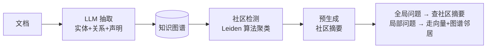

# 深入专题 · RAG 进阶实战（GraphRAG / 评估体系 / 生产优化清单）

> 基础链路见 [README](./README.md)，面试题见 [题库 04](../12-AI面试题库/04-RAG与知识库.md)。本篇讲深三个生产级主题。

## 1. GraphRAG：突破向量检索的天花板

### 1.1 传统 RAG 的结构性缺陷

向量检索返回的是**局部片段**，天然回答不了：
- 全局性问题："整个语料库的主题脉络是什么？"
- 多跳推理："A 公司的供应商的竞争对手是谁？"（需跨多文档串联实体关系）

### 1.2 GraphRAG 工作原理（微软开源方案）

- **建库成本**：每个文档需多轮 LLM 抽取 → 成本是向量 RAG 的 5~20 倍（这是最大落地障碍）
- **LightRAG** 等轻量方案：简化社区层、增量更新友好，是 2026 年更务实的选择
- **选型决策**：实体关系密集 + 全局问题多（投研、法律案卷、企业知识全景）→ GraphRAG；常规问答 → 向量 RAG 足够，别过度工程

## 2. RAG 评估体系（没有评估就没有优化）

### 2.1 三层指标

| 层 | 指标 | 含义 | 工具 |
|----|------|------|------|
| 检索层 | Hit Rate / Recall@K / MRR | 答案块是否被捞到、排多前 | 自建评测集 + 脚本 |
| 生成层 | Faithfulness 忠实度 | 答案是否忠于检索内容（防幻觉） | RAGAS / LLM-as-Judge |
| 端到端 | Answer Relevancy / 人工满意度 | 最终答案是否有用 | RAGAS + 用户反馈 |

### 2.2 RAGAS 四大指标速记

- **Context Precision**：召回的块里相关的占比（噪声多不多）
- **Context Recall**：该召回的是否都召回了
- **Faithfulness**：答案每句话能否在上下文中找到依据
- **Answer Relevancy**：答案与问题的相关程度

### 2.3 评测集构建方法（最被低估的一步）

1. 从真实用户日志抽 50~100 个高频/典型问题
2. 人工标注"标准答案 + 答案所在的文档块"
3. 分层归因：检索命中率与生成忠实度**分开打分**——问题才能定位到具体环节
4. badcase 回流：线上点踩 case 定期补进评测集

## 3. 生产优化清单（按投入产出排序）

### 第一梯队（成本低收益大）
- [ ] **查询改写**：多轮对话先补全指代再检索（命中率立升）
- [ ] **混合检索**：向量 + BM25，RRF 融合（专业术语场景 +25% 准确率量级）
- [ ] **Rerank**：Top-20 粗排 → Cross-Encoder 精排取 Top-5（Top-5 召回 71%→89% 量级）
- [ ] **Prompt 强约束**：仅依据资料回答 + 逐句引用编号 + 低相似度拒答兜底

### 第二梯队（中等投入）
- [ ] **切分优化**：递归切分 + 10~20% overlap + 按文档类型定制（表格整表保留、FAQ 不拆）
- [ ] **Parent-Child**：小块检索命中返回父块（精确 + 上下文兼得）
- [ ] **元数据过滤**：权限/部门/时间标签前置过滤
- [ ] **缓存**：高频问题语义缓存（命中率高的场景延迟与成本双降）

### 第三梯队（重投入，确认瓶颈再做）
- [ ] Embedding 领域微调（垂直领域术语召回差时）
- [ ] HyDE / 多路召回 / Step-back 查询
- [ ] GraphRAG / Agentic RAG（复杂多跳问题场景）
- [ ] 生成端微调（让模型习惯"严格按资料作答"的行为模式）

## 4. 常见线上事故与对策（经验帖）

| 事故 | 根因 | 对策 |
|------|------|------|
| 答案引用过时政策 | 旧文档未下架，新旧同时命中 | 文档版本管理 + 时间元数据加权 |
| 串科室答案 | 权限未过滤，A 部门检索到 B 部门文档 | 检索前置权限过滤（不是生成后再遮） |
| 表格数据答错 | 表格被切碎，行列关系丢失 | 表格转 Markdown 整表保留 / 走 Text-to-SQL |
| 高峰期超时 | 检索与生成串行 + 无缓存 | 流水线并行 + 语义缓存 + 降级小模型 |
| Embedding 升级后全崩 | 向量空间不兼容，新旧混查 | 全量重建 + 双写切换 |

## 5. 动手作业（检验掌握）

把 [10-项目3](../10-AI应用实战/README.md) 的 RAG 代码跑通后，依次做三个增强并记录效果：
1. 加 BM25 混合检索，对比 10 个测试问题的命中率变化
2. 加查询改写（多轮场景）
3. 用 RAGAS 跑一轮四指标评估，写一页报告
