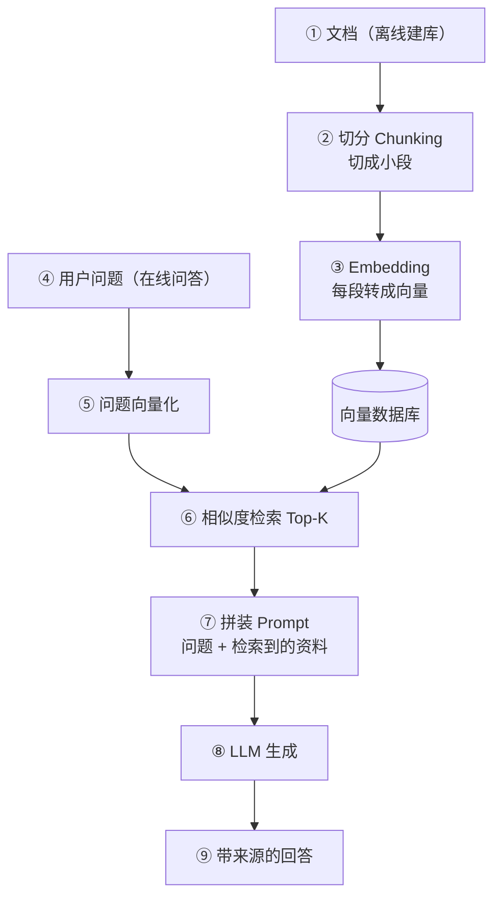

# 07 · RAG 与知识库（检索增强生成）

## 1. 为什么需要 RAG

LLM 有三大短板，RAG（Retrieval-Augmented Generation）一并解决：

| 短板 | RAG 对策 |
|------|----------|
| 知识截止，不知新信息 | 检索最新文档注入上下文 |
| 不懂你的私有数据 | 检索企业/个人知识库 |
| 幻觉，编造事实 | 基于检索到的真实资料回答，可附引用来源 |

> 类比：闭卷考试（纯 LLM）→ 开卷考试（RAG，允许查资料再作答）。

## 2. RAG 工作流程

> 上半段是**离线建库**（一次性，可批量），下半段是**在线问答**（每次请求实时执行），中间通过向量数据库衔接。

## 3. 核心技术概念

### Embedding（向量嵌入）

把文本映射为高维向量（如 1536 维），**语义相近的文本在向量空间中距离也近**。

> 类比：给每段文字一个"语义坐标"。"猫"和"狗"坐标很近，"猫"和"量子力学"坐标很远。

### 相似度检索

- **余弦相似度**：衡量两个向量方向有多接近，越接近 1 越相似
- **Top-K**：取最相关的前 K 个片段（通常 3~10 个）

### 切分策略（Chunking）

| 策略 | 说明 | 适用 |
|------|------|------|
| 固定长度 | 每 N 字切一段，简单但可能切断语义 | 快速验证 |
| 按结构切分 | 按标题/段落/句子边界切 | Markdown、论文 |
| 语义切分 | 按语义变化点切分 | 高质量要求 |
| 重叠窗口 | 相邻段保留重叠，避免边界丢信息 | 通用（常配 10~20% 重叠） |

## 4. 向量数据库选型

| 产品 | 特点 | 场景 |
|------|------|------|
| FAISS | Meta 开源库，本地高性能 | 原型验证、单机 |
| Chroma | 轻量易上手，Python 友好 | 个人项目 |
| Milvus / Zilliz | 分布式、企业级 | 大规模生产 |
| Pinecone | 全托管云服务 | 免运维 |
| pgvector | PostgreSQL 插件 | 已有 PG 技术栈 |

## 5. RAG 进阶优化

- **混合检索**：向量检索（语义）+ 关键词检索 BM25（精确匹配），取两者之长
- **重排序 Rerank**：初检取 Top-50，再用专门模型精排取 Top-5，显著提升准确率
- **查询改写**：把用户口语问题改写成更适合检索的形式
- **HyDE**：先让 LLM 生成"假设答案"，用假设答案去检索
- **评估指标**：检索命中率、答案忠实度（Faithfulness）、答案相关性

## 6. 实践建议

1. 用 Chroma + 任意 Embedding API，把自己的 10 篇笔记建成可问答的知识库（约 80 行 Python）
2. 对比实验：同一个私有问题，直接问 LLM vs RAG 后再问，感受差距
3. 遇到"检索到了但答得不好"，优先检查切分粒度和 Top-K 数量

## 7. 延伸阅读

- [04-大语言模型](../04-大语言模型/README.md) —— 理解幻觉的根源
- [RAG技术流派详解](./RAG技术流派详解.md) —— **流派大全**：18 种 RAG 变体 + 对比总表 + 选型决策树 + **切分实现附录**（overlap 复制切片/递归切分/结构感知/语义切分，含代码；**父子切片完整实现**：双存储架构/三层版/句子窗口/Auto-Merging/参数表/陷阱清单）
- [06-AI-Agent智能体](../06-AI-Agent智能体/README.md) —— RAG 常作为 Agent 的记忆工具
- [14-技术对比与选型](../14-技术对比与选型/02-方案与工具对比.md) —— RAG vs 微调 vs 长上下文、检索方案对比

## 学完自测检查点

1. 画出 RAG 离线建库与在线问答两条链路
2. 为什么语义检索用余弦相似度而不是欧氏距离
3. Chunk 切大切小各有什么问题，生产常用配方是什么
4. 混合检索为什么必须用，RRF 相比手动加权好在哪
5. "检索到了但答得不好"的排查顺序（归因矩阵）
6. RAGAS 四指标分别测什么（见[进阶实战](./RAG进阶实战.md) §2）
7. 说出 RAG 四大演化阶段的递进逻辑，以及 CRAG/Self-RAG/Parent-Child 各解决什么问题（见[流派详解](./RAG技术流派详解.md)）
