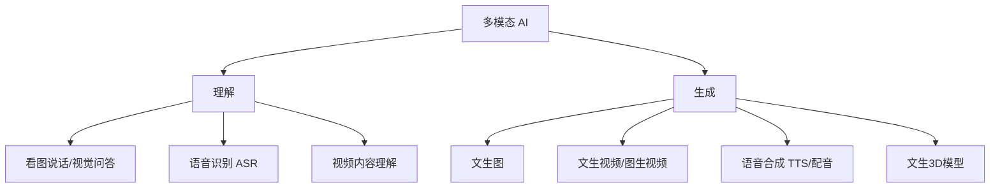

# 08 · 多模态 AI

> 多模态（Multimodal）= AI 同时理解和生成文本、图像、音频、视频等多种信息形态。

## 1. 多模态能力全景



## 2. 图像生成

### 扩散模型（Diffusion）原理

从纯噪声开始，逐步"去噪"，最终显现出符合文字描述的图像。类比：雕塑家从一块混沌石料中一点点凿出作品。

```
文字提示 → 模型理解语义 → 噪声 → 逐步去噪 ×N步 → 清晰图像
```

### 主流工具

| 工具 | 特点 |
|------|------|
| Midjourney | 艺术感最强，适合创意设计 |
| DALL·E / GPT 图像 | 对话式改图，指令遵循好 |
| Stable Diffusion / Flux | 开源可本地部署，可控性强（LoRA、ControlNet） |
| 即梦/可灵/通义万相 | 国产，中文理解好 |

### 关键技巧

- **提示词结构**：主体 + 细节 + 风格 + 构图 + 画质词
  > 例："一只橘猫坐在窗台上，午后阳光，吉卜力风格，特写镜头，8K 高清"
- **图生图（img2img）**：上传参考图 + 文字描述，在原图基础上改造
- **ControlNet**：精确控制姿势/线稿/景深，让构图可控
- **LoRA**：小模型微调，固定人物/画风

## 3. 视频生成

- **文生视频 / 图生视频**：输入文字或首帧图片，生成数秒视频
- 代表：Sora（OpenAI）、可灵（快手）、即梦（字节）、Vidu、Runway
- 关键要素：运镜描述（推/拉/摇/移）、时长、运动幅度
- 当前局限：时长有限、物理一致性仍有瑕疵、成本较高

## 4. 语音 AI

| 方向 | 说明 | 代表 |
|------|------|------|
| ASR 语音识别 | 语音转文字 | Whisper（开源标杆） |
| TTS 语音合成 | 文字转语音 | edge-tts（免费）、CosyVoice、ElevenLabs |
| 声音克隆 | 几秒样本复刻音色 | GPT-SoVITS、CosyVoice |
| 实时语音对话 | 端到端语音交互 | GPT-4o Voice、豆包语音 |

## 5. 多模态大模型（看懂世界）

- **视觉语言模型（VLM）**：GPT-4o、Claude、Gemini、Qwen-VL 等可直接理解图片/截图/图表
- 典型用法：截图问"这个报错怎么解决"、拍照问"这是什么植物"、上传图表让 AI 解读数据

## 6. 实践建议

1. 用本环境的「多模态内容生成」skill 生成一张插图，体验文生图
2. 给学习资料配图：每个复杂概念生成一张示意插图，插入对应 Markdown
3. 截图一段代码报错发给多模态模型，体验视觉问答

## 7. 延伸阅读

- [多模态技术深入专题](./多模态技术深入专题.md) —— 深入专题：VLM 三件套、扩散模型、视频与语音原理
- [具身智能专题](./具身智能专题.md) —— 深入专题：VLA 架构、世界模型、四大难点、2026 格局
- [03-深度学习](../03-深度学习/README.md) —— 理解 ViT 与多模态架构基础
- [10-AI应用实战](../10-AI应用实战/README.md) —— 多模态在实战项目中的组合使用

## 重点·陷阱·工程注意事项

**必记重点**
- 提示词五段结构：主体+细节+风格+构图+画质；图生视频"先锁首帧再生动"两步走最稳
- VLM 三件套（ViT/连接器/LLM）与扩散模型去噪直觉——理解原理才能调得好参数
- 多模态内容的版权与标识是合规红线（见 [13 章](../13-AI安全与伦理/README.md)）

**高频陷阱**
- ❌ 期望"一次生成完美"：正确姿势是迭代——先生成 → 选构图 → 局部重绘（img2img/ControlNet 锁定）
- ❌ 文生视频直接上：主体不可控；先用文生图定首帧，再图生视频
- ❌ 截图小字/密集表格直接问 VLM 不核实：OCR 与计数是弱项，关键数字必须人工复核
- ❌ 声音克隆/换脸用于他人形象：需授权 + 显著标识，否则触碰法律红线
- ❌ 生成内容直接商用不查条款：各平台商用授权政策不同，先用后查会踩版权坑

**工程案例与注意事项**
- 内容工厂管线（写稿→配图→配音）每步都要有人工审核点，全自动发布是事故温床
- 生图成本控制：先低分辨率多方案选构图，确定后再高清重绘，比直接高清省钱数倍
- 生成的 URL 多数有有效期（如云生图 24h），重要素材必须**及时下载本地存档**

## 学完自测检查点

1. 用"雕塑家凿石料"类比解释扩散模型的去噪过程
2. 文生图提示词的五段结构（主体/细节/风格/构图/画质）
3. ControlNet 和 LoRA 分别解决什么问题
4. VLM 看图的三件套架构（ViT/连接器/LLM，见[深入专题](./多模态技术深入专题.md) §1）
5. 语音三段式（ASR→LLM→TTS）与端到端路线的优劣
6. 声音克隆的合规红线是什么（见 [13-AI安全与伦理](../13-AI安全与伦理/README.md)）
