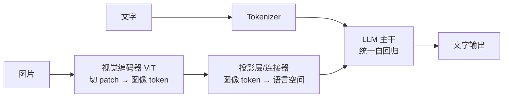
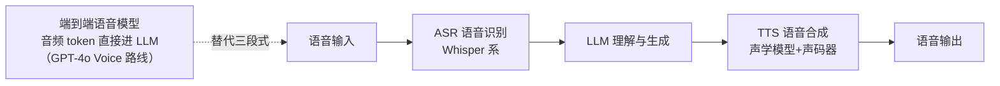

# 深入专题 · 多模态技术原理（VLM / 扩散模型 / 视频与语音）

> 应用全景见 [README](./README.md)。本篇回答：多模态模型是怎么"看懂"和"画出"世界的？

## 1. 视觉语言模型（VLM）怎么"看图"

### 1.1 标准架构三件套

1. **ViT（Vision Transformer）**：图片切成 14×14 小方块（patch），每个 patch 变成一个 token → 图像变成"一门外语"
2. **连接器（Projector）**：把视觉 token 映射到 LLM 的 embedding 空间（常见 MLP 或 Q-Former）
3. **统一生成**：视觉 token 与文本 token 拼接，走同一个自回归 LLM → "看图说话"本质是跨模态的下一个 token 预测

### 1.2 CLIP：跨模态对齐的奠基者

- 对比学习：4 亿图文对训练，让匹配图文对的向量靠近、不匹配的拉远
- 得到**共享语义空间**：图像和文字可以互相检索（以文搜图）→ 也是扩散模型的"语义导航仪"
- 类比：给图像和文字办了同一本护照，从此可以互相通行

### 1.3 VLM 的关键难点（面试可聊）

- **分辨率与 token 成本**：高清图 = 海量 patch token → 动态分辨率、token 压缩（Qwen-VL 的 NaViT 等）
- **幻觉**：VLM 幻觉比纯文本更严重（"图里有几个人"常数错）→ 视觉 grounding 训练、引用图中区域作答
- **OCR 与细粒度**：小字、表格结构 → 专门的高分辨率分支

## 2. 扩散模型（Diffusion）：图像/视频生成的引擎

### 2.1 数学直觉（不推导，只建立图像）

- **前向过程（加噪）**：清晰图片逐步加高斯噪声，T 步后变成纯噪声（有解析公式，无需学习）
- **反向过程（去噪）**：训练一个网络 $\epsilon_\theta(x_t, t, \text{text})$ 预测"这一步加的噪声是什么" → 逐步减去噪声，从纯噪声"雕刻"出图片
- **训练目标极简**：预测噪声的 MSE $L = \|\epsilon - \epsilon_\theta\|^2$ —— 大道至简

### 2.2 关键工程组件

| 组件 | 作用 |
|------|------|
| Text Encoder（CLIP/T5） | 把提示词变成条件向量，引导生成方向 |
| Latent Space（VAE） | 在压缩的潜空间去噪而非像素空间 → 算力需求降一个量级（Stable Diffusion 核心创新） |
| U-Net / DiT | 去噪网络架构；DiT（Diffusion Transformer）是新主流（Sora 同款路线） |
| CFG 引导强度 | 控制"听话程度"：太低不像描述，太高画面过饱和僵硬 |
| ControlNet | 注入线稿/姿态/深度条件 → 构图精确可控 |
| LoRA | 小成本微调风格/人物 |

### 2.3 采样步数与加速

- 朴素需 50+ 步去噪；DDIM/DPM-Solver/LCM/蒸馏 → 4~8 步出图
- 这就是为什么实时生图（秒级）在 2024 年后成为可能

## 3. 视频生成：在扩散上加时间维

- 核心难点不是画质而是**时序一致性**：前后帧人物不能变脸、物理要合理
- 路线：图像扩散 + 时间注意力层（帧间关联）→ DiT 统一时空 patch（Sora 路线）
- **图生视频**比文生视频可控得多（首帧锁定主体）→ 实战推荐"先生图、再生动"两步走
- 当前边界：长视频叙事、复杂物理交互、精确文字渲染仍是弱项

## 4. 语音链路

- **三段式**（ASR→LLM→TTS）：可控、便宜，但延迟高、丢失语气情感信息
- **端到端**：语音直接编码为 audio token 进 LLM → 低延迟、能听出情绪、可打断 → 实时对话的方向
- **声音克隆**：few-shot 音色条件（几秒样本）→ GPT-SoVITS/CosyVoice 开源可玩；注意[合规红线](../13-AI安全与伦理/README.md)（克隆他人声音需授权 + 内容标识）

## 5. 多模态趋势判断（2026）

1. **统一架构**：理解+生成一体化模型（一个模型既能看图又能画图）成为主流方向
2. **全模态 token 化**：文本/图像/音频/视频统一为 token 序列，一个 Transformer 处理一切
3. **世界模型**：视频生成模型隐式学习物理规律，被视为通往具身智能的路径之一

## 6. 动手作业

1. 截图一张包含表格的文档照片，分别问两个 VLM"提取表格为 Markdown"，对比准确率
2. 用同一提示词生成图片，分别调 CFG 低/中/高三档，观察"听话程度 vs 画面自然度"的权衡
3. 体验一次实时语音对话，留意打断响应速度（端到端 vs 三段式的体感差异）
