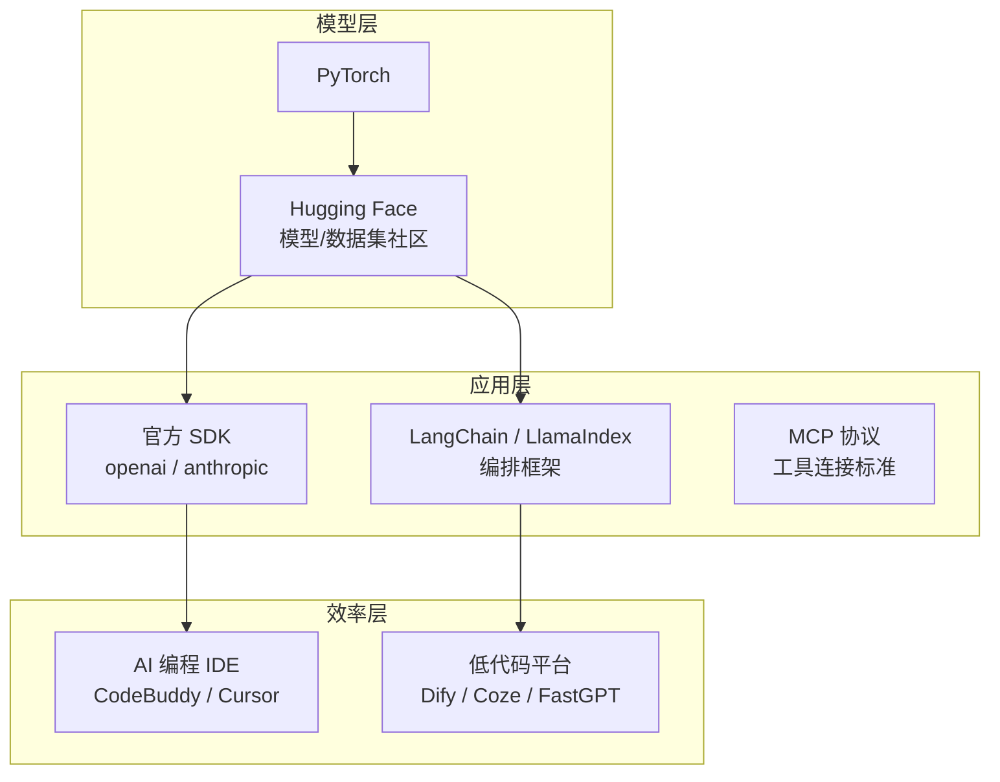

# 09 · AI 开发工具与框架

## 1. 工具链全景



## 2. 深度学习框架

| 框架 | 特点 | 谁在用 |
|------|------|--------|
| **PyTorch** | 动态图、调试友好、研究界标准 | 学术界 + 工业界主流（推荐首选） |
| TensorFlow | Google 出品，生产部署成熟 | Google 系、移动端 |
| JAX | 函数式、高性能编译 | DeepMind、前沿研究 |

## 3. Hugging Face：AI 界的 GitHub

- **Models**：下载 100 万+ 预训练模型（BERT、Whisper、Stable Diffusion…）
- **Datasets**：海量训练数据集
- **Transformers 库**：三行代码加载任意模型
- **Spaces**：免费在线体验各种 AI Demo

```python
from transformers import pipeline
clf = pipeline("sentiment-analysis")
print(clf("这个资料库太好用了！"))  # [{'label': 'POSITIVE', ...}]
```

## 4. LLM 应用开发框架

| 框架 | 定位 | 适合 |
|------|------|------|
| LangChain | 链式编排 LLM 调用、工具、记忆 | 复杂 LLM 应用 |
| LlamaIndex | 专注 RAG / 知识库索引 | 文档问答系统 |
| 官方 SDK | 直接调 API，最透明可控 | 入门与轻量应用 |
| Dify / Coze | 可视化拖拽搭 Agent 和工作流 | 非程序员 / 快速验证 |

**学习路径建议**：先用官方 SDK 手写 → 理解本质后再用框架 → 框架只是帮你少写样板代码。

## 5. MCP（Model Context Protocol）

统一 Agent 与工具连接方式的开放协议（详见 [06-AI-Agent智能体](../06-AI-Agent智能体/README.md)）。常用 MCP Server：文件系统、数据库、浏览器（Playwright）、搜索、Git 等，可直接在 CodeBuddy 中配置使用。

## 6. AI 编程工具

| 工具 | 形态 | 特点 |
|------|------|------|
| **CodeBuddy** | IDE + Agent | 技能系统、子代理、自动化任务、多模态生成 |
| Claude Code | 终端 Agent | 强大的长任务自治能力 |
| Cursor | AI IDE | Tab 补全与 Agent 并重 |
| GitHub Copilot | 插件 | 补全体验成熟 |

**高效用法**：明确需求 → 小步迭代 → 让 Agent 自己跑测试验证 → 及时纠偏。

## 7. API 与成本

- 国产 API（DeepSeek、Qwen、Kimi、GLM）价格低、无需特殊网络，适合练手
- 省钱技巧：小任务用小模型、开启缓存、压缩 Prompt、本地开源模型（Ollama）跑隐私数据

## 8. 实践建议

1. 安装 Ollama，本地跑一个 Qwen/DeepSeek 小模型，体验"零成本"推理
2. 用官方 SDK 写 30 行代码调用 API，完成一个命令行翻译小工具
3. 在 Dify/Coze 上拖一个"知识库问答"应用，体会低代码与写代码的取舍

## 9. 延伸阅读

- [端侧AI与轻量化模型专题](./端侧AI与轻量化模型专题.md) —— 深入专题：端侧爆发动因、五大压缩技术、端云协同、2026 产品格局
- [10-AI应用实战](../10-AI应用实战/README.md) —— 用这些工具完成完整项目

## 重点·陷阱·工程注意事项

**必记重点**
- LLM 应用最小本质四步：拼 prompt → 调 API → 解析输出 → 循环/编排——框架只是这四步的封装
- **先裸写 SDK 再上框架**：不踩过坑就不知道框架帮你挡了什么
- MCP 的价值是"一次开发处处可用"；Ollama 的价值是隐私/零成本/离线三合一

**工程陷阱**
- ❌ 框架全家桶式使用（如 LangChain 所有抽象层都用上）→ 调试时定位不到问题层，**只用需要的层**
- ❌ 多厂商 SDK 混用不做适配层 → 换模型时全业务代码重写（FC 格式 OpenAI 与 Claude 不同）
- ❌ 工具描述写给"人"看而不是写给"模型"看 → 调用时机错乱；错误返回只给错误码不给原因 → 模型无法自我修正
- ❌ 本地跑大模型不评估硬件：7B 模型 Q4 也要 5~6GB 显存/内存，先查配置再 pull
- ❌ API Key 硬编码进代码并提交仓库 → 泄露即被盗刷（用环境变量 + 额度告警）

**工程案例与注意事项**
- 成本失控急救包：Prompt 瘦身 → 语义缓存 → 小模型路由 → 离线任务批量 API（半价）
- 低代码平台的正确定位：**验证期用 Dify/Coze，沉淀期代码重写核心链路**——反过来用会被平台锁死
- 技术栈每季度复核一次（框架版本动荡是常态），抽象接口层让"换掉它"的成本足够低

## 学完自测检查点

1. 说出 LLM 应用的最小本质四步（拼 prompt → 调 API → 解析 → 循环）
2. 为什么建议"先裸写 SDK 再上框架"
3. LangChain 与 LlamaIndex 的定位差异，LangGraph 解决什么
4. Ollama 的三个使用场景（隐私/零成本/离线）
5. 低代码平台的"验证用低代码、沉淀用代码"原则，能举例说明
6. 按[决策树](./LLM应用开发实战.md#7-技术选型决策树)为三个假想需求选型
