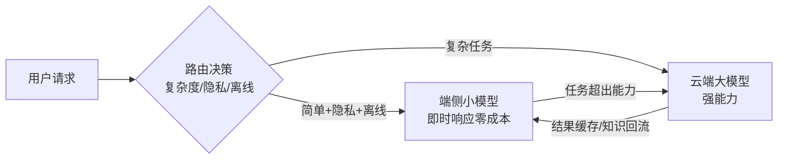

# 深入专题 · 端侧 AI 与轻量化模型（On-Device AI）

> 2026 年 AI 最大的范式转移之一：从"云端军备竞赛"转向"端侧落地"。本篇讲清为什么端侧爆发、怎么把模型塞进手机、以及端云如何协同。

## 1. 为什么 2026 是端侧爆发年

| 驱动力 | 说明 |
|--------|------|
| **隐私** | 个人数据不出机（语音/照片/位置），符合合规与用户信任 |
| **成本** | 云端每 token 计费，端侧**零边际成本**（电费除外） |
| **离线可用** | 飞行模式、弱网、敏感场景（工厂/医院/军事） |
| **低延迟** | 免网络往返，实时语音/实时翻译必需 |
| **数据主权** | 端侧模型 + 端侧记忆（RAG 本地化）成为新叙事 |

**关键拐点**（联网核实，2026）：PrismML 把 27B 模型压到 3.9GB 塞进 iPhone；vivo 预研 30B 端侧 MoE 大模型；OPPO 提出"主动式 AI"（从等指令到按场景主动服务）；Apple Intelligence 落地。

## 2. 核心矛盾：模型大 vs 设备小

```
内存（手机 8~12GB，模型可用 3~5GB）
显存/带宽（无独立显存，靠 LPDDR 内存带宽）
功耗与发热（持续推理会烫手、耗电）
→ 必须压缩模型 + 优化推理引擎 + 端云协同
```

## 3. 五大压缩技术（怎么把大模型塞进去）

| 技术 | 原理 | 效果 | 代价 |
|------|------|------|------|
| **量化** | 权重降精度（FP32→INT8/INT4） | 体积 4~8 倍↓，速度↑ | 精度略降（W4A16 损失很小） |
| **蒸馏** | 大模型教小模型 | 能力迁移 | 需大模型当老师 |
| **剪枝** | 删冗余参数/结构 | 体积↓ | 结构化剪枝才真提速 |
| **MoE 端侧** | 总参大、激活参小（每次只跑部分专家） | 能力↑ | 内存仍要装全量权重 |
| **低秩/重参数化** | 结构等价但参数更省 | 体积↓ | 需重训 |

**量化是端侧的第一优先级**（最成熟、收益最确定）：INT4 权重 + INT8 激活是主流配置，7B 模型可压到 ~4GB。

## 4. 推理引擎与部署框架

| 框架 | 定位 | 特点 |
|------|------|------|
| **llama.cpp** | 通用 CPU/GPU 推理 | GGUF 格式，量化齐全，社区最活跃 |
| **MNN** | 阿里移动端 | 手机 NPU 适配好，多后端 |
| **ONNX Runtime** | 跨平台标准 | 生态最广，移动/边缘通用 |
| **ExecuTorch** | PyTorch 官方端侧 | 与 PyTorch 生态无缝 |
| **NPU 专有 SDK** | 高通/苹果/华为 | 极致性能但碎片化 |

**选型**：跨平台优先 ONNX Runtime / llama.cpp；手机深度优化用厂商 NPU SDK；性能与可移植性永远在拉扯。

## 5. 端云协同架构（2026 主流形态）



**协同原则**：
- 端侧处理**高频、简单、隐私敏感**任务（输入法、相册搜索、摘要、简单问答）
- 云端处理**低频、复杂、需强推理**任务（长文写作、复杂编程、深度研究）
- 端侧记忆引擎：个人画像/偏好存本地，云端任务按需脱敏调用

**分级路由**是端云协同的灵魂——同样的任务，路由到端侧可能成本趋近于 0。

## 6. 真实产品形态（2026 联网核实）

| 产品 | 做法 | 启示 |
|------|------|------|
| Apple Intelligence | 端侧小模型 + 私有云计算兜底 | 隐私叙事 + 能力分层 |
| vivo 蓝心小 V | 30B 端侧 MoE + AgentOS 预览版 | 端侧为根、个人化为魂 |
| OPPO ColorOS 17 | 端侧大模型 + 记忆引擎 + 主动式 AI | 从"等指令"到"按场景主动服务" |
| Android 厂商集体 | 端侧轻量模型 + 系统级 Agent | 端侧 AI 是手机下一战场 |

**趋势判断**：端侧 AI 的竞争点正从"模型压缩"转向"**端侧记忆引擎 + 系统级 Agent**"——谁掌握个人数据闭环，谁赢。

## 7. 开发者实战路线

1. 用 **Ollama/llama.cpp** 在本地跑 7B/8B 模型（Q4 量化），体会端侧能力边界
2. 做一次量化实验：同一模型 FP16 vs INT8 vs INT4，测体积/速度/质量三元对比
3. 搭一个端云协同 demo：简单问题路由到本地模型、复杂问题路由到云端 API
4. 选型自测：隐私文档摘要（端侧）、跨文档深度分析（云端）、实时翻译（端侧）——能说清每个该走哪

## 8. 常见误区与陷阱

- ❌ "端侧模型就是云端模型的低配版"：正确认知是**分工**——端侧赢在隐私/成本/延迟，不是能力
- ❌ 盲目追求参数量：端侧看"效果/内存/功耗"三角，30B 塞进手机若功耗失控无意义
- ❌ 量化不看任务：代码/数学类任务 INT4 损失可能不可接受，须按任务评估
- ❌ 忽视内存带宽：端侧推理瓶颈常在**带宽**（每 token 都要搬权重），不是算力

## 9. 学完自测检查点

1. 端侧 AI 爆发的五个驱动力是什么
2. 五大压缩技术中，哪一项收益最确定、应优先做？为什么
3. 端云协同的分级路由原则，举三个"该走端侧"的例子
4. 为什么端侧推理瓶颈常是内存带宽而非算力
5. 30B 端侧 MoE 的"总参大激活小"在端侧场景的利弊

## 延伸阅读

- 本地部署实践 → [README](./README.md) Ollama 部分、[LLM应用开发实战](./LLM应用开发实战.md) §4
- 推理优化技术细节 → [题库06](../12-AI面试题库/06-推理部署与工程落地.md)
- C 端产品架构（端侧是重要成本/隐私杠杆）→ [C端智能体架构](../06-AI-Agent智能体/C端智能体百万用户架构设计.md)
