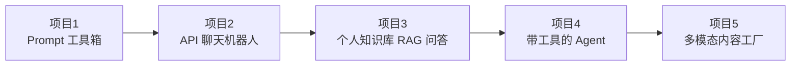

# 10 · AI 应用实战

## 1. 实战项目路线图（由易到难）

## 2. 项目详解

### 项目 1：Prompt 工具箱（零代码）

- **目标**：沉淀自己的提示词资产
- **产出**：翻译、总结、周报、代码审查 4 个高质量 Prompt 模板
- **验收**：同一任务模板输出显著优于裸提问
- 技能点：[05-Prompt工程](../05-Prompt工程/README.md)

### 项目 2：API 聊天机器人（~50 行代码）

- **目标**：跑通 LLM API 全流程
- **功能**：多轮对话、流式输出、温度调节、token 统计
- **技术**：Python + DeepSeek/OpenAI SDK
- 技能点：[04-大语言模型](../04-大语言模型/README.md)、[09-工具框架](../09-AI开发工具与框架/README.md)

### 项目 3：个人知识库问答（RAG）

- **目标**：把自己的笔记/Markdown 变成可问答的知识库
- **流程**：文档切分 → Embedding → Chroma 存储 → 检索 → LLM 生成带引用的回答
- **进阶**：加 Rerank、混合检索，评估命中率
- 技能点：[07-RAG与知识库](../07-RAG与知识库/README.md)

### 项目 4：带工具的 Agent

- **目标**：LLM 自主决定调用工具完成任务
- **功能**：联网搜索 + 计算器 + 文件读写，ReAct 循环
- **进阶**：封装为 MCP Server 接入 CodeBuddy
- 技能点：[06-AI-Agent智能体](../06-AI-Agent智能体/README.md)

### 项目 5：多模态内容工厂

- **目标**：输入一个主题，自动产出"文章 + 配图 + 配音"
- **流程**：LLM 写稿 → 文生图配图 → TTS 配音 → 合成输出
- 技能点：[08-多模态AI](../08-多模态AI/README.md)

## 3. AI 落地方法论

### 判断一个需求适不适合用 AI

| 适合 | 不适合 |
|------|--------|
| 容错率较高、可人工复核 | 零容错（医疗诊断最终决策） |
| 有明确输入输出 | 需求本身模糊不清 |
| 重复性高、耗人力 | 极低频的一次性任务 |
| 数据可获得 | 涉及敏感数据且无私有化条件 |

### 通用落地流程

**关键原则**：先用最便宜的方式（Prompt）验证价值，再逐步加重工程投入；90% 的需求死在"直接上大工程"。

## 4. 成本与避坑

- **幻觉**：关键场景必须 RAG + 引用来源 + 人工抽检
- **成本失控**：上线前压测 token 消耗，设置用量告警
- **数据安全**：敏感数据走私有化部署或本地模型（Ollama）
- **过度工程**：能 Prompt 解决的不微调，能 API 解决的不自训

## 5. 实践建议

1. 本周完成项目 1 和 2，建立"我也能做 AI 应用"的信心
2. 把项目 3 做成自己真实在用的工具（比如用本资料库做知识库）
3. 每完成一个项目，写一页复盘：哪里超预期、哪里踩坑

## 6. 延伸阅读

- [11-学习资源导航](../11-学习资源导航/README.md) —— 找灵感和学习榜样

## 学完自测检查点

1. "能 Prompt 不 RAG，能 RAG 不微调"——能解释并各举一个反例（什么时候必须升级方案）
2. 判断 AI 适用场景的四个标准（容错率/输入输出明确/重复性/数据可得）
3. 落地六步流程中，为什么第一步是 Prompt 验证而不是买卡训模型
4. 跑通 [code/](./code/README.md) 里至少 2 个项目，并能讲清每段代码作用
5. 给项目 3 的 RAG 加一项增强（混合检索或查询改写），记录前后对比
6. 跑通 `project5_multi_agent.py` 与 `project6_hitl.py`，能说出各自的设计要点（去重为何必需、审批信息为何要三件套）
