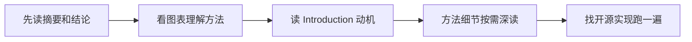

# 11 · 学习资源导航

> 资源会持续更新。发现优质新资源时，可让「AI学习小能手」用 web-search-free 联网核实后补充到本页。

## 1. 系统课程

| 课程 | 讲师/机构 | 特点 | 适合 |
|------|-----------|------|------|
| 机器学习 | 吴恩达 Coursera | 最经典入门课 | 零基础 |
| Deep Learning Specialization | 吴恩达 | 深度学习系统课 | 进阶 |
| 动手学深度学习 | 李沐 | 中文、免费、代码驱动 | 边学边练 |
| CS224n NLP | Stanford | NLP 名校公开课 | 深入 NLP |
| fast.ai | fast.ai | 自上而下，先会用再懂原理 | 实践派 |
| 3Blue1Brown 神经网络系列 | YouTube/B站 | 动画讲透数学直觉 | 建立直觉 |

## 2. 书籍

- **入门**：《人工智能简史》、《生命3.0》（宏观视野）
- **机器学习**：《统计学习方法》（李航）、《机器学习》（周志华"西瓜书"）
- **深度学习**：《深度学习》（花书）、*Dive into Deep Learning*（免费在线）
- **大模型**：《大语言模型》（赵鑫等，人大团队，免费开源）
- **工程实践**：*Hands-On Machine Learning with Scikit-Learn, Keras & TensorFlow*

## 3. 必关注信息源

### 官方博客（一手信息）

- OpenAI Blog、Anthropic News、Google DeepMind Blog
- 深度求索 DeepSeek、通义 Qwen、智谱 GLM 官方公众号/博客

### 社区与聚合

- **Hugging Face**：模型/Demo/论文趋势榜
- **Papers with Code**：论文 + 配套代码
- **arXiv cs.AI / cs.CL**：最新论文（配合 AI 总结工具食用）
- **机器之心 / 量子位**：中文 AI 资讯
- **GitHub Trending**：看 AI 开源项目在造什么轮子

### 实践平台

- **Kaggle**：数据科学竞赛，练手 + 看大神的 Notebook
- **ModelScope 魔搭**：阿里模型社区，国产模型全
- **Dify / Coze**：不写代码体验搭 Agent

## 4. 论文阅读指南

入门必读经典：

1. **Attention Is All You Need**（2017）— Transformer 开山之作
2. **BERT**（2018）— 预训练范式确立
3. **GPT-3: Language Models are Few-Shot Learners**（2020）— 涌现能力
4. **InstructGPT**（2022）— RLHF 对齐
5. **DeepSeek-R1**（2025）— 强化学习推理模型

## 5. 如何用 AI 加速学 AI

| 场景 | 做法 |
|------|------|
| 读不懂的论文 | 贴给 LLM："用高中生能懂的话解释第三节方法" |
| 新概念 | 让「AI学习小能手」生成带图示的讲解，存入本资料库 |
| 跟踪动态 | 让 agent 用 web-search-free 搜本周 AI 要闻并总结 |
| 系统调研 | 让 agent 用 deep-research-report 出深度报告 |
| 代码实战 | 让 AI 生成练习代码 → 自己跑通 → 让 AI 当 code reviewer |

## 6. 学习节奏建议

- **第 1~2 周**：01 + 04 + 05，会用、会问
- **第 3~6 周**：02 + 03，理解原理，跑通经典代码
- **第 7~10 周**：06 + 07 + 09，动手做 RAG 和 Agent 项目
- **之后**：08 + 10，选一个方向深入，持续跟踪 11 的信息源

## 重点·陷阱·工程注意事项

**必记重点**
- 信息源优先级：一手（官方博客/arXiv/GitHub）> 二手解读 > 短视频碎片——离源头越远失真越多
- 论文五遍读法：摘要→图表→动机→细节→跑代码；复现 > 阅读，输出 > 输入
- 70/20/10 时间分配：70% 长期知识（原理）、20% 速朽信息（动态）、10% 动手验证

**学习陷阱（最隐蔽的坑）**
- ❌ **收藏 = 学习**：资料库只囤不用就是数字垃圾场——每周清一次"收藏未读"，要么学要么删
- ❌ 追新弃旧：不懂 Transformer 就追 Agent 框架，只会背概念——基础章节没过关前不碰前沿
- ❌ 只看中文二手搬运：滞后数周且常有错译，关键概念必须对照原文
- ❌ 视频看完当学会：能不看资料讲 3 分钟 + 写 30 行代码，才算真的会
- ❌ 无差别刷信息流：每天固定 20 分钟扫榜，而不是被打断式推送牵着走

**注意事项**
- 用 AI 加速学 AI：论文贴给 LLM 要"高中生能懂的解释"，代码让它生成你来跑通
- 里程碑驱动：每 2 周产出一个可见成果（笔记/demo/分享），没有产出的学习会烂尾
- 学习节奏参照 §6，但**卡壳超过 3 天就降级**（回前一章补基础），硬扛是最低效的策略

## 学完自测检查点

1. 说出至少 3 个一手信息源（非二手搬运）及各自侧重点
2. 论文五遍读法的顺序（摘要→图表→动机→细节→跑代码）
3. 5 篇入门必读经典论文各自的历史地位
4. 判断一个 AI 新闻含金量的四条标准（见 [01 深入专题](../01-AI基础入门/深入专题-AI版图与流派.md) §5）
5. 给自己排一个未来 4 周的学习计划（参照 §6 节奏建议），写入日历
