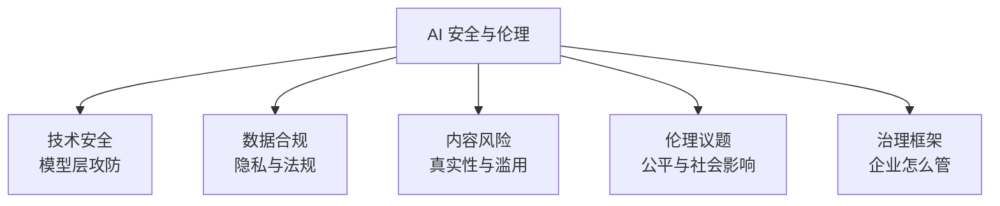
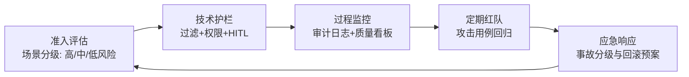

# 13 · AI 安全与伦理

> 会用 AI 只是上半场，安全合规地用 AI 才是下半场。本篇覆盖技术安全、数据合规、内容伦理与治理框架。

## 1. 全景图

## 2. 技术安全：模型层的攻防

### 2.1 主要攻击面

| 攻击 | 原理 | 防御 |
|------|------|------|
| **提示注入 Prompt Injection** | 外部内容（网页/文档）夹带恶意指令劫持 Agent | 数据/指令分离、内容标记、权限最小化、高危操作人工审批 |
| **越狱 Jailbreak** | 话术绕过安全对齐（角色扮演、编码混淆） | 安全训练、输入输出双向过滤、红队测试 |
| **数据投毒** | 污染训练/RAG 数据，植入错误或后门 | 数据来源管控、清洗去毒、检索源白名单 |
| **模型窃取/成员推断** | 通过 API 输出反推训练数据或复制模型 | 限流、输出扰动、水印 |
| **供应链风险** | 恶意开源模型/依赖夹带后门 | 来源审核、哈希校验、沙箱运行 |

### 2.2 红队测试（Red Teaming）

上线前系统性"攻击自己"：构造越狱话术、注入样本、越权操作尝试，形成攻击用例库并纳入回归。每次模型/prompt 变更后重跑。

## 3. 数据合规（国内视角）

### 3.1 关键法规框架

- **《生成式人工智能服务管理暂行办法》**（2023）：面向公众提供生成式 AI 服务需备案、训练数据合法合规、标识生成内容
- **《互联网信息服务算法推荐管理规定》**：算法备案制度
- **AI 生成合成内容标识办法**（2025 施行）：AI 生成内容必须显式/隐式标识
- **《个人信息保护法》PIPL**：个人信息处理的知情同意、最小必要、跨境传输评估

### 3.2 企业实操清单

- 敏感数据（个人信息、商业机密）**不出域**：私有化部署或专属实例，脱敏后再调外部 API
- 训练/RAG 数据来源留痕（授权链路可证明）
- 用户对话数据的存储期限与用途明示
- 对外服务：完成备案 + 内容标识 + 投诉处置机制

## 4. 内容风险

| 风险 | 说明 | 缓解 |
|------|------|------|
| 幻觉误导 | 错误信息被当真（医疗/法律/金融高危） | RAG + 引用 + 人工复核 + 免责声明 |
| 深度伪造 | 假音视频用于诈骗、造谣 | 内容标识、检测工具、平台审核 |
| 版权争议 | 训练数据与生成内容的版权归属未定 | 用合规数据源、商用前查平台条款 |
| 批量垃圾内容 | AI 水文污染信息生态 | 平台侧 AIGC 检测与限流 |

**个人底线**：不用 AI 生成冒充真人的内容、不散布未核实的 AI 输出、商用生成内容前确认版权条款。

## 5. 伦理议题（开放讨论）

- **偏见与公平**：训练数据的社会偏见被模型放大（招聘、信贷场景高危）→ 公平性评估、人工兜底
- **就业冲击**：重复性认知工作首当其冲；历史规律是"岗位重构多于消失"，但转型期阵痛真实存在 → 个人对策：向"AI 的指挥者与验证者"角色迁移
- **责任归属**：AI 出错谁负责？（开发者/部署方/使用者）→ 各行业监管在细化，趋势是"部署方承担主体责任"
- **对齐的长期问题**：能力越强，"目标错配"代价越大 → 可解释性、可控性研究（Anthropic 等公司核心议题）

## 6. 企业 AI 治理框架（落地模板）

- **场景分级**：创意辅助（低风险，宽松）→ 客户-facing 问答（中风险，护栏+抽检）→ 医疗/金融决策（高风险，人工决策为最终环节）
- 核心原则：**AI 是建议者，人是负责人**——高风险场景的最终决策权必须留在人手里

## 7. 与各章节的联系

- 幻觉机理 → [04-大语言模型](../04-大语言模型/README.md)
- 对齐技术（RLHF/DPO/宪法 AI）→ [03-预训练微调与对齐（题库）](../12-AI面试题库/03-预训练微调与对齐.md)
- Agent 安全（注入/HITL/权限）→ [06-AI-Agent智能体](../06-AI-Agent智能体/README.md) + [Harness 工程](../06-AI-Agent智能体/Harness工程实战.md) L6 层
- 合规面试题 → [12-AI面试题库/06](../12-AI面试题库/06-推理部署与工程落地.md) Q17

## 8. 延伸阅读

- Anthropic《Responsible Scaling Policy》、OpenAI《Preparedness Framework》—— 前沿实验室的风险治理范本
- 《生成式人工智能服务管理暂行办法》原文（网信办官网）
- 书籍：《AI 2030》（库兹韦尔）、《生命3.0》（Max Tegmark，宏观视角）

## 学完自测检查点

1. 说出五类技术攻击面及各自的核心防御
2. 国内生成式 AI 服务的三个合规动作（备案/标识/数据来源合法）
3. "Prompt 防御是劝阻，权限控制才是保险"——解释这句并举例
4. 企业治理五环（准入→护栏→监控→红队→应急）各环节做什么
5. 高/中/低风险场景的分级标准，各举一个例子
