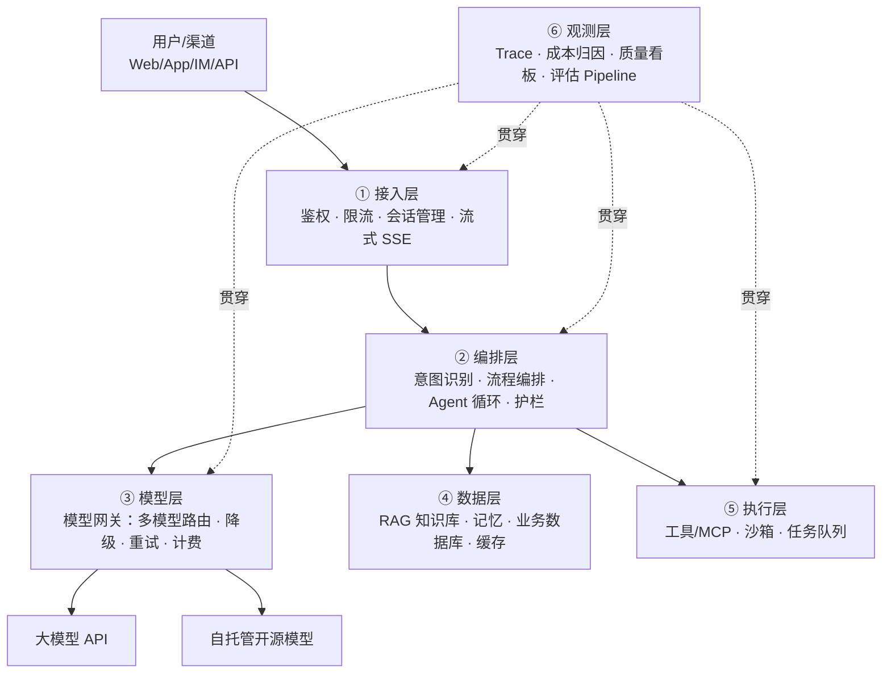
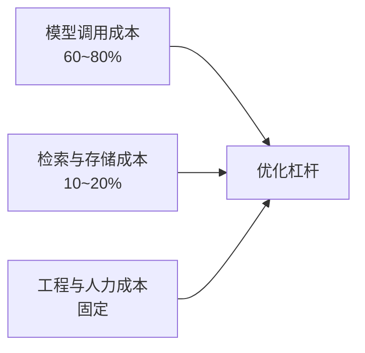

# 01 · 通用架构蓝图与容量估算

## 1. LLM 应用分层参考架构（90% 的 AI 系统都长这样）



| 层 | 职责 | 核心组件 | 常见失误 |
|----|------|----------|----------|
| ① 接入 | 挡流量、管会话 | API 网关、WebSocket/SSE、限流器 | 同步阻塞等 LLM（必须流式） |
| ② 编排 | 业务逻辑与不确定性管理 | 意图路由、Prompt 模板、护栏、Agent 循环 | 把业务逻辑塞进 Prompt（应代码化） |
| ③ 模型 | 屏蔽多模型差异 | 模型网关、路由策略、降级链 | 业务代码直连某家 API（被锁定） |
| ④ 数据 | 知识与状态 | 向量库、Redis、业务库、语义缓存 | 权限过滤在生成后而非检索时 |
| ⑤ 执行 | 与真实世界交互 | MCP 工具、沙箱、消息队列 | 无超时/无幂等/无审批 |
| ⑥ 观测 | 让概率系统可管理 | Trace、评测集、成本看板 | 只有日志没有"质量"指标 |

## 2. 容量估算（AI 版：从 QPS 到 token 到 GPU）

### 2.1 标准估算链路

```
日活用户 DAU × 人均会话数 × 每会话轮次 = 日请求量
日请求量 × (平均输入 token + 平均输出 token) = 日 token 总量
日 token 总量 ÷ 86400 × 峰值系数(3~5) = 峰值每秒 token（决定推理资源）
```

### 2.2 成本估算示例（面试要能现场算）

**场景**：客服机器人，DAU 10 万，人均 1 次会话，每会话 5 轮，每轮输入 800 token（含 RAG 上下文）、输出 200 token。

```
日请求量 = 10万 × 1 × 5 = 50 万次/天
日 token  = 50万 × (800 + 200) = 5 亿 token/天
峰值 QPS ≈ 50万 × 4 ÷ 86400 ≈ 23 QPS（低峰期的 4 倍系数）

API 成本（按 ¥2/百万输入 + ¥8/百万输出 估算）：
  = 50万 × (800×2 + 200×8) / 1e6 ≈ ¥1,600/天 ≈ ¥4.8万/月

优化后（50% 缓存命中 + 30% 流量路由到小模型）：
  ≈ ¥2.4万/月 → 直接决定项目毛利
```

### 2.3 自托管 GPU 估算（什么时候该自己部署）

```
单张 H800（vLLM + 70B 模型 + 连续批处理）≈ 2,000~4,000 token/s 输出吞吐
需求：峰值 23 QPS × 200 token 输出 ≈ 4,600 token/s → 2~3 张卡（含冗余）

盈亏平衡点（经验值）：
· 月 token 消耗 < 100 亿 → API 更划算（免去运维与空转）
· 月 token 消耗 > 1000 亿 或 数据必须私有 → 自托管开始划算
（具体阈值随卡价与 API 定价变动，用上面的公式代入当期价格计算）
```

### 2.4 延迟预算分配（TTFT < 1s 的体感红线怎么达成）

| 环节 | 预算 | 手段 |
|------|------|------|
| 接入与鉴权 | <50ms | 边缘部署、连接池 |
| 意图/路由 | <100ms | 小模型/规则，不上大模型 |
| RAG 检索 | <100ms | HNSW 调优、缓存热查询 |
| 模型 TTFT | <600ms | Prefix Cache、就近节点、流式 |
| **合计 TTFT** | **<1s** | 后续 token 流式输出（TPOT < 50ms 无感） |

## 3. 成本模型：AI 应用的"三座大山"



**优化杠杆（按 ROI 排序）**：
1. **语义缓存**：相似问题直接返回缓存答案（命中率 20~40% 很常见）→ 成本立减
2. **模型路由**：70% 简单流量给小模型（价格差 10 倍）→ 综合成本减半
3. **Prompt 瘦身**：压缩 system prompt 与历史轮次（输入 token 常占大头）
4. **Prefix/Context Caching**：相同前缀命中缓存（最高省 90% 输入费）
5. **批量 API**：非实时任务离线批处理（约半价）
6. **量化与蒸馏**：自托管场景 W4A16、用大模型蒸馏小模型

**反直觉提醒**：先做 1 和 2（纯工程、零风险），别一上来就量化/蒸馏（有质量风险）。

## 4. 关键架构决策清单（立项时逐项回答）

- [ ] **API 还是自托管？**（用 §2.3 的盈亏平衡公式，别拍脑袋）
- [ ] **同步还是异步？** 秒级内必须回应的用流式；分钟级任务走队列 + 轮询/Webhook
- [ ] **单模型还是路由？** 流量有复杂度分层就路由（省大钱）
- [ ] **RAG 还是微调还是长上下文？**（查 [14 板块对比表](../14-技术对比与选型/02-方案与工具对比.md)）
- [ ] **Workflow 还是 Agent？** 路径可枚举用 Workflow（省 4~8 倍 token）
- [ ] **缓存放哪几层？** 语义缓存（答案级）+ Prefix Cache（前缀级）+ 工具结果缓存（调用级）
- [ ] **降级链怎么排？** 主模型挂 → 备用模型 → 缓存答案 → 模板回复 → 人工，每一层都要测过
- [ ] **评估怎么做？** 上线前必须有自建评测集 + 回归门禁（见 [03 篇](./03-非功能设计清单.md) §6）

## 5. 学完自测检查点

1. 不看公式，现场估算"DAU 5 万、人均 3 轮、每轮 1500 token"的日 token 量与峰值 QPS
2. 画出六层架构并说清每层最常见的失误
3. 成本优化六大杠杆按 ROI 排序是什么？为什么先做缓存和路由？
4. TTFT < 1s 的预算怎么分配到各环节？
5. 自托管 vs API 的盈亏平衡取决于哪三个变量？
