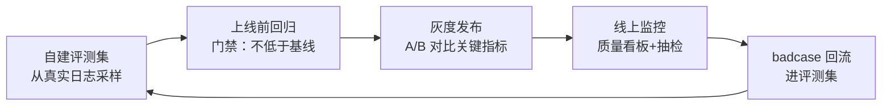

# 03 · 非功能设计清单（上线前自查）

> 功能决定系统"能不能用"，非功能决定系统"能不能活"。AI 系统的非功能设计比传统系统多了"质量"与"成本"两条生命线。按七个维度逐项自查。

## 1. 延迟（Latency）

| 检查项 | 目标 | 手段 |
|--------|------|------|
| TTFT（首 token） | <1s | Prefix Cache、就近部署、Prompt 瘦身 |
| TPOT（流式速度） | <50ms/token | 量化、投机采样、并发控制 |
| 检索延迟 | <100ms | HNSW 调优、热查询缓存 |
| 端到端（非流式场景） | <5s | 异步化：长任务改任务队列+通知 |
| 降级时延迟 | 不劣化 | 降级链各环节同样要压测 |

**陷阱**：P50 达标但 P99 爆炸——LLM 延迟方差大，**必须看 P95/P99**；超时设置要区分"排队超时"与"生成超时"。

## 2. 吞吐与弹性（Throughput & Scaling）

- [ ] 模型层限流：按租户/用户/接口三级配额（防单一客户打爆共享资源）
- [ ] 排队策略：突发流量进队列（削峰）而非直接拒绝；队列满时的优雅拒绝话术
- [ ] 无状态化：编排层无状态（会话状态外置 Redis），实例可水平扩展
- [ ] 自托管扩缩容：按"活跃会话数/token 吞吐"扩缩，而非 CPU 指标（LLM 服务 CPU 指标失真）
- [ ] 背压机制：下游（模型 API）限流时向上游传递压力，而不是无限重试

## 3. 成本（Cost）——AI 系统特有的生死线

- [ ] **成本归因到租户/功能/模型**：每 token 知道是谁、哪个功能、哪个模型花的
- [ ] 预算与熔断：租户级日预算，超限降级（切小模型/只读缓存）而非直接停服
- [ ] 缓存三件套：语义缓存（答案级）+ Prefix Cache（前缀级）+ 工具结果缓存（调用级），各有命中率监控
- [ ] 沉默成本监控：超时未取消的流式连接、失败重试的重复消耗、空闲沙箱/实例
- [ ] 月度成本复盘：模型单价变化时重算路由策略（新模型可能让小模型也能胜任）

## 4. 可靠性与降级（Reliability）

```
降级链（每层都要测过，不能只在文档里）：
主模型 → 备用模型（另一家）→ 小模型（能力降级但可用）→ 语义缓存 → 模板回复 → 人工/排队
```

- [ ] 超时与重试：指数退避 + 抖动；重试幂等（同一请求不产生重复副作用）
- [ ] 多供应商容灾：至少两家模型 API 可切换（接口抽象层先行）
- [ ] 数据持久化：会话状态、用户数据定期备份；RPO/RTO 有明确指标
- [ ] 演练：每季度做一次"主模型挂掉"故障演练（不演练的降级链等于没有）

## 5. 安全与合规（Security）

- [ ] Prompt 注入：外部内容标记包裹、工具结果标注可信度、高危操作不因注入内容触发（见 [13 章](../13-AI安全与伦理/README.md)）
- [ ] 数据隔离：多租户场景检索层强制 tenant 过滤 + 二次校验（见 [06 云端方案](../06-AI-Agent智能体/云端智能体系统设计方案.md) §4）
- [ ] 凭证管理：API Key 进 KMS/Vault，不进代码不进日志；Agent 用短时令牌（<15min）
- [ ] 内容合规：输入输出双向过滤；AIGC 标识；审计日志 Append-only
- [ ] 供应链：依赖扫描、模型来源校验、沙箱执行不可信代码

## 6. 质量保障（Quality）——概率系统的确定性工程



- [ ] **自建评测集**：50~200 条真实分布 case（问题+期望+来源），每次改动（模型/prompt/检索参数）跑回归
- [ ] 评估指标分层：检索命中率 / 忠实度 / 端到端满意度（RAGAS 或 LLM-as-Judge + 人工抽检 5%）
- [ ] 线上质量信号：点踩率、追问率（"你确定吗"=不信任信号）、转人工率、会话完成率
- [ ] Prompt/模型变更走灰度：小流量 A/B → 指标显著性检验 → 全量
- [ ] **防"改了 A 场景好、坏了 B 场景"**：评测集必须覆盖全部核心业务场景，不是越改越好而是越改越偏

## 7. 可观测（Observability）

- [ ] 全链路 Trace：一次请求能看到 检索片段→上下文组装→模型调用（参数/耗时/token）→工具调用→输出
- [ ] 四类看板：质量（完成率/点踩率）、成本（token/租户/功能）、性能（TTFT/P95）、安全（拦截/越权）
- [ ] 告警分级：P0（服务不可用/成本突增 5 倍）电话级；P1（质量指标劣化）值班群；P2（趋势异常）日报
- [ ] 回放能力：任意 badcase 可完整回放当时的输入、检索、上下文、模型输出（没有回放就无法归因）

## 上线前终极十问（签字版）

1. 主模型挂了，用户看到什么？（测过降级链吗）
2. 明天流量 ×10，系统哪里先崩？（排队与限流有效吗）
3. 本月账单翻倍，能定位到是哪个租户/功能吗？
4. 一个用户说"AI 胡说八道"，能回放那次会话找出根因吗？
5. 某个租户要求删除全部数据，能完整执行并证明吗？
6. Prompt 被注入恶意指令，最坏能造成什么？（权限最小化了吗）
7. 新模型发布，切换前怎么验证不会劣化？（评测集回归门禁）
8. P99 延迟是多少？（不是 P50）
9. 语义缓存命中错误答案的概率多大？（有校验与过期机制吗）
10. 这套系统下季度的成本趋势是升是降？（有预测与优化路线吗）

**任何一问答不上来，就是下一个迭代的需求池。**
