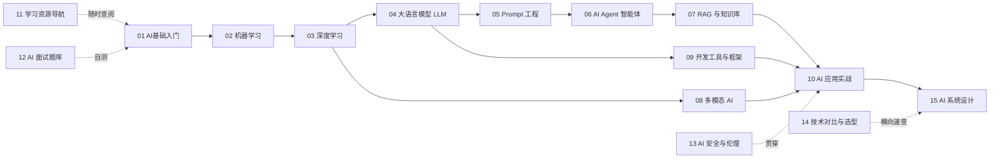

# AI 学习资料库

> 由「AI学习小能手」agent 维护的系统化 AI 图文学习资料，覆盖从零基础到实战应用的完整路径。

## 学习路线图

## 目录结构

| 目录 | 主题 | 适合阶段 |
|------|------|----------|
| [01-AI基础入门](./01-AI基础入门/README.md) | AI 概念、发展历史、核心术语 | 零基础 |
| [02-机器学习](./02-机器学习/README.md) | 监督/无监督/强化学习、经典算法 | 入门 |
| [03-深度学习](./03-深度学习/README.md) | 神经网络、CNN、RNN、Transformer | 进阶 |
| [04-大语言模型](./04-大语言模型/README.md) | GPT、Claude、DeepSeek、训练与推理 | 进阶 |
| [05-Prompt工程](./05-Prompt工程/README.md) | 提示词技巧、结构化 Prompt、Few-shot | 人人必学 |
| [06-AI-Agent智能体](./06-AI-Agent智能体/README.md) | Agent 架构、工具调用、多智能体 | 高阶 |
| [07-RAG与知识库](./07-RAG与知识库/README.md) | 向量数据库、Embedding、检索增强 | 高阶 |
| [08-多模态AI](./08-多模态AI/README.md) | 文生图、文生视频、语音 AI | 拓展 |
| [09-AI开发工具与框架](./09-AI开发工具与框架/README.md) | PyTorch、LangChain、MCP、AI IDE | 工程化 |
| [10-AI应用实战](./10-AI应用实战/README.md) | 项目案例、落地方法论 | 实战 |
| [11-学习资源导航](./11-学习资源导航/README.md) | 课程、书籍、社区、论文渠道 | 随时查阅 |
| [12-AI面试题库](./12-AI面试题库/README.md) | 225+ 高频面试题及答案要点，覆盖 ML/DL/LLM/RAG/Agent/工程落地 | 求职备战 |
| [13-AI安全与伦理](./13-AI安全与伦理/README.md) | 技术攻防、数据合规、内容风险、企业治理框架 | 进阶必修 |
| [14-技术对比与选型](./14-技术对比与选型/README.md) | **横向总结**：架构/方案/工具决策表 + 技术演进反思 | 全阶段常查 |
| [15-AI系统设计](./15-AI系统设计/README.md) | **系统设计**：通用架构蓝图、容量估算、8 场景案例、非功能清单 | 开发者必修 |

**速查工具**：[AI核心术语表](./01-AI基础入门/AI核心术语表.md) —— 60+ 术语一句话速查，当字典用。

## 配套能力

- **Agent**：`.codebuddy/agents/ai-learning-assistant.md` —— 「AI学习小能手」，可答疑、生成学习资料、制定学习计划
- **Skill：web-search-free** —— 免费联网搜索，获取最新 AI 资讯与资料
- **Skill：deep-research-report** —— 基于材料生成深度研究报告

## 使用方式

1. 按路线图顺序学习，或按需查阅对应目录
2. 遇到不懂的概念，直接向「AI学习小能手」提问
3. 需要最新资讯（如新模型发布）时，让 agent 使用 web-search-free 联网检索
4. 需要系统性调研某个主题时，让 agent 使用 deep-research-report 生成报告
